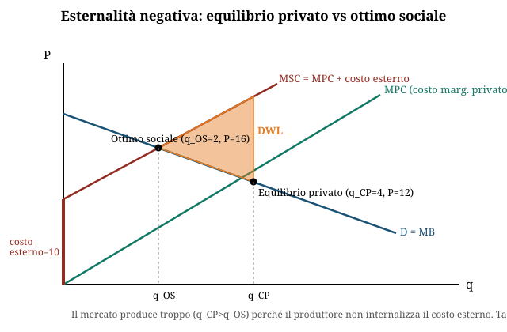

# Dispensa Politica Economica

**Esame 08/09/2026**

**Struttura della prova** (modalità d'esame 2026-2027)

| Fase | Cosa | Tempo | Soglia |
|---|---|---|---|
| Preselezione | 11 domande a risposta multipla | 10 minuti | almeno 6 corrette, altrimenti non si accede allo scritto |
| Scritto | 2 domande aperte + 1 esercizio | 1 ora | — |
| Orale | facoltativo, oppure a richiesta del docente | — | — |

Testo di riferimento: Paesani, P., *Manuale di politica economica*, II edizione, Giappichelli, 2020.

Appelli a.a. 2026-27: 20 gennaio · 10 febbraio · 16 giugno · 14 luglio · 8 settembre.

[TOC]

<div class="pagebreak"></div>


# Mappa di priorità — argomento → esercizio tipo → pagina

Vista d'insieme prima di aprire la dispensa per intero.

**Come è fatta la prova** (modalità d'esame 2026-2027): **preselezione** con 11 domande a risposta multipla in 10 minuti, superata con almeno 6 corrette → **scritto** di 1 ora con due domande aperte + un esercizio → **orale** facoltativo o a richiesta del docente. Testo di riferimento: Paesani, *Manuale di politica economica*, II ed., Giappichelli 2020.

Le due fasi chiedono cose diverse, e la tabella va letta due volte:

- **Per la preselezione** conta l'**ampiezza**: 11 domande secche possono pescare su qualunque riga. ~55 secondi a domanda significa richiamo immediato — definizioni, formule, chi sostiene cosa. Materiale giusto: **formulario + glossario su tutte e 14 le righe**, e le [domande di preselezione](00d-domande-preselezione.md) per allenare la velocità.
- **Per lo scritto** conta la **profondità** sulle righe ad alta priorità: l'esercizio è **uno solo**, e nei compiti passati è sempre venuto dai core 1-4 (o dai secondari 5-6). Le due domande aperte pescano dalla colonna "teoria".

> **Nota sulla numerazione.** Il numero del file **non** indica più la priorità: gli schemi 1-10 sono ordinati per priorità (stabilita analizzando 8 compiti passati), mentre gli 11-14 sono stati aggiunti dopo, per coprire capitoli del programma che nei compiti passati non erano mai comparsi. **La priorità la porta solo la colonna dedicata.**

| # | Argomento | Priorità | Tipo di esercizio atteso |
|---|---|---|---|
| [1](01-politica-fiscale-bilancio-pubblico.md) | Politica fiscale, bilancio pubblico, debito | 🔴 Core | Calcolo tasso debito/PIL costante · saldo primario da tabella PA · teorema di Haavelmo (teoria) |
| [2](02-inflazione-curva-phillips.md) | Inflazione, curva di Phillips | 🔴 Core | Curva dei salari/disoccupazione · salario reale · AD-AS grafico · teoria (cause inflazione, deflazione) |
| [3](03-concorrenza-imperfetta-monopolio.md) | Concorrenza imperfetta, monopolio | 🔴 Core | Perdita secca da D e MC dati · monopolio naturale/mercato contendibile · caso antitrust (teoria) |
| [4](04-economia-benessere-teoria-normativa.md) | Economia del benessere | 🔴 Core | Pareto-efficienza da tabella utilità · FBS (3 criteri) · Primo Teorema, second best (teoria) |
| [11](11-teoria-normativa-obiettivi-strumenti.md) | **Teoria normativa: obiettivi e strumenti** | 🔴 Core | **Esercizio obiettivo-strumento** (ricavare G dato N, efficacia dello strumento) · regola aurea di Tinbergen · assegnazione appropriata (teoria) |
| [5](05-mercato-del-lavoro.md) | Mercato del lavoro | 🟡 Secondario | Tassi di attività/occupazione/disoccupazione da dati |
| [6](06-economia-aperta-bilancia-pagamenti.md) | Economia aperta, bilancia pagamenti | 🟡 Secondario | Modello IS-LM-BP completo · riserve ufficiali · dazi e costi comparati |
| [7](07-teorie-macro-moneta-bce.md) | Teorie macro, moneta, BCE | 🟡 Secondario | Tabella comparativa scuole di pensiero · moltiplicatore monetario · domanda di moneta |
| [8](08-esternalita-fallimenti-mercato.md) | Esternalità, fallimenti di mercato | 🟡 Secondario | Confronto equilibrio privato/ottimo sociale con esternalità data · cambiamento climatico (teoria) |
| [13](13-valutazione-progetti-acb.md) | **Valutazione progetti pubblici (ACB)** | 🟡 Secondario | **Calcolo di VAN assoluto e relativo, TIR, scelta fra due progetti** · prezzi ombra (teoria) |
| [12](12-fallimenti-stato-political-economy.md) | **Fallimenti dello Stato, political economy** | 🟡 Secondario | Nessun esercizio — le tre cause, ciclo di Nordhaus, agenzia, corruzione (teoria) |
| [9](09-crescita-sviluppo.md) | Crescita e sviluppo | 🟢 Copertura | Misurazione PIL, crescita vs sviluppo, legge di Okun, ISU |
| [10](10-disuguaglianze-stato-sociale.md) | Disuguaglianze, Stato Sociale | 🟢 Copertura | Gini/Lorenz, redistribuzione, modelli di welfare, genere |
| [14](14-sistema-monetario-internazionale.md) | **Sistema monetario internazionale** | 🟢 Copertura | Nessun esercizio — cambi fissi vs flessibili, gold standard, dilemma di Triffin |

**Ordine di studio consigliato**

1. **I cinque core** (1, 2, 3, 4, 11): coprono tutto ciò che è comparso nei compiti passati, più il capitolo che dà il nome al corso. È qui che si gioca lo **scritto**.
2. **I cinque secondari** (5, 6, 7, 8, 13): il 13 è l'unico degli aggiunti con un **esercizio numerico** proprio (VAN/TIR), quindi non trattarlo come teoria pura.
3. **Le tre coperture** (9, 10, 14): definizioni e indicatori, per non perdere punti alla preselezione. Il **14** è l'unico schema senza riscontro nei PDF della docente: se il tempo manca, è il primo da sacrificare.

**Se il tempo stringe davvero**: core + [formulario](00a-formulario.md) + [domande di preselezione](00d-domande-preselezione.md). Alla preselezione una domanda su un argomento mai visto costa quanto una sui core, e lo sbarramento è a 6 su 11.

Per le formule vedi il [formulario](00a-formulario.md); per i simboli il [glossario](00b-glossario-simboli.md).


<div class="pagebreak"></div>


# Glossario dei simboli

I simboli ricorrono in schemi diversi con lo stesso significato — questa tabella li fissa una volta per tutte, per evitare confusione quando si passa da un argomento all'altro.

| Simbolo | Significato | Dove compare |
|---|---|---|
| **i** | Tasso di interesse (nominale, di policy o del modello IS-LM). **Coincide con r** usato nel modello dei prestiti in schema 1 §6 — stessa variabile, notazione diversa in quel solo paragrafo. | Schemi 1, 6, 7 |
| **r** | Tasso di interesse reale (r = i − π); usato come sinonimo di i nel modello dei prestiti | Schema 1 |
| **π, ṗ** | Tasso di inflazione (variazione % del livello dei prezzi) | Schemi 1, 2, 7 |
| **ẇ** | Tasso di crescita dei salari monetari | Schema 2 |
| **θ̇** | Tasso di crescita della produttività | Schema 2 |
| **u** | Tasso di disoccupazione | Schemi 2, 5 |
| **uN (o u\*)** | Tasso di disoccupazione naturale / NAIRU | Schema 2 |
| **Y** | Reddito / prodotto (PIL) | Schemi 1, 2, 6, 7, 9 |
| **Q, q** | Quantità (di un bene, in un mercato) — usato indifferentemente maiuscolo/minuscolo a seconda dello schema | Schemi 3, 8 |
| **P, p** | Prezzo — stessa cosa, maiuscolo/minuscolo indifferente | Schemi 2, 3, 8 |
| **MC** | Costo marginale | Schemi 1, 3, 8 |
| **MR** | Ricavo marginale | Schema 3 |
| **ATC / CMeT** | Costo medio totale | Schema 3 |
| **DWL** | Perdita secca (deadweight loss) | Schemi 3, 8 |
| **L** | Indice di Lerner (potere di mercato): L = (P−MC)/P | Schema 3 |
| **MC_P, MC_S** | Costo marginale privato / sociale | Schema 8 |
| **CME** | Costo esterno marginale | Schema 8 |
| **FBS** | Funzione di Benessere Sociale | Schema 4 |
| **EEG** | Equilibrio Economico Generale | Schemi 1, 4 |
| **SMS** | Saggio Marginale di Sostituzione (tra beni, lato consumo) | Schema 4 |
| **SMST** | Saggio Marginale di Sostituzione Tecnica (tra fattori, lato produzione) | Schema 4 |
| **FL, N, U** | Forza lavoro, occupati, disoccupati | Schema 5 |
| **a, n, u** | Tasso di attività, occupazione, disoccupazione (attenzione: qui u = tasso di disoccupazione, stesso simbolo della curva di Phillips ma calcolato su base censuaria, non macro) | Schema 5 |
| **CC** | Saldo della bilancia commerciale (conto corrente) | Schema 6 |
| **BP** | Bilancia dei pagamenti (anche come nome della curva nel modello Mundell-Fleming) | Schema 6 |
| **IS / LM** | Curve di equilibrio del mercato dei beni / della moneta (modello IS-LM) | Schemi 1, 6, 7 |
| **H** | Base monetaria | Schema 7 |
| **M** | Offerta di moneta (attenzione: in altri contesti M indica anche le importazioni — controllare sempre lo schema di riferimento) | Schemi 6, 7 |
| **G** | Gini (indice di disuguaglianza) — non confondere con G = spesa pubblica usato negli schemi di politica fiscale/IS-LM | Schemi 1, 6, 10 |
| **h, j** | Rapporto circolante/depositi (h) e coefficiente di riserva, obbligatoria + libera (j), nel moltiplicatore monetario | Schema 7 |
| **θ** | Produttività media del lavoro nel modello obiettivo-strumento (Y^off = θN). **Attenzione**: θ̇ nello schema 2 è il *tasso di crescita* della produttività — grandezze diverse, stessa lettera | Schemi 2, 11 |
| **c, t** | Propensione al consumo (c) e aliquota fiscale (t) nel moltiplicatore 1/[1−c(1−t)] | Schemi 1, 11 |
| **W** | Funzione di benessere sociale (obiettivi flessibili, indice di Okun). **Attenzione**: non è il salario, che è w minuscolo | Schemi 4, 11 |
| **b_t, c_t** | Benefici e costi del progetto pubblico al tempo t (analisi costi-benefici) | Schema 13 |
| **VAN, VAN_r, TIR** | Valore attuale netto assoluto, relativo, e tasso interno di rendimento | Schema 13 |
| **εₓ, ε_m** | Elasticità di esportazioni e importazioni rispetto al tasso di cambio (condizione di Marshall-Lerner) | Schema 6 |
| **e** | Tasso di cambio nominale (e ė = suo tasso di variazione atteso, nella parità scoperta) | Schemi 6, 14 |


<div class="pagebreak"></div>


# Formulario riassuntivo

Tutte le formule chiave della dispensa in un unico posto, per il ripasso last-minute. Ogni riga rimanda allo schema dove è spiegata e derivata per esteso.

## Politica fiscale e bilancio pubblico ([schema 1](01-politica-fiscale-bilancio-pubblico.md))

| Formula | Significato |
|---|---|
| **ΔB = (G − T) + iB** | Variazione del debito pubblico: disavanzo primario + interessi sul debito esistente |
| **i − ṗ = Ẏ** | Tasso di interesse (reale) che mantiene costante il rapporto debito/PIL, dati crescita del PIL (Ẏ) e inflazione (ṗ) |
| **S(r) = I(−r) + (G − T)** | Equilibrio EEG nel modello dei prestiti (mercato dei fondi mutuabili) |

## Inflazione e curva di Phillips ([schema 2](02-inflazione-curva-phillips.md))

| Formula | Significato |
|---|---|
| **π = ẇ − θ̇ + (1+g)˙** | Principio del costo pieno: inflazione = crescita salari − crescita produttività + margine di profitto |
| **ẇ = γ(u)** | Curva di Phillips originaria (crescita salari in funzione della disoccupazione) |
| **π = γ(u) − θ̇ + (1+g)˙** | Curva di Phillips "menù di scelta" (Samuelson-Solow) |
| **πₜ = γ(u) + πᵉₜ** | Curva di Phillips aumentata dalle aspettative (Friedman-Phelps) |
| **πᵉₜ = πᵉₜ₋₁ + λ(πₜ₋₁ − πᵉₜ₋₁)** | Aspettative adattive (0<λ<1) |

## Concorrenza imperfetta e monopolio ([schema 3](03-concorrenza-imperfetta-monopolio.md))

| Formula | Significato |
|---|---|
| **MR = dTR/dQ = a − 2bQ** | Ricavo marginale per domanda lineare P = a − bQ (pendenza doppia della domanda) |
| **MR = MC** | Condizione di massimo profitto del monopolista → determina Q_M |
| **DWL = ½ · (Q_C − Q_M) · [P_M − MC(Q_M)]** | Perdita secca, metodo del triangolo |
| **L = (P − MC) / P** | Indice di Lerner (potere di mercato): 0 in concorrenza perfetta, >0 con potere di mercato |
| **P = ATC** | Equilibrio di mercato contendibile (profitti nulli, prezzo limite) |

## Economia del benessere e teoria normativa ([schema 4](04-economia-benessere-teoria-normativa.md))

| Formula | Significato |
|---|---|
| **SMS₁,₂ = p₁/p₂** | Condizione di efficienza nello scambio (saggio marginale di sostituzione = rapporto prezzi) |
| **SMST_K,L = w_K/w_L** | Condizione di efficienza nella produzione (saggio marg. sostituzione tecnica = rapporto prezzi fattori) |
| **W = ΣUᵢ** | FBS utilitarista |
| **W = min(Uᵢ)** | FBS rawlsiana |
| **W = U₁ × U₂** | FBS di Bergson-Samuelson (esempio) |

## Mercato del lavoro ([schema 5](05-mercato-del-lavoro.md))

| Formula | Significato |
|---|---|
| **FL = N + U** | Forza lavoro = occupati + disoccupati |
| **a = FL / Pop₁₅₊** | Tasso di attività |
| **n = N / Pop₁₅₊** | Tasso di occupazione |
| **u = U / FL** | Tasso di disoccupazione |
| **n = a × (1 − u)** | Identità di verifica tra i tre tassi |

## Teoria normativa: obiettivi e strumenti ([schema 11](11-teoria-normativa-obiettivi-strumenti.md))

| Formula | Significato |
|---|---|
| **W = a·ṗ + b·u** | Funzione di benessere sociale con due obiettivi (a, b = pesi) |
| **W = ṗ + u** | **Indice di malessere di Okun** (caso a = b = 1); s.m.s. fra obiettivi costante e pari a 1 |
| **N = (1/θ)·[1/(1−c(1−t))]·(I+G)** | Modello in **forma ridotta**: obiettivo in funzione degli strumenti |
| **G = θ·[1−c(1−t)]·N − I** | Modello in **forma ridotta inversa**: strumento in funzione dell'obiettivo |
| **dN/dG = 1/[θ(1−c(1−t))]** | **Efficacia** dello strumento sull'obiettivo |
| **n. strumenti ≥ n. obiettivi** | **Regola aurea di Tinbergen** |

## Economia aperta e bilancia dei pagamenti ([schema 6](06-economia-aperta-bilancia-pagamenti.md))

| Formula | Significato |
|---|---|
| **Y = C+I+G+X−M** | Equilibrio del mercato dei beni in economia aperta (curva IS aperta) |
| **CC = (pₓe)qₓ − p_m q_m** | Saldo della bilancia commerciale in valuta estera |
| **L_d(Y,i) = fY + L₀ − gi** | Domanda di moneta (curva LM) |
| **\|εₓ\| + \|ε_m\| > 1** | **Condizione di Marshall-Lerner**: la svalutazione migliora il saldo solo se prevale l'effetto quantità |
| **i = i\* − ė** | Condizione di **parità scoperta** (equilibrio dei movimenti di capitale) |
| **(X+M)/Y** | Grado di apertura dell'economia |

## Valutazione dei progetti pubblici ([schema 13](13-valutazione-progetti-acb.md))

| Formula | Significato |
|---|---|
| **B = Σ b_t/(1+i)^t** · **C = Σ c_t/(1+i)^t** | Valore attuale di benefici e costi (i = tasso di sconto sociale) |
| **VAN = B − C** | Valore attuale netto **assoluto**; ammissibile se **> 0** |
| **VAN_r = (B−C)/C** | Valore attuale netto **relativo** (neutralizza l'effetto dimensione) |
| **B − C = 0 → i = TIR** | Tasso interno di rendimento: il tasso che **annulla il VAN**; ammissibile se TIR > tasso di mercato |

## Teorie macro, moneta e BCE ([schema 7](07-teorie-macro-moneta-bce.md))

| Formula | Significato |
|---|---|
| **M = (1+h)/(h+j) · H** | Moltiplicatore monetario (h = circolante/depositi, j = coefficiente di riserva) |
| **L(Y,i) = fY + L₀ − gi** | Domanda di moneta (transattiva + speculativa) |

## Esternalità e fallimenti di mercato ([schema 8](08-esternalita-fallimenti-mercato.md))

| Formula | Significato |
|---|---|
| **MC_S = MC_P + CME** | Costo marginale sociale = costo privato + costo esterno marginale (esternalità negativa) |
| **MB_S = MB_P + BME** | Beneficio marginale sociale (esternalità positiva) |
| **t = CME** | Tassa pigouviana ottimale = costo esterno marginale valutato all'ottimo sociale |

## Crescita e sviluppo ([schema 9](09-crescita-sviluppo.md))

| Formula | Significato |
|---|---|
| **OG = (Y − Y_p)/Y_p** | Output gap in percentuale |
| **Δu = −1% ⟺ crescita ≈ +2,5% sopra il potenziale** | **Legge di Okun** (da non confondere con l'indice di malessere) |

## Disuguaglianze e Stato Sociale ([schema 10](10-disuguaglianze-stato-sociale.md))

| Formula | Significato |
|---|---|
| **G = A / (A+B) = 2A** | Indice di Gini (A = area tra bisettrice e curva di Lorenz) |


<div class="pagebreak"></div>


# Politica fiscale, bilancio pubblico e debito pubblico

**Domande d'esame collegate:**

- Calcolo del tasso di interesse che garantisce un rapporto debito/PIL costante, dati crescita PIL, inflazione, bilancio primario in pareggio
- "Cosa afferma il teorema di Haavelmo?"
- Da una tabella di conto economico della PA: calcolo di saldo corrente, indebitamento netto, saldo primario (% PIL), con commento
- IS-LM: spiegare graficamente l'efficacia della politica fiscale (moltiplicatore keynesiano) e lo spiazzamento finanziario (crowding-out) se la politica monetaria non è accomodante

---

**1. Il bilancio pubblico: definizioni e saldi**

- **Amministrazioni pubbliche (AAPP)** = amministrazioni centrali (settore statale + altri enti) + amministrazioni locali + enti di previdenza. È l'aggregato di riferimento della finanza pubblica (diverso da "settore pubblico" che include anche le aziende pubbliche tipo Poste, Ferrovie, Banca d'Italia).
- Composizione del bilancio:
  - **T (entrate)**: tributarie (imposte dirette + indirette) + contributi sociali
  - **G (spesa)**: consumi pubblici + investimenti pubblici + trasferimenti (TR)
  - **INT**: interessi sul debito pubblico

| Saldo | Formula | Significato |
|---|---|---|
| **Saldo corrente** | Entrate correnti − Spese correnti | Se positivo, lo Stato risparmia sulla gestione corrente (può finanziare investimenti) |
| **Saldo primario (Bp)** | **T − G** | Saldo al netto degli interessi: misura lo sforzo di finanza pubblica "sotto controllo" del governo (esclude l'eredità del debito passato) |
| **Saldo di bilancio / Indebitamento netto (Bs)** | **T − (G + INT)** | Saldo complessivo; se negativo = deficit = "indebitamento netto"; finanzia il fabbisogno con nuovo debito |

- **NB per l'esame**: il saldo primario **esclude** gli interessi, l'indebitamento netto li **include**. Un paese può avere saldo primario positivo (avanzo primario) e comunque indebitamento netto negativo (deficit) se la spesa per interessi è molto alta — è il caso storico dell'Italia.
- I saldi si esprimono sempre **in % del PIL** per essere comparabili nel tempo e tra paesi (soglia PSC storica: indebitamento netto ≤ 3% PIL, debito ≤ 60% PIL).

---

**2. Le imposte: tipologie ed effetti**

- **In somma fissa (T)**: non dipende dal reddito.
- **Proporzionale**: T = tY, aliquota costante.
- **Progressiva**: t₀ + t(y)Y, aliquota crescente col reddito, finalità redistributiva.
- L'imposizione **progressiva** è uno **stabilizzatore automatico**: in una recessione (Y↓) il prelievo fiscale medio scende più che proporzionalmente e i trasferimenti (sussidi di disoccupazione) salgono → si attutisce la caduta del reddito disponibile e dei consumi, senza bisogno di una manovra discrezionale.
- **Drenaggio fiscale (fiscal drag)**: con inflazione e aliquote progressive non indicizzate, un aumento del reddito solo *nominale* fa scattare aliquote più alte → il reddito reale netto diminuisce anche se il reddito reale lordo è invariato. Rimedi: credito d'imposta compensativo, indicizzazione degli scaglioni.
  **Esempio numerico** (scaglioni: 20% fino a 1.000, 30% da 1.000 a 2.000). Reddito 1.000 → imposta 200, **aliquota media 20%**. Con inflazione al 20%, il reddito nominale sale a 1.200 ma il **potere d'acquisto è invariato**: imposta = 200 + 0,30 × 200 = 260 → **aliquota media 21,7%**. Il contribuente paga più imposte in termini reali **senza che nessuna aliquota sia stata alzata** e senza essere diventato più ricco: è un aumento di imposizione deciso dall'inflazione, non dal Parlamento.
- **Erosione, elusione, evasione** indeboliscono gettito ed equità: concentrano il carico fiscale su categorie meno capaci di sottrarsi (tipicamente il lavoro dipendente). Evasione in Italia stimata 110-130 mld/anno (~5% del debito pubblico).

---

**3. Il finanziamento della spesa pubblica: deficit, debito, base monetaria**

- Se **T = G**: bilancio in pareggio, nessun nuovo debito.
- Se **T < G** (deficit): finanziamento tramite
  - emissione di titoli di debito pubblico (ΔB), oppure
  - creazione di base monetaria (ΔH) — **vietata nell'Unione Monetaria Europea**.

- Identità di finanziamento: **G + INT − T = ΔH + ΔB**
- Finanziamento con **base monetaria**: meno costoso (niente interessi), ma rischia inflazione ("tassa da inflazione": l'inflazione inattesa riduce il valore reale del debito a vantaggio del governo).
- Finanziamento con **debito**: costoso (interessi), ma non genera direttamente inflazione.
- **I titoli di debito pubblico sono ricchezza per chi li detiene?**
  - *No*, secondo il **Teorema di equivalenza ricardiana**: agenti "ultra-razionali" prevedono che il debito odierno implica tasse future più alte, quindi aumentano il risparmio oggi (spiazzamento reale) → l'effetto della spesa pubblica sul reddito è identico che sia finanziata con imposte o con debito.
  - *Sì*, in una visione più tradizionale: il reddito disponibile aumenta subito → i consumi aumentano (i titoli sono percepiti come ricchezza netta perché le tasse future ricadranno anche su altri/su generazioni diverse).

---

**4. Il debito pubblico e la sua sostenibilità (formula dinamica debito/PIL)**

- Il **debito pubblico** è lo *stock* accumulato nel tempo dai flussi di disavanzo, finanziato con emissione di titoli.
- Indicatore chiave, il **rapporto debito/PIL**:

```
                      B
      debito/PIL = ───────
                     p · Y
```

**dove:** `B` = stock di debito · `p` = livello dei prezzi · `Y` = PIL reale (quindi `p · Y` = PIL nominale). La sostenibilità richiede che questo rapporto sia **non crescente** nel tempo.

**Derivazione step-by-step della condizione di sostenibilità:**

**Notazione**: il **puntino sopra una lettera** significa "tasso di variazione di quella grandezza". Quindi `Ḃ = ΔB/B` (di quanto % cresce il debito), `ṗ = Δp/p` (inflazione), `Ẏ = ΔY/Y` (crescita reale del PIL).

**1.** Il rapporto debito/PIL **aumenta** se il debito cresce più in fretta del PIL nominale (inflazione + crescita reale):

```
      Ḃ − ṗ − Ẏ  >  0
```

**2.** Se non c'è finanziamento monetario, la variazione dello stock di debito in un periodo è pari al **disavanzo primario** più la **spesa per interessi** sul debito già esistente:

```
      ΔB = (G − T) + i · B
```

**dove:** `G` = spesa pubblica · `T` = entrate · `i` = tasso di interesse nominale sul debito

**3.** Caso particolare — **saldo primario nullo** (cioè `G − T = 0`): resta `ΔB = i · B`, quindi il debito cresce esattamente al tasso di interesse:

```
      Ḃ = ΔB/B = i
```

**4.** Si sostituisce `Ḃ = i` nella condizione del punto 1 e si rovescia la disuguaglianza (per avere la condizione di **sostenibilità**, non di esplosione):

```
      i − ṗ − Ẏ < 0        cioè        i − ṗ  <  Ẏ
```

**La regola da ricordare**: il debito è sostenibile se il **tasso di interesse reale** (`i − ṗ`) è inferiore al **tasso di crescita reale del PIL** (`Ẏ`). In sigla: **r < g**.

- Questa è la formula-chiave per i calcoli d'esame su "tasso di interesse compatibile con debito/PIL costante": si impone l'**uguaglianza** (caso limite di rapporto esattamente costante)

```
      i − ṗ = Ẏ
```

e si risolve per l'incognita richiesta.
- Con **saldo primario non nullo**, la condizione si generalizza (bisogna tener conto anche del deficit/avanzo primario in % di PIL); la sostenibilità è più facile con: avanzo primario, finanziamento (parziale) con base monetaria, tasso di interesse basso, crescita del PIL alta, inflazione.
- Perché un debito troppo alto è un male: il risparmio si dirige verso i titoli pubblici anziché altri impieghi produttivi; rischio di insolvenza/crisi finanziaria e aumento dei tassi; rende difficili le manovre anticicliche.

**Le cinque cause della crescita del rapporto debito/PIL in Italia negli anni '80** (domanda aperta ricorrente — si noti che sono esattamente i termini della formula al punto 4 che peggiorano tutti insieme):

1. **Elevati disavanzi primari**, fra il 3% e il 5% del PIL;
2. **Spesa per interessi crescente**, dal 5% all'8,5% del PIL;
3. **Aumento dei tassi di interesse internazionali**, per effetto della politica monetaria restrittiva USA;
4. **Aumento dei tassi di interesse interni**, con la fine della politica monetaria accomodante dopo l'indipendenza della Banca d'Italia (il "divorzio" del 1981, vedi [schema 07](07-teorie-macro-moneta-bce.md));
5. **Debole crescita di Y**, per gli effetti della stretta monetaria e per il mantenimento di un cambio forte della lira.

**Le politiche di rientro dal debito:** contenimento del **disavanzo primario** (aumento delle entrate, anche via privatizzazioni · riduzione delle spese, con effetti redistributivi) · **politiche per la crescita** che non passino per maggiore spesa pubblica (politiche industriali) · **politiche monetarie accomodanti** fino al caso estremo della monetizzazione (**vietata** nell'unione monetaria) · **gestione del debito** e controllo dei tassi su mercato primario e secondario · **ripudio del debito** (il paese diventa inaffidabile e perde l'accesso ai mercati).

**La spesa per interessi è una redistribuzione** in tre direzioni: dall'interno **all'estero** (per la quota di titoli in mani straniere) · dai **contribuenti ai sottoscrittori** dei titoli · dalle **generazioni future a quella presente**.

---

**5. Il teorema di Haavelmo (teorema del bilancio in pareggio)**

**Cosa afferma:** un aumento della spesa pubblica finanziato con un pari aumento delle imposte (bilancio che resta in pareggio, ΔG = ΔT) **non è neutrale**: produce comunque un aumento del reddito di equilibrio pari all'aumento della spesa stessa. Il **moltiplicatore del bilancio in pareggio è uguale a 1**.

**Dimostrazione (modello reddito-spesa, imposta in somma fissa, economia chiusa):**

```
      Y = C + I + G
      C = c · (Y − T)          con I = Ī  (investimenti dati)
```

**dove:** `c` = propensione marginale al consumo (0 < c < 1) · `T` = imposte in somma fissa · la barra sopra `Ī` significa "grandezza data, non spiegata dal modello"

Sostituendo `C` dentro `Y` e risolvendo:

```
                 1
      Y = ───────────  ·  ( Ī + G − c · T )
              1 − c
```

Si passa alle **variazioni** (Δ = "variazione di"):

```
      ΔY = 1/(1−c) · ( ΔG − c · ΔT )
```

Ora si impone la condizione del teorema, `ΔG = ΔT` (bilancio in pareggio):

```
      ΔY = 1/(1−c) · ( ΔG − c · ΔG )
         = 1/(1−c) · (1 − c) · ΔG
         = ΔG
```

**Intuizione economica:** l'aumento di G ha un effetto espansivo pieno (moltiplicatore 1/(1−c)) sulla domanda aggregata. L'aumento di T ha un effetto restrittivo minore, pari a c/(1−c), perché riduce il reddito disponibile ma i consumatori assorbono solo una quota c della minore disponibilità (il resto avrebbe comunque un peso minore rispetto all'iniezione diretta di spesa pubblica, che si traduce in domanda al 100%). La somma netta dei due effetti è esattamente pari a ΔG.

**Attenzione — vale solo con imposta in somma fissa.** Con imposta **proporzionale** (T = tY), il teorema **non vale più**:

```
      Y  = 1/(1 − c(1−t)) · ( I₀ + G )
      ΔY = 1/(1 − c(1−t)) · ΔG
      ΔT = t · ΔY = t/(1 − c(1−t)) · ΔG
```

**dove:** `t` = aliquota dell'imposta proporzionale (`T = t · Y`), quindi il gettito **cresce insieme al reddito** invece di restare fisso
- Si dimostra che **ΔT < ΔG** sempre (perché t < 1−c(1−t) quando t<1): quindi con imposta proporzionale l'aumento di spesa genera un aumento di reddito maggiore dell'aumento di gettito fiscale indotto, e il bilancio pubblico peggiora anche se G e T "partono" dallo stesso importo nominale — il legame ΔG=ΔT del teorema si riferisce a una manovra di variazione delle aliquote/della spesa impostata ex-ante, non all'esito automatico.

---

**6. Politica fiscale e mercato dei prestiti: la visione neoclassica**

- Modello dei prestiti (equilibrio **EEG**, equilibrio economico generale, a piena occupazione data): **S(r) = I(−r) + (G − T)**
    - S(r) = offerta di prestiti (risparmio delle famiglie, crescente in r)
    - I(−r) + (G−T) = domanda di prestiti (imprese + Stato)

- **Politica fiscale espansiva (↑G o ↓T) → effetto spiazzamento (crowding-out):**
    1. ↑(G−T) → aumenta la domanda di prestiti da parte dello Stato
    2. → aumenta il tasso di interesse reale r
    3. → aumentano i risparmi, **diminuiscono C e I privati**
    4. Nel nuovo equilibrio Y = Y* (invariato, perché piena occupazione), ma la quota di prodotto assorbita dallo Stato è cresciuta a scapito di quella privata: **la spesa pubblica sostituisce, non aggiunge, spesa privata**.

- Implicazioni di policy (visione 1 / neoclassica): contenere spesa pubblica e tassazione, evitare oscillazioni delle aliquote, limitare il ruolo della manovra di bilancio nella stabilizzazione. Condizione ideale: G − T = 0.

---

**7. Politica fiscale nel modello reddito-spesa keynesiano e IS-LM**

**Modello reddito-spesa (senza settore monetario), imposta in somma fissa:**

- Y = C + I + G; C = c(Y−T); I = I₀ → **Y = 1/(1−c) · (I₀ + G − cT)**
- **Moltiplicatore della spesa pubblica = 1/(1−c)** (con 0<c<1): un aumento di G si traduce in un aumento più che proporzionale di Y, perché la spesa iniziale genera reddito, che genera consumo aggiuntivo, che genera altro reddito, ecc. (↑I→↑Y→↑C→↑Y→↑C…)
- In economia **aperta** e con imposta proporzionale il moltiplicatore si riduce: Y = 1/(1−c(1−t)+m) · (I₀+G+X₀) — le "fughe" verso tasse e importazioni indeboliscono l'effetto moltiplicativo.

**Il modello IS-LM (integra il mercato dei beni con quello monetario):**

- La curva **IS** rappresenta le combinazioni (Y, i) che equilibrano il mercato dei beni: Y = C(Y−T) + I(i) + G. È inclinata negativamente (i↑ → I↓ → Y↓). *(qui i = r, tasso di interesse — stessa variabile chiamata r nel modello dei prestiti sopra; da schema 07 in poi si usa sempre i)*
- La curva **LM** rappresenta le combinazioni (Y, i) che equilibrano il mercato della moneta (domanda di moneta = offerta data M/p). È inclinata positivamente (Y↑ → più domanda di moneta per transazioni → i deve salire per riequilibrare, a offerta di moneta data).
- **Efficacia della politica fiscale espansiva (↑G):**
    - La IS si sposta a destra (per ogni r, il livello di Y di equilibrio nel mercato dei beni è più alto).
    - Con LM invariata (politica monetaria **non accomodante**, offerta di moneta costante): il nuovo equilibrio si sposta lungo la LM verso l'alto a destra → **sia Y che r aumentano**.
    - L'aumento di Y è **minore** di quanto previsto dal moltiplicatore keynesiano "puro" (che si avrebbe a r costante), perché l'aumento di r **spiazza parzialmente gli investimenti privati** (↓I): questo è lo **spiazzamento finanziario (crowding-out)** — graficamente, la distanza tra lo spostamento "orizzontale" della IS (l'effetto moltiplicatore pieno, a r invariato) e lo spostamento effettivo di Y lungo la nuova LM misura esattamente il crowding-out.
    - Se invece la politica monetaria è **accomodante** (la Banca Centrale espande M in parallelo, spostando anche la LM a destra): r non sale (o sale meno), l'investimento privato non viene spiazzato, e l'aumento di Y è più vicino al pieno moltiplicatore keynesiano.

- Collegamento con la visione neoclassica: quando l'economia è già a piena occupazione (Y = Y_PO fisso, offerta rigida), l'aumento della domanda aggregata da politica fiscale non può tradursi in più Y reale e si scarica interamente sui tassi di interesse (o sui prezzi) → è il caso limite dello spiazzamento totale visto al punto 6.


---

**8. Vincoli europei alla politica di bilancio**

- **Trattato di Maastricht (1992)**: soglie **debito/PIL ≤ 60%**, **deficit/PIL ≤ 3%**. Con crescita nominale del 5%, un deficit/PIL del 3% stabilizza il debito/PIL al 60% (relazione approssimata: d stabile se f/d ≈ γ, cioè 3/60 = 5%).
- Logica delle regole: permettere agli stabilizzatori automatici di operare, assicurare la sostenibilità dei debiti, evitare rischi di contagio (spillover) fra paesi.
- Percorso storico: Patto di Stabilità e Crescita (1997) → riforma 2005 → Six Pack (2011) → Fiscal Compact (2012) → sospensione clausola di salvaguardia (2020, Covid) → **riforma del PSC (23 aprile 2024)**: piano nazionale strutturale di bilancio di medio termine (4-5 anni), percorsi di riduzione del debito differenziati per paese (più flessibili per paesi con debito > 90% PIL se accompagnati da riforme/investimenti), maggiore attenzione alla qualità della spesa, possibilità di trattare la spesa per la difesa come fattore flessibile.

---

## Esercizio tipo svolto

### Tipo 1 — Tasso di interesse per rapporto debito/PIL costante (domanda d'esame più probabile)

**Testo:** Un paese ha un tasso di crescita reale del PIL Ẏ = 2%, un tasso di inflazione ṗ = 1,5%, e un bilancio primario in pareggio (G = T). Qual è il tasso di interesse nominale i che mantiene costante il rapporto debito/PIL?

**Svolgimento:**

1. Con saldo primario nullo, la formula di sostenibilità impone che il rapporto debito/PIL resti costante quando:
 **i − ṗ = Ẏ**

2. Sostituendo i dati:
 i − 1,5% = 2%

3. **i = 2% + 1,5% = 3,5%**

**Commento:** con un tasso di interesse nominale del 3,5% (cioè un tasso reale del 2%, esattamente uguale alla crescita reale del PIL), il debito cresce alla stessa velocità del PIL nominale e il rapporto B/(pY) resta invariato. Se il tasso di interesse effettivo fosse superiore al 3,5% (a parità di crescita e inflazione), il rapporto debito/PIL aumenterebbe nonostante il pareggio primario — è la cosiddetta "palla di neve del debito" (snowball effect), ed è per questo che la condizione i − ṗ < Ẏ è il criterio-chiave di sostenibilità.

### Tipo 2 — Variante con saldo primario non nullo

**Testo:** Stesso paese di prima (Ẏ = 2%, ṗ = 1,5%), ma ora ha un **disavanzo primario** pari all'1% del PIL (G − T = 1% di Y). Il debito iniziale è pari all'80% del PIL. Il rapporto debito/PIL aumenta o diminuisce, se il tasso di interesse nominale è i = 4%?

**Svolgimento (logica, senza formula chiusa completa — impostazione da esame):**

1. Tasso di interesse reale: i − ṗ = 4% − 1,5% = 2,5%.
2. Confronto con la crescita: Ẏ = 2% < 2,5% (tasso reale) → la componente "palla di neve" da sola farebbe **aumentare** il rapporto debito/PIL (perché il costo reale del debito supera la crescita).
3. In più c'è un disavanzo primario dell'1% (G>T), che aggiunge ulteriore nuovo debito ogni anno.
4. **Conclusione: il rapporto debito/PIL aumenta**, per due ragioni cumulative: (a) il tasso di interesse reale supera la crescita, (b) il paese produce nuovo debito anche al netto degli interessi (disavanzo primario). Per stabilizzare il rapporto servirebbe o un avanzo primario sufficiente a compensare il differenziale (i−ṗ−Ẏ)×(debito/PIL), oppure una riduzione di i, oppure più crescita/inflazione.

*(Nota per l'esame: se il testo dà anche il livello iniziale del rapporto debito/PIL, la variazione approssimata del rapporto nel periodo è: Δ(B/Y) ≈ [(i−ṗ−Ẏ)×(B/Y)] + (disavanzo primario/PIL). Utile per rispondere a domande che chiedono "di quanto cambia" e non solo "aumenta o diminuisce".)*


<div class="pagebreak"></div>


# Inflazione e Curva di Phillips

**Domande d'esame collegate:** Calcolo con curva dei salari tipo ẇ=0,55-5u (relazione salario-disoccupazione), tasso di inflazione, effetto di una politica dei redditi (es. taglio salari -2%) sulla disoccupazione · Calcolo salario reale, PIL reale/nominale, quota salari su reddito · Perché in concorrenza perfetta non c'è disoccupazione volontaria · Cause dell'inflazione · Perché la deflazione è dannosa · Chi è svantaggiato dall'inflazione · Rappresentare graficamente inflazione da domanda e da costi con il modello AD-AS · Relazione tra curva AS e curva di Phillips

---

**1. Definizione e misura dell'inflazione**

- L'**inflazione** è un processo di aumento continuo e generalizzato del livello dei prezzi dei beni e servizi al consumo.
- **Tasso di inflazione**: **π = ṗ = (variazione dei prezzi nell'unità di tempo) / (livello dei prezzi)**.
- Un tasso del 10% annuo composto per 10 anni porta un prezzo di 100€ a 259€ (non 200€: è un tasso di crescita composto, non lineare).
- Si misura come tasso di crescita annuo o come indice (base = 100 in un anno di riferimento), tramite **indici** costruiti come media ponderata dei prezzi di un **paniere**:
  - indice **al consumo** (il più usato, paniere ampio di beni/servizi delle famiglie);
  - indice alla produzione;
  - indice all'ingrosso;
  - **deflatore implicito del PIL** = PIL nominale / PIL reale.

**2. Cause dell'inflazione**

| Tipo | Meccanismo |
|---|---|
| **Da domanda** | Aumento della domanda aggregata; l'offerta non si adegua nel breve periodo → produttori alzano i prezzi |
| **Da offerta / da costi** | Shock che riducono l'offerta o fanno salire i costi di produzione (materie prime, lavoro, macchinari, guerre); il trasferimento sui prezzi dipende dalla struttura di mercato |
| **Importata** | Aumento del prezzo delle materie prime acquistate all'estero |
| **Da profitti** | Aumento dei margini di profitto (mark-up) in mercati non concorrenziali |
| **Da eccesso di moneta** | Teoria monetarista: espansione incontrollata dell'offerta di moneta da parte delle banche centrali rispetto alle merci prodotte |
| **Da aspettative** | I lavoratori/imprese incorporano l'inflazione attesa nelle richieste salariali/nei prezzi, alimentando l'inflazione effettiva (vedi curva di Phillips aumentata, punto 6) |

**3. Il principio del costo pieno e l'inflazione come conflitto distributivo**

- Ipotesi: mercati non concorrenziali → le imprese sono **price-maker**.
- Le imprese fissano il prezzo come **costo del lavoro per unità di prodotto** (CLUP = `w/θ`) maggiorato di un **mark-up**:

```
                        w
      p = (1 + g) · ───────
                        θ
```

**dove:**
- `p` = prezzo · `w` = salario **nominale** (in euro)
- `θ` = **produttività media del lavoro** (`θ = Y/N`, prodotto per occupato)
- `w/θ` = **CLUP**, costo del lavoro per unità di prodotto
- `g` = margine di profitto, quindi `(1+g)` = **mark-up** applicato sul costo

- In termini **dinamici** (tassi di variazione, indicati dal puntino) si ottiene l'**equazione del costo pieno**:

```
      π = ṗ = ẇ − θ̇ + (1+g)˙
```

**dove:**
- `π` (o `ṗ`) = tasso di **inflazione**
- `ẇ` = tasso di crescita dei **salari nominali** → spinge i prezzi **su**
- `θ̇` = tasso di crescita della **produttività** → spinge i prezzi **giù** (col segno meno: se ogni lavoratore produce di più, il costo unitario scende)
- `(1+g)˙` = variazione del **mark-up** → spinge i prezzi **su**

**Come si legge**: non c'è inflazione se i salari crescono quanto la produttività e il mark-up resta fermo. L'inflazione compare quando una delle due parti pretende una fetta più grande e l'altra non cede.

- L'inflazione nasce dal **conflitto distributivo** tra imprese (che vogliono il mark-up) e sindacati (che vogliono il salario reale w/p) sulla ripartizione del reddito.

**4. Salario reale, PIL reale/nominale, quota salari**

- **Salario reale** = w/p (potere d'acquisto del salario nominale w).
- **PIL nominale** = pY (valore a prezzi correnti); **PIL reale** = Y (valore a prezzi costanti, "quantità"); **deflatore del PIL** = PIL nominale/PIL reale.
- Due categorie di reddito: lavoratori e percettori di profitto → **pY = W + PR**, con **W = wN** (reddito da lavoro = salario nominale × occupati).
- **Quota di reddito da lavoro** = wN/pY = (w/p)/θ (salario reale su produttività del lavoro).
- La quota di reddito da lavoro **non varia** se: **ẇ − ṗ − θ̇ = 0**.
- Se il mark-up è costante ((1+g)˙=0) e il salario cresce quanto la produttività (ẇ = θ̇), allora π = 0: nessuna inflazione e **quote distributive invariate**. Nei dati OECD reali, la quota salari su reddito è comunque scesa in quasi tutti i paesi G20 dal 1970 al 2011.

**5. Politiche anti-inflazionistiche, in base alla causa**

| Causa dell'inflazione | Politica |
|---|---|
| Conflitto distributivo (salari/prezzi) | **Politica dei redditi** + politiche per la produttività |
| Profitti in mercati non concorrenziali | Politiche per la concorrenza + price cap |
| Domanda o eccesso di moneta | Politica monetaria |

- **Politica dei redditi**: accordi tra imprese e sindacati, con intervento del Governo, per controllare la dinamica di salari e profitti ed evitare l'aumento del livello generale dei prezzi (fondamento: principio del costo pieno).
  - Controllo dei salari (blocco, o crescita = produttività — ma quale produttività, viste le dinamiche settoriali diverse?).
  - Controllo dei prezzi (= controllo dei margini di profitto).
  - Relazioni industriali: **scambio economico** (vantaggi fiscali/economici) o **scambio politico** (impegni del governo su materie non economiche → **patto sociale**).
  - Esempi italiani: 1984 predeterminazione della "scala mobile" (per bloccare la spirale salari-inflazione); 1993 aumenti salariali basati su inflazione programmata + contrattazione di secondo livello.

**6. La curva di Phillips (originaria)**

- Relazione empirica tra tasso di disoccupazione u e tasso di variazione dei **salari monetari** ẇ (Phillips, dati UK 1861-1957):

```
      ẇ = γ(u)
```

**dove:** `ẇ` = tasso di crescita dei salari monetari · `u` = tasso di disoccupazione · `γ( )` indica semplicemente "è una funzione di" — la relazione è **decrescente**: più disoccupazione, meno spinta salariale.

- Curva decrescente e convessa. **uN (o u\*)** = tasso di disoccupazione naturale: al di sotto le imprese offrono salari più alti per attirare lavoratori (ẇ>0), al di sopra i salari ristagnano o scendono.
- Sinonimo da riconoscere: **NAIRU** (*Non-Accelerating Inflation Rate of Unemployment*), il tasso di disoccupazione compatibile con un'inflazione **stabile** (non accelerante). Nell'impostazione Friedman-Phelps coincide con il tasso naturale: è il punto in cui la curva di Phillips di lungo periodo diventa verticale. **Attenzione**: non è il tasso a cui l'inflazione è *nulla*, ma quello a cui l'inflazione **non accelera**.

**7. La curva di Phillips "menù di scelta" (Samuelson-Solow)**

- Sostituendo ẇ = γ(u) nell'equazione del costo pieno (π = ẇ − θ̇ + (1+g)˙) si ottiene:

```
      π = γ(u) − θ̇ + (1+g)˙
```

Cioè: la disoccupazione entra nell'equazione dell'inflazione **attraverso i salari**.

- Mostra un **trade-off tra inflazione e disoccupazione**: il policymaker può ridurre u accettando più π, muovendosi **lungo** la curva (non spostandola).
- La scelta ottimale è nel punto di tangenza tra il vincolo (CdP) e la funzione obiettivo del policymaker (curve di indifferenza tra i due "mali" inflazione e disoccupazione) — collegato alla **regola aurea di Tinbergen**: se n. strumenti < n. obiettivi non tutti gli obiettivi sono raggiungibili contemporaneamente; si rinuncia a qualche obiettivo, si aggiungono strumenti, o si passa a "obiettivi flessibili" (funzione di perdita da minimizzare).

**8. Curva di Phillips aumentata dalle aspettative (Friedman-Phelps, 1968)**

- La relazione non è stabile nel **lungo periodo** perché trascura l'**inflazione attesa** πᵉ:

```
      π_t = γ(u) + πᵉ_t
```

**dove:** `π_t` = inflazione nel periodo t · `πᵉ_t` = inflazione **attesa** per il periodo t (la "e" in alto sta per *attesa*) · il pedice `t` indica il periodo.

- Con **aspettative adattive** (ci si aspetta quello che è successo, corretto per l'errore commesso):

```
      πᵉ_t = πᵉ_(t−1) + λ · ( π_(t−1) − πᵉ_(t−1) )       con 0 < λ < 1
```

**dove:** `λ` misura **quanto in fretta** si correggono le aspettative: λ vicino a 1 = correzione rapida, λ vicino a 0 = aspettative lente. Le imprese aggiustano le aspettative istantaneamente, i lavoratori con ritardo.
- Esiste una famiglia di **curve di Phillips di breve periodo (SRPC)**, una per ogni livello di aspettative, e una **curva di lungo periodo (LRPC) verticale in corrispondenza di uN**: nel lungo periodo non c'è trade-off, solo nel breve.
  - u < uN → π > πᵉ (l'economia "surriscalda")
  - u = uN → π = πᵉ (equilibrio, aspettative corrette)
  - u > uN → π < πᵉ

- Con λ=1 (caso limite): πᵉt = π(t-1). Se u resta stabilmente sotto u\*, l'inflazione **accelera** periodo dopo periodo invece di stabilizzarsi (vedi esercizio tipo).


**9. Perché in concorrenza perfetta non c'è disoccupazione volontaria**

- In concorrenza perfetta il salario è determinato dall'incontro tra domanda e offerta di lavoro: al salario di equilibrio, domanda e offerta di lavoro coincidono e chi vuole lavorare a quel salario trova impiego.
- Non essendoci rigidità di prezzi/salari né potere di mercato, non si generano eccessi di offerta di lavoro persistenti: eventuale disoccupazione osservata sarebbe solo frizionale/di breve aggiustamento, non "involontaria" nel senso di lavoratori disposti a lavorare al salario vigente ma esclusi dal mercato. La disoccupazione involontaria richiede invece imperfezioni di mercato (salari rigidi verso il basso, potere contrattuale, informazione imperfetta, principio del costo pieno con price-maker) — è per questo che nei modelli con conflitto distributivo (punto 3) e nella curva di Phillips esiste un uN "naturale" positivo anche in equilibrio.

**10. Modello AD-AS: inflazione da domanda vs da costi (rappresentazione grafica)**

- Assi: prezzo p (verticale), reddito/output Y (orizzontale). AD inclinata negativamente, AS inclinata positivamente (o verticale nel lungo periodo).
- **Inflazione da domanda**: la curva **AD si sposta a destra** (più domanda aggregata) → nuovo equilibrio con **p più alto e Y più alto** lungo la stessa AS.
- **Inflazione da costi/offerta**: la curva **AS si sposta a sinistra/verso l'alto** (costi di produzione più alti o shock di offerta negativo) → nuovo equilibrio con **p più alto ma Y più basso**.
- Collegamento con la Curva di Phillips: uno spostamento di AD a destra corrisponde a un movimento **lungo** la CdP (meno u, più π — trade-off "normale"). Uno shock di AS negativo genera invece **più inflazione E più disoccupazione insieme**: è la **stagflazione** (USA anni '70), un caso in cui il trade-off della CdP tradizionale si rompe perché l'origine dello shock non è la domanda ma l'offerta.


**11. Perché la deflazione è dannosa**

- La deflazione (prezzi in calo continuo) non è il semplice "specchio" positivo dell'inflazione:
  - i consumatori rinviano gli acquisti aspettandosi prezzi ancora più bassi in futuro → crollo della domanda aggregata, che alimenta ulteriore deflazione (spirale deflattiva);
  - il valore reale dei debiti **aumenta** (effetto opposto rispetto all'inflazione) → aggrava la posizione dei debitori, può portare a insolvenze e instabilità finanziaria;
  - i salari nominali sono rigidi verso il basso, quindi un aggiustamento via deflazione genera più facilmente disoccupazione invece che riduzione ordinata dei salari reali;
  - la politica monetaria convenzionale perde efficacia (rischio di tassi di interesse reali troppo alti anche con tassi nominali a zero — "trappola della liquidità").

- In sintesi: la deflazione redistribuisce ricchezza dai debitori ai creditori (opposto dell'inflazione non attesa) e deprime la domanda, con effetti recessivi che si autoalimentano.

**12. Chi è danneggiato dall'inflazione**

| Situazione | Chi guadagna | Chi perde |
|---|---|---|
| **Inflazione non attesa** | Debitori (il valore reale del debito si riduce) | Creditori (il valore reale del credito si riduce); percettori di **redditi fissi** (pensioni, stipendi non indicizzati) — subiscono una perdita di potere d'acquisto |
| **Inflazione attesa** (anche se corretta) | — | Tutti sostengono comunque **menù costs** (costo di revisione dei listini prezzi) e **shoe-leather costs** (costo-opportunità di detenere circolante che si svaluta) |
| **Iperinflazione** | — | Instabilità finanziaria generalizzata, danno diffuso |

- In generale: l'inflazione non prevista **redistribuisce** reddito e ricchezza (modifica i prezzi relativi e il valore reale di crediti/debiti); l'inflazione anticipata ha comunque dei costi reali di aggiustamento anche se non redistribuisce.

---

## Esercizio tipo svolto

**Traccia (analoga a quella d'esame):**
Il mercato del lavoro di un paese è descritto dalla curva dei salari:

```
      ẇ = 0,55 − 5 · u
```

**dove:**
- `ẇ` = tasso di variazione dei **salari monetari**
- `u` = tasso di disoccupazione, **in decimali** (10% si scrive 0,10)
- `0,55` = intercetta: quanto crescerebbero i salari con disoccupazione nulla
- `5` = pendenza: di quanto rallenta la crescita salariale per ogni punto di disoccupazione in più

**Ipotesi date dal testo:** `θ̇ = 0` (produttività costante) e `(1+g)˙ = 0` (mark-up costante).

**a) Determinare il tasso di disoccupazione naturale (uN)**, cioè quello per cui i salari monetari sono **stabili** (`ẇ = 0`):

```
      0,55 − 5 · uN = 0
      5 · uN = 0,55
      uN = 0,11        →  11%
```

**b) Se il tasso di disoccupazione effettivo è u = 8% (0,08), calcolare ẇ e il tasso di inflazione π.**

```
      ẇ = 0,55 − 5 · (0,08)
         = 0,55 − 0,40
         = 0,15           →  15%
```

Con `θ̇ = 0` e `(1+g)˙ = 0`, l'equazione del costo pieno `π = ẇ − θ̇ + (1+g)˙` si riduce a:

```
      π = ẇ = 15%
```

  (Con u=8% sotto il livello naturale dell'11%, il mercato del lavoro è "surriscaldato": i salari crescono più velocemente e questo si trasferisce interamente in inflazione, dato che produttività e mark-up sono fermi.)

**c) Politica dei redditi: taglio dei salari nominali del 2% (Δẇ = −2 punti percentuali). Quale disoccupazione è compatibile con lo stesso tasso di crescita salariale, cioè quale u riporta ẇ al livello desiderato (es. si vuole ẇ = 15% − 2% = 13%)?**

```
      0,13 = 0,55 − 5 · u
      5 · u = 0,55 − 0,13 = 0,42
      u = 0,084        →  8,4%
```

  Interpretazione: a parità di dinamica salariale desiderata più bassa, la curva dei salari implica che serve un tasso di disoccupazione leggermente più alto (dall'8% all'8,4%) per ottenerla — oppure, letto al contrario: un intervento di politica dei redditi che taglia direttamente i salari nominali del 2% (spostando la relazione, non muovendosi lungo di essa) permette di ottenere la stessa dinamica salariale (e quindi la stessa inflazione, visto il costo pieno) con un tasso di disoccupazione più basso di quanto richiederebbe il solo meccanismo di mercato — è esattamente l'obiettivo della politica dei redditi (punto 5): **controllare l'inflazione senza dover scaricare tutto l'aggiustamento sulla disoccupazione**, riducendo il "prezzo" in termini di posti di lavoro persi rispetto a una politica puramente restrittiva (monetaria/fiscale) che agirebbe solo alzando u lungo la curva.

**d) Che succede se il governo cerca di mantenere u=8% (sotto uN=11%) periodo dopo periodo, con aspettative adattive e λ=1?**

  Con la curva di Phillips aumentata πt = γ(ut) + πᵉt e πᵉt = π(t-1):

  | t | πᵉt | ut | ẇt (=πt, dato θ̇=0, mark-up costante) |
  |---|-----|-----|-----|
  | 0 | 0% | 8% | γ(8%) = 15% |
  | 1 | 15% | 8% | γ(8%) + πᵉ1 = 15% + 15% = 30% |
  | 2 | 30% | 8% | 15% + 30% = 45% |

  L'inflazione **non si stabilizza**, ma **accelera** di periodo in periodo (accelerazionismo di Friedman-Phelps): mantenere u permanentemente sotto uN non è sostenibile, perché ogni periodo le aspettative si aggiornano sull'inflazione passata e la spingono ulteriormente verso l'alto. L'unico modo per fermare l'accelerazione è lasciare che u torni a uN = 11%, dove ẇ = γ(uN) = 0 e l'inflazione si stabilizza al livello atteso (costante, non necessariamente zero se le aspettative pregresse erano positive).


<div class="pagebreak"></div>


# Concorrenza imperfetta, monopolio e politiche per la concorrenza

**Domande d'esame collegate:**

- Dato mercato con domanda P=20-2q, MC=3q: calcolo della perdita secca (deadweight loss) di monopolio
- Domanda aperta applicata: caso antitrust reale (es. FTC vs Facebook/Instagram/WhatsApp) → discussione su politica della concorrenza
- Dato mercato con domanda P=20-Q, costi TC=10q+16: verificare che sia un monopolio naturale, calcolare l'equilibrio di monopolio (prezzo, quantità, profitti), calcolare l'equilibrio in caso di mercato contendibile, calcolare la perdita del monopolista con regolamentazione P=MC

---

## 1. **I fallimenti del mercato e la concorrenza imperfetta**

- Il mercato fallisce quando non è **concorrenziale** (pochi operatori, rendimenti di scala crescenti, barriere di entrata/uscita, accordi/intese, informazione asimmetrica) oppure quando è **non completo** (esternalità, beni pubblici, costi di transazione).
- In condizioni di concorrenza imperfetta l'equilibrio dell'impresa è **MR = MC** (ricavo marginale = costo marginale), ma a differenza della concorrenza perfetta questo implica **P > MC**: l'impresa ha **potere di mercato**.
- Forme di mercato non concorrenziale, in ordine di intensità del potere di mercato (dal continuum Concorrenza perfetta → Concorrenza monopolistica → Oligopolio → Monopolio puro):
  - **Monopolio**: legale (brevetti), di fatto (strategico), **naturale** (tecnologico)
  - **Oligopolio**: poche imprese, interazione strategica e interdipendenza delle decisioni
  - **Concorrenza monopolistica**: prodotto non omogeneo (differenziazione, pubblicità)
  - **Collusione**: accordi/intese fanno comportare le imprese come un unico monopolista

## 2. **Potere di mercato e indice di Lerner**

- **Potere di mercato (PdM)** = capacità dell'impresa di fissare **P > MC**
- Deriva da: barriere all'entrata, economie di scala (monopolio naturale), accordi ed intese
- Si misura con l'**indice di Lerner**:

```
            P − MC
      L = ──────────
              P
```

**dove:** `P` = prezzo praticato · `MC` = costo marginale · si divide per `P` per avere un numero **confrontabile** fra mercati diversi (una differenza di 40 pesa diversamente su un prezzo di 100 o di 1.000).

- L varia tra 0 (concorrenza perfetta, P=MC) e valori prossimi a 1 (forte potere di mercato). Più L è alto, più l'impresa si allontana dall'equilibrio concorrenziale.

## 3. **Efficienza allocativa e benessere sociale**

- Il benessere sociale (BS) è la somma di surplus del consumatore (SC) e surplus del produttore (SP): **BS = SC + SP**
- **SC** = differenza tra disponibilità a pagare (curva di domanda) e prezzo effettivamente pagato
- **SP** = differenza tra prezzo di vendita e costo marginale (curva di offerta)
- In **concorrenza perfetta** l'equilibrio (P_C, Q_C, dove Domanda = Offerta = MC) **massimizza il BS** ed è **Pareto-efficiente**: non esistono scambi mutualmente vantaggiosi non sfruttati.

## 4. **Equilibrio di monopolio — derivazione step-by-step**

Metodo generale per una funzione di domanda lineare **P = a − bQ** e un costo marginale **MC(Q)**:

```
      1) Ricavo totale:      TR = P · Q = (a − bQ) · Q = aQ − bQ²
      2) Ricavo marginale:   MR = dTR/dQ = a − 2bQ
```

**dove:** `a` = intercetta della domanda (prezzo massimo) · `b` = pendenza · Regola pratica: **il MR ha la stessa intercetta della domanda e pendenza doppia**.

3. **Condizione di massimo profitto**: MR = MC → si risolve per **Q_M** (quantità di monopolio)
4. **Prezzo di monopolio**: si sostituisce Q_M nella funzione di domanda → **P_M = a − bQ_M**
5. **Profitto**: **π = TR(Q_M) − TC(Q_M) = P_M·Q_M − TC(Q_M)**

- Il monopolista, a differenza del concorrenziale, **non produce dove D = MC** ma dove **MR = MC**, quindi produce **meno** e vende a un **prezzo più alto** rispetto al livello concorrenziale (P_M > P_C, Q_M < Q_C).

## 5. **Perdita secca (deadweight loss) di monopolio**

- Il monopolista pone MR=MC e produce Q_M < Q_C (quantità concorrenziale, dove Domanda=MC)
- **In monopolio il surplus totale è inferiore rispetto al mercato concorrenziale**: esistono scambi mutualmente vantaggiosi non realizzati tra Q_M e Q_C
- Il triangolo compreso tra Q_M, Q_C e la curva di domanda/offerta è la **perdita secca (DWL)**

**Formula e metodo di calcolo della DWL:**

```
      metodo del triangolo:
      DWL = ½ · (Q_C − Q_M) · [ P_M − MC(Q_M) ]

      metodo dell'integrale (equivalente, se MC non è costante):
      DWL = ∫ da Q_M a Q_C di [ Domanda(Q) − MC(Q) ] dQ
```

**dove:** `Q_C` = quantità **concorrenziale** (efficiente) · `Q_M` = quantità di **monopolio** · `P_M` = prezzo di monopolio · la base del triangolo è la quantità non prodotta, l'altezza è lo scarto fra prezzo e costo marginale.
- I due metodi danno lo stesso risultato; con domanda e MC lineari conviene il metodo del triangolo.


## 6. **Monopolio naturale**

- **Definizione**: si ha monopolio naturale quando i **costi fissi sono molto elevati** (barriera all'entrata) e i **costi variabili sono relativamente bassi**, tipico delle *utilities* (acqua, gas, energia elettrica, rifiuti, trasporto pubblico locale) che devono costruire e mantenere un'infrastruttura di rete.
- **Come si verifica**: si confronta il **costo medio totale (ATC/CMeT)** con la **domanda** (o con il costo marginale). Se l'ATC è **decrescente** su tutto il range di quantità rilevante ed è sempre **superiore al MC** (per la presenza di costi fissi elevati spalmati su più unità), allora un'unica impresa produce a costo inferiore rispetto a più imprese che si dividono il mercato → è **subadditivo** → monopolio naturale.
- Graficamente: ATC decrescente, MC = M costante e sotto l'ATC; MR e Domanda si incrociano con MC in Q\* (quantità di monopolio), mentre Domanda incrocia MC in Q\*\* > Q\* (quantità efficiente). Il rettangolo Π tra P\* e ATC è il profitto di monopolio; il triangolo S tra Q\* e Q\*\* è la perdita secca.

## 7. **Mercati contendibili**

- **Definizione**: mercato con **libertà di entrata e uscita senza costi** (assenza di *sunk costs*, costi affondati)
- **Hit and run entry**: se le imprese presenti hanno **profitti positivi**, nuove imprese entrano offrendo un prezzo leggermente più basso; le imprese insediate sono costrette a ridurre il prezzo, e le nuove entrate possono uscire senza costi se non conviene più restare
- **Anche in presenza di economie di scala** (quindi anche in un monopolio naturale), in un mercato contendibile le imprese realizzano **profitti nulli** (equilibrio hit-and-run-proof)
- L'equilibrio contendibile **non è efficiente nel senso di Pareto** (il prezzo resta comunque pari al costo medio, non al costo marginale)
- Il **prezzo limite** è il prezzo più basso compatibile con profitti nulli (P = ATC) che scoraggia l'entrata di nuovi concorrenti pur non essendo pari al costo marginale
- La **deregolamentazione** trova il suo fondamento teorico proprio nella teoria dei mercati contendibili


## 8. **Regolamentazione P=MC e perdita del monopolista naturale**

- La regola di prezzo ideale dal punto di vista dell'efficienza sarebbe **P = MC** (come in concorrenza perfetta)
- **Ma in presenza di monopolio naturale ciò non è possibile**: dato che l'ATC è sempre superiore al MC (per i costi fissi elevati), imporre P = MC significa fissare un prezzo **inferiore al costo medio**, quindi il monopolista **subisce una perdita** pari, nel caso di costi lineari, ai **costi fissi non recuperati**
- Per questo in pratica si regolano i prezzi con strumenti alternativi:
  - **Price cap** (in particolare il **price cap dinamico**): tasso consentito di aumento del prezzo = **IPC − x**, dove IPC è il tasso di inflazione al consumo e x è deciso dal regolatore in base al miglioramento atteso della produttività
  - Limite massimo al **margine di profitto** (rischio: le imprese gonfiano i costi medi)
  - Limite massimo al **tasso di rendimento sul capitale investito** (rischio: sovracapitalizzazione)
  - Limite massimo diretto al **prezzo** (richiede informazioni molto attendibili sui costi; asimmetria informativa impresa-regolatore → *yardstick competition*)

## 9. **Politiche per la concorrenza e antitrust**

- **Liberalizzazione e apertura dei mercati**: eliminazione di barriere di entrata/uscita non giustificate da altri fallimenti del mercato; l'apertura internazionale riduce il potere di mercato ma solo nei settori *tradables* e solo nel breve periodo (nel lungo periodo possono formarsi oligopoli internazionali)
- **Scissione del monopolista privato** in imprese più piccole (separazione orizzontale/verticale, es. baby bells)
- **Asta** per il diritto a produrre in condizioni di monopolio: se competitiva, trasferisce i profitti di monopolio dall'impresa vincitrice allo Stato
- **Legislazione antimonopolistica (antitrust)**: previene la formazione di monopoli/accordi collusivi e sanziona quelli in essere
  - USA: Sherman Act (1890), Clayton Act (1914)
  - Europa: Trattato di Roma (1957) e Amsterdam (1997), TFUE artt. 101-109, Merger Regulation 139/2004
  - Italia: legge 287/90, ricalca la normativa europea

- **Impresa pubblica** (nazionalizzazione): rinuncia all'obiettivo di massimo profitto per perseguire finalità pubbliche (efficienza in monopolio naturale, sviluppo di un settore); criticata per carenze manageriali (relazione **agente-principale**) e clientelismo
- **Regolamentazione**: controllo diretto tramite regole (entrata, concorrenza effettiva, tariffe/prezzi)

**Le privatizzazioni (dagli anni '80)** — l'inversione di rotta rispetto all'impresa pubblica, in settori con economie di scala (comunicazioni, energia, trasporti: Trenitalia/Italo). **Sei motivazioni da conoscere:**

1. **Mutamenti tecnologici** che hanno fatto venire meno alcune posizioni di monopolio naturale — le ferrovie richiedono il monopolio sulla **rete**, non sull'**offerta di servizi ai passeggeri** (da qui la separazione rete/servizio);
2. **Teorie sui fallimenti dello Stato** (clientelismo, cattura del regolatore) → [schema 12](12-fallimenti-stato-political-economy.md);
3. Affermarsi di **altri strumenti di controllo** (regolazione indipendente, price cap) che rendono superflua la proprietà pubblica;
4. La **normativa europea vieta gli aiuti di Stato**: le perdite ripianate col debito pubblico sono considerate aiuto e distorsive della concorrenza;
5. **Vincoli di bilancio pubblico**: eccessivo indebitamento a favore delle imprese pubbliche;
6. **Sviluppo dei mercati finanziari**: in Italia si pensava che quotare grandi imprese pubbliche avrebbe irrobustito una borsa poco sviluppata.

### Tabella riassuntiva — confronto tra strutture di mercato

| Caratteristica | Concorrenza perfetta | Monopolio (generico) | Monopolio naturale | Mercato contendibile |
|---|---|---|---|---|
| **Equilibrio** | P = MC | MR = MC, P > MC | MR = MC, P > ATC | P = ATC (profitti nulli) |
| **Numero imprese effettive** | Molte | Una | Una (efficiente per costi) | Una o poche, ma minacciate da entrata |
| **Barriere all'entrata** | Assenti | Presenti (legali/naturali/strategiche) | Costi fissi elevati | Assenti (no sunk costs) |
| **Profitti di lungo periodo** | Nulli | Positivi | Positivi (Π) | Nulli |
| **Efficienza allocativa (Pareto)** | Sì | No (DWL) | No (DWL) | No (P≠MC, ma P=ATC) |
| **Indice di Lerner (L)** | 0 | Alto (>0) | Alto (>0), ma limitato dalla contendibilità potenziale | Basso/nullo se pienamente contendibile |

### Legislazione antitrust europea (e italiana) — quadro sintetico

| Norma (TFUE / L.287-90) | Oggetto | Esempi |
|---|---|---|
| **Art. 101 TFUE** (art. 2 e 4) | Intese | Orizzontali: fissazione congiunta prezzi, spartizione mercati. Verticali: accordi di esclusiva, prezzi imposti |
| **Art. 102 TFUE** (art. 3) | Abuso di posizione dominante | Prezzi ingiustificatamente gravosi, ostacoli all'accesso, comportamenti che inducono l'uscita |
| **Merger Regulation** (art. 6) | Fusioni e acquisizioni | Controllo delle concentrazioni |

- **Mercato rilevante**: definito per dimensione merceologica (sostituibilità dei beni, misurata dall'**elasticità incrociata**) e dimensione geografica (costi di trasporto, barriere linguistiche/normative)
- **Posizione dominante**: l'impresa può comportarsi in modo indipendente dai concorrenti e dai consumatori
- **Concentrazione**: si misura con **quoziente di concentrazione** e **indice di Herfindahl**

## 10. **Cenni di politica antitrust — casi applicati da conoscere**

- **FTC vs Facebook (2020)**: la FTC ha citato in giudizio Meta/Facebook per monopolizzazione illegale, contestando in particolare le acquisizioni "predatorie" di Instagram e WhatsApp come strategia per eliminare concorrenti emergenti (*buy or bury*) e mantenere la posizione dominante nei social network personali. Rimedio proposto: la separazione (divestiture) di Instagram e WhatsApp da Facebook — causa tuttora in corso/in contenzioso, non un caso concluso. Domanda aperta tipica: discutere se la vendita di Instagram e WhatsApp migliorerebbe il benessere sociale (argomenti pro: più concorrenza, meno barriere per nuovi entranti, prezzo pubblicitario più basso; argomenti contro: perdita di sinergie/economie di scala e di rete, possibili minori investimenti in sicurezza/qualità).
- **AGCM vs Google (istruttoria 2023)**: caso italiano di presunto abuso di posizione dominante, chiuso con impegni (commitments) accettati da Alphabet. Da collegare ai concetti di **posizione dominante** e **interoperabilità**.
- Schema logico da usare per rispondere a una domanda aperta di questo tipo: (1) individuare il mercato rilevante, (2) verificare l'esistenza di posizione dominante, (3) individuare la condotta abusiva/anticompetitiva contestata, (4) valutare il rimedio proposto (comportamentale o strutturale) rispetto all'effetto sul benessere sociale (SC+SP), citando esplicitamente il trade-off tra maggiore concorrenza e perdita di eventuali economie di scala/rete.

---

## **Esercizio tipo svolto 1 — Perdita secca di monopolio**

**Dati**: Domanda inversa P = 20 − 2q; Costo marginale MC = 3q

**Passo 1 — Ricavo marginale**

```
      TR = P · q = (20 − 2q) · q = 20q − 2q²
      MR = dTR/dq = 20 − 4q
```

**dove:** `TR` = ricavo **totale** · `MR` = ricavo **marginale** (il ricavo in più dell'ultima unità venduta). Regola pratica: con domanda lineare, **il MR ha la stessa intercetta e pendenza doppia**.

**Passo 2 — Equilibrio di monopolio (MR = MC)**

```
      20 − 4q = 3q
      20 = 7q
      q_M = 20/7 ≈ 2,857
      P_M = 20 − 2 · (20/7) = 20 − 40/7 = 100/7 ≈ 14,29
```

**Passo 3 — Equilibrio concorrenziale (P = MC, il termine di paragone efficiente)**

```
      20 − 2q = 3q
      20 = 5q
      q_C = 4
      P_C = 20 − 2 · 4 = 12
```

**Passo 4 — Perdita secca (metodo del triangolo)**

Al livello `q_M` il costo marginale vale `MC(q_M) = 3 · (20/7) = 60/7 ≈ 8,571`. Il triangolo ha per base la quantità persa e per altezza la distanza fra prezzo e costo marginale:

```
      DWL = ½ · (q_C − q_M) · [ P_M − MC(q_M) ]
          = ½ · (4 − 20/7) · (100/7 − 60/7)
          = ½ · (8/7) · (40/7)
          = 160/49 ≈ 3,27
```

**dove:** `DWL` = *deadweight loss*, la **perdita secca**: benessere che sparisce, non che passa da qualcuno a qualcun altro.

**Verifica con il metodo dell'integrale** (stesso risultato):

```
      DWL = ∫ da q_M a q_C di (20 − 5q) dq
          = [ 20q − 2,5q² ] da 20/7 a 4
          = 40 − 36,73 ≈ 3,27   ✓
```

**Conclusione**: rispetto al mercato concorrenziale, il monopolista riduce la quantità da 4 a 2,857 unità e alza il prezzo da 12 a 14,29. La perdita secca di benessere sociale è di circa **3,27** (unità monetarie).

---

## **Esercizio tipo svolto 2 — Monopolio naturale e mercato contendibile**

**Dati**: Domanda inversa P = 20 − Q; Costo totale TC = 10q + 16 (quindi MC = 10 costante, costo fisso = 16)

**Passo 1 — Verifica che sia un monopolio naturale**

```
      ATC = TC/q = (10q + 16)/q = 10 + 16/q
```

**dove:** `ATC` = costo medio totale (costo per unità prodotta) · `TC` = costo totale · il pezzo `16/q` è il **costo fisso spalmato** sulle unità prodotte: più si produce, più si assottiglia.

- ATC è **decrescente** al crescere di q (per la presenza del costo fisso 16 spalmato su più unità) e **sempre superiore al MC = 10**
- Un'unica impresa produce a costo medio inferiore rispetto a due imprese che si dividano la stessa quantità totale (i costi fissi si duplicherebbero) → il costo è **subadditivo**
→ Si conferma che si tratta di un **monopolio naturale**

**Passo 2 — Equilibrio di monopolio**

```
      TR = P · Q = (20 − Q) · Q = 20Q − Q²
      MR = 20 − 2Q

      MR = MC:   20 − 2Q = 10   →   Q_M = 5
      P_M = 20 − 5 = 15

      profitto:  π = TR − TC = (15 · 5) − (10 · 5 + 16)
                   = 75 − 66 = 9
```

**Passo 3 — Equilibrio in mercato contendibile (profitti nulli, P = ATC)**
Si impone `P = ATC`, cioè si cerca l'intersezione fra la curva di domanda e il costo medio:

```
      20 − Q = 10 + 16/Q

      moltiplicando tutto per Q:
      20Q − Q² = 10Q + 16
      Q² − 10Q + 16 = 0

      formula risolutiva:
      Q = [ 10 ± √(100 − 64) ] / 2 = (10 ± 6) / 2

      Q = 2   oppure   Q = 8
```

- A Q = 2: P = 18 (ATC = 10+16/2 = 18) → ma non è un equilibrio stabile: per quantità intermedie (es. Q=5) il prezzo di domanda (15) è superiore all'ATC (13,2), quindi un entrante potrebbe inserirsi con un prezzo più basso e restare comunque profittevole → questo punto viene "eroso" dalla contendibilità
- A **Q = 8**: P = 12 (ATC = 10+16/8 = 12) → oltre Q=8 il prezzo di domanda scende sotto l'ATC (non profittevole), quindi nessun entrante trova conveniente espandersi oltre → questo è l'equilibrio **stabile (hit-and-run-proof)**

**Equilibrio contendibile: Q = 8, P = 12, profitto = 12·8 − (10·8+16) = 96 − 96 = 0**

> ✅ **Convenzione confermata**: negli esercizi sul mercato contendibile si impone **P = costo medio** (non P = MC). Delle due radici si tiene quella **maggiore**, l'unica hit-and-run-proof. Il criterio è confermato da altri appunti dello stesso corso e non è più un punto aperto.

Rispetto al monopolio "protetto" (Q=5, P=15, π=9), la contendibilità costringe il monopolista naturale ad aumentare la quantità (da 5 a 8) e abbassare il prezzo (da 15 a 12) fino ad azzerare il profitto, pur restando un'unica impresa a produrre (l'equilibrio non è comunque Pareto-efficiente perché P=12 > MC=10).

**Passo 4 — Perdita del monopolista con regolamentazione P = MC**

```
      si impone P = MC = 10:
      20 − Q = 10   →   Q = 10

      TR = 10 · 10 = 100
      TC = 10 · 10 + 16 = 116

      π = 100 − 116 = −16
```

**Conclusione**: imponendo il prezzo efficiente P=MC=10, il monopolista naturale **subisce una perdita di 16**, esattamente pari ai costi fissi non recuperati (il prezzo copre solo il costo variabile/marginale ma non i costi fissi). Questo è il motivo per cui in pratica, per i monopoli naturali (utilities), non si impone P=MC ma si ricorre a strumenti come il **price cap** o al prezzo di equilibrio contendibile P=ATC (Passo 3), che garantiscono almeno la sopravvivenza economica dell'impresa.


<div class="pagebreak"></div>


# Economia del benessere e teoria normativa della politica economica

**Domande d'esame collegate:**

- Data una tabella di utilità di 3 individui in 3 stati sociali diversi: individuare gli stati Pareto-efficienti; determinare la scelta collettiva secondo Funzione di Benessere Sociale (FBS) utilitarista, rawlsiana, e di Bergson-Samuelson (es. W=U1×U2); commentare i risultati.
- Domanda teorica standalone: "Spiegate perché in presenza di mercati completi, un sistema di concorrenza perfetta raggiunge una situazione di ottimo paretiano" (Primo Teorema dell'economia del benessere).

---

## 1. **Perché serve l'economia del benessere**

- L'obiettivo della politica economica è la **massimizzazione del benessere della collettività**.
- L'**economia del benessere** si occupa dei fondamenti dell'azione pubblica: individuare le **preferenze e gli obiettivi sociali** a partire dalle preferenze individuali (**individualismo etico e metodologico** — ciascuno è il miglior giudice di se stesso).
- Il problema centrale è **aggregare** le preferenze individuali in una preferenza collettiva. Tre strade principali:
  - **votazione a maggioranza** (rischia il **paradosso di Condorcet**: A batte B, B batte C, C batte A — nessun vincitore stabile; funziona solo se le preferenze sono **unimodali**, e allora vince l'alternativa dell'**elettore mediano**);
  - **Funzione di Benessere Sociale (FBS)**;
  - **criterio paretiano**.

- Il **Teorema di impossibilità di Arrow** dice che non esiste una regola di aggregazione che soddisfi insieme transitività, monotonicità, indipendenza dalle alternative irrilevanti e non dittatorialità. Per aggirarlo, la FBS ammette **confronti interpersonali di utilità** (cosa che il criterio paretiano, basato su utilità ordinale, non fa).

---

## 2. **Ottimo paretiano / Pareto-efficienza: definizione e come si individua**

- **Definizione**: una situazione **A è preferibile a B** se in A **almeno un individuo sta meglio e nessuno sta peggio** che in B.
- **Un'allocazione è Pareto-efficiente** se non esiste nessun'altra allocazione che migliori la condizione di qualcuno **senza peggiorare** quella di nessun altro.
- **Come si individua da una tabella di utilità (N individui, M stati)**: si confrontano gli stati **a coppie**, individuo per individuo.
  - Se lo stato B ha **tutte le utilità ≥** rispetto allo stato A e **almeno una strettamente >**, allora **B domina A** → A **non è Pareto-efficiente** (va scartato).
  - Se il confronto è **misto** (in un'utilità sale, in un'altra scende), i due stati **non sono confrontabili** con Pareto: restano **entrambi candidati efficienti**.
  - Uno stato è **Pareto-efficiente** se **nessun altro stato lo domina**.

- **Limite cruciale**: il criterio paretiano fonda su utilità **ordinali e non confrontabili tra individui** → è **l'unico criterio "neutro"** (non richiede giudizi di valore sull'equità), ma proprio per questo:
  - **non tiene conto dell'equità** ("una situazione può essere di ottimo paretiano ed essere assolutamente disgustosa", Sen — es. A=(100,1000) vs B=(101,2000): B domina A ma è molto più diseguale, e Pareto non lo segnala);
  - **non dà un ordinamento completo**: più stati possono essere simultaneamente efficienti e reciprocamente non confrontabili (nessun criterio per scegliere tra loro);
  - **privilegia lo status quo** (serve un miglioramento paretiano stretto per giustificare un cambiamento);
  - è un criterio di efficienza **statico** (non dinamico/adattivo/innovativo).

- Proprio per superare l'**incompletezza** dell'ordinamento paretiano, si introduce la **FBS**, che aggiunge un giudizio di valore su efficienza vs equità.

---

## 3. **Efficienza paretiana in generale: le tre condizioni**

| Tipo di efficienza | Condizione richiesta | Se non è soddisfatta |
|---|---|---|
| **Nello scambio** | Uguaglianza dei **SMS** (Saggio Marginale di Sostituzione) tra tutti i consumatori, per ogni coppia di beni | si può riallocare i beni tra consumatori e migliorare qualcuno senza peggiorare altri |
| **Nella produzione** | Uguaglianza dei **SMST** (Saggio Marginale di Sostituzione Tecnica) tra tutte le imprese, per ogni coppia di input | si può riallocare i fattori produttivi e produrre di più di un bene senza produrre di meno di un altro |
| **Nella composizione del prodotto** | **SMS = SMT** (Saggio Marginale di Trasformazione, pendenza della frontiera delle possibilità produttive) | si può cambiare il mix di beni prodotti e aumentare la soddisfazione di qualcuno senza peggiorare quella di altri |

- Graficamente: **scatola di Edgeworth** (curva dei contratti = punti di tangenza tra curve di indifferenza = allocazioni efficienti nello scambio) e **frontiera di Pareto** (frontiera delle possibili utilità): solo i punti **sulla frontiera** sono efficienti; un punto interno può muoversi verso la frontiera con un **miglioramento paretiano debole** (migliora solo alcuni) o **forte** (migliora tutti).


### I tipi di efficienza: non solo quella allocativa

L'efficienza paretiana (o allocativa) è **una** delle nozioni di efficienza. Le altre compaiono spesso come domanda a risposta multipla:

| | Tipo | Definizione |
|---|---|---|
| **Statica** | **Allocativa (paretiana)** | Le tre condizioni sopra: non si può migliorare qualcuno senza peggiorare qualcun altro |
| **Statica** | **Efficienza "x"** | Capacità di scegliere programmi di produzione **tecnicamente efficienti**: organizzare lavoro e produzione in modo da massimizzare l'output, data la combinazione capitale-lavoro efficiente ai prezzi vigenti. L'inefficienza "x" è lo spreco organizzativo interno all'impresa — tipico del monopolista non pressato dalla concorrenza |
| **Dinamica** | **Efficienza adattiva** | Capacità di **apprendere gradualmente** i problemi e le risposte corrette: abbassare nel tempo il costo di produzione, conoscere meglio la curva di domanda |
| **Dinamica** | **Capacità innovativa** | Capacità di introdurre innovazioni **di processo** (riduzione dei costi) o **di prodotto** (nuovi prodotti) |

**Perché conta**: la concorrenza perfetta assicura l'efficienza **allocativa statica**, ma può non assicurare quella **dinamica** — il monopolio temporaneo garantito dal brevetto incentiva la R&S. È la tensione che sta dietro alle politiche per l'innovazione ([schema 08](08-esternalita-fallimenti-mercato.md), §8).

---

## 4. **I tre criteri principali di Funzione di Benessere Sociale (FBS)**

| Criterio | Formula (N individui) | Cosa massimizza / implicazione | Giudizio di valore implicito |
|---|---|---|---|
| **Utilitarista** | **W = Σ Uᵢ** (somma delle utilità) | Massimizza il **benessere totale**, indipendentemente da come è distribuito | Nessuna avversione alla disuguaglianza: un'unità di utilità in più vale uguale per chiunque la riceva. Curve di indifferenza sociale = **rette a -45°** |
| **Rawlsiana** | **W = min(Uᵢ)** | Massimizza l'utilità dell'**individuo peggiore** (criterio **maximin**) | Massima avversione alla disuguaglianza: conta solo chi sta peggio. Curve di indifferenza sociale a **"L"** (angolo retto) |
| **Bergson-Samuelson** | Forma generale **W = f(U₁, U₂, …, Uₙ)**, es. **W = U1 × U2** | Forma flessibile che pesa efficienza ed equità in un continuum tra i due estremi precedenti | Avversione alla disuguaglianza intermedia e graduabile. Curve di indifferenza sociale **convesse verso l'origine** (tipo iperboli) |

- Punto chiave da scrivere all'esame: **le diverse FBS esprimono diversi giudizi di valore circa il peso relativo di efficienza ed equità** — non esiste un criterio "oggettivamente giusto", la scelta della FBS è normativa.
- La FBS **richiede confronti interpersonali di utilità** (a differenza del criterio paretiano) e per questo riesce a dare un **ordinamento completo** anche tra stati Pareto-efficienti non confrontabili con Pareto.

---

## 5. **Primo Teorema dell'economia del benessere**

### Enunciato
> **In un sistema economico di concorrenza perfetta, nel quale vi sia un insieme completo di mercati, un equilibrio concorrenziale, se esiste, è un ottimo paretiano.**

Schema logico: **Concorrenza perfetta + Mercati completi → Ottimo paretiano.**

### Condizioni richieste
- **Concorrenza perfetta**: omogeneità dei beni, elevata numerosità degli operatori, libertà di entrata/uscita dal mercato, perfetta informazione, assenza di accordi/intese.
- **Mercati completi**: esiste un mercato per ogni bene e servizio, assenza di esternalità e beni pubblici, assenza di costi di transazione e asimmetrie informative.

### Dimostrazione / intuizione completa
In **equilibrio economico generale (EEG)** di concorrenza perfetta, **tutti** i consumatori e **tutte** le imprese si trovano di fronte agli **stessi prezzi relativi** (dei beni e dei fattori), presi come dati (price-taking):

1. **Scelta ottima del consumatore**: ogni consumatore eguaglia il proprio saggio marginale di sostituzione tra due beni al rapporto dei prezzi:
   **SMS₁,₂ = p₁/p₂**
   Poiché p₁/p₂ è lo **stesso per tutti** i consumatori (prezzi di mercato unici), ne segue che i **SMS sono uguali tra tutti i consumatori** → è soddisfatta la condizione di **efficienza nello scambio**.

2. **Scelta ottima dell'impresa**: ogni impresa eguaglia il proprio saggio marginale di sostituzione tecnica tra due input al rapporto dei prezzi dei fattori:
   **SMST_K,L = w_K/w_L**
   Poiché w_K/w_L è lo stesso per tutte le imprese, i **SMST sono uguali tra tutte le imprese** → è soddisfatta la condizione di **efficienza nella produzione**.

3. **Equilibrio di mercato**: in concorrenza perfetta ogni impresa produce dove **P = MC** (prezzo = costo marginale). Questo fa sì che il **SMT** (pendenza della frontiera delle possibilità produttive, cioè il rapporto dei costi marginali) coincida anch'esso con il rapporto dei prezzi, uguale al SMS dei consumatori:
   **SMS = SMT** → è soddisfatta la condizione di **efficienza nella composizione del prodotto**.

4. Le tre condizioni di efficienza paretiana (scambio, produzione, composizione del prodotto — punto 3 dello schema sopra) sono **tutte simultaneamente soddisfatte** dall'equilibrio concorrenziale, proprio perché il meccanismo dei prezzi (uguali per tutti) le fa coincidere automaticamente. Questa è la sostanza della **"mano invisibile"**: ogni agente, perseguendo il proprio interesse individuale dato il sistema dei prezzi, porta senza saperlo il sistema a un'allocazione Pareto-efficiente.

**Intuizione alternativa in equilibrio parziale (un mercato)**: nell'equilibrio di domanda e offerta (P₁*, Q₁*), la curva di domanda esprime il beneficio marginale dei consumatori e la curva di offerta il costo marginale di produzione. Per qualunque quantità diversa da Q₁*, ci sarebbe uno scarto tra beneficio marginale e costo marginale dell'ultima unità: sarebbe possibile produrre di più o di meno e aumentare il benessere netto. Solo in equilibrio (beneficio marginale = costo marginale = P₁*) non sono più possibili miglioramenti paretiani.

### Limiti del Primo Teorema
- **Non considera l'equità**: dice solo che l'equilibrio è efficiente, non che sia giusto (la distribuzione delle dotazioni iniziali resta arbitraria).
- Si basa su **ipotesi stringenti e irrealistiche** (concorrenza perfetta e completezza dei mercati, viste sopra) → nella realtà si verificano i **fallimenti del mercato**.

| Categoria di fallimento | Cause |
|---|---|
| **Mercati non concorrenziali** | scarsa numerosità degli operatori · rendimenti di scala crescenti · barriere/costi di entrata-uscita · accordi e intese · informazione asimmetrica |
| **Mercati non completi** | esternalità · beni pubblici · costi di transazione e asimmetrie informative |
| **Pur in presenza di efficienza paretiana** | bisogni meritori · innovazione (efficienza dinamica) · equità |

La **terza riga** è quella che si dimentica più facilmente: anche quando il mercato *è* efficiente, ci sono tre ragioni per intervenire comunque — beni che la collettività ritiene di dover garantire al di là delle preferenze individuali, la spinta all'innovazione, e la distribuzione.

Quando questi presupposti vengono meno, il mercato **non riesce da solo a raggiungere un'allocazione efficiente** → sono i **limiti della mano invisibile**, che giustificano (ma non da soli: serve anche il confronto coi **fallimenti dello Stato**, [schema 12](12-fallimenti-stato-political-economy.md)) l'intervento pubblico allocativo.

### Il teorema del *second best*

Il Primo Teorema **non è robusto**: piccoli allontanamenti dall'equilibrio concorrenziale allontanano dall'efficienza paretiana in modo non graduale.

**Enunciato (in sostanza)**: se in un mercato la condizione di efficienza non può essere soddisfatta, **non è detto che convenga soddisfarla nel maggior numero possibile degli altri mercati**. O le condizioni valgono ovunque, oppure può essere preferibile allontanarsene anche altrove.

**L'esempio controintuitivo da citare.** Quale situazione è migliore?
- (a) un mercato in **monopolio** ma completo → **una** violazione;
- (b) un mercato in **monopolio e con esternalità negativa** → **due** violazioni.

La risposta è **(b)**. Il monopolio riduce la quantità sotto il livello efficiente; l'esternalità negativa la spinge sopra. Le due distorsioni **si compensano** e il risultato può essere più vicino all'ottimo sociale della situazione con una sola violazione.

**Implicazione di politica economica**: correggere una singola distorsione lasciandone altre in piedi può **peggiorare** il benessere. È un argomento di prudenza contro le riforme parziali.

---

## 6. **Cenno al Secondo Teorema dell'economia del benessere**

### Enunciato
> **Se i mercati sono completi** (più ipotesi tecniche su funzioni di utilità e di produzione, tipicamente convessità), **ogni posizione di ottimo paretiano può essere ottenuta come equilibrio concorrenziale, attraverso un'opportuna (re)distribuzione iniziale delle risorse.**

### Implicazione: divisione dei compiti tra Stato e mercato
- **Mercato** → si occupa dell'**allocazione** delle risorse (→ efficienza).
- **Stato** → si occupa della **(pre)distribuzione** delle dotazioni iniziali (→ equità).
- In pratica: lo Stato **non deve** intervenire direttamente sull'allocazione finale (quello resta compito della concorrenza), ma può **redistribuire ex ante** le dotazioni (es. tramite tassazione e trasferimenti) e poi lasciare che il meccanismo di mercato porti, autonomamente, a un nuovo ottimo paretiano — stavolta anche più equo secondo il giudizio di valore scelto.
- Esempio grafico tipico: dati tre ottimi paretiani A, B, C sulla frontiera, per raggiungere B a partire da una situazione iniziale inefficiente O, lo Stato ridistribuisce le dotazioni da O al punto X (sulla stessa retta di scambio che porta a B), poi il mercato conduce da X a B.

---

## 7. **Il ruolo normativo della politica economica: perché serve anche se il mercato è efficiente**

- Anche quando il mercato raggiunge un ottimo paretiano (Primo Teorema), **l'efficienza non implica l'equità**: il criterio paretiano è muto sulla giustizia distributiva (vedi limiti al punto 2).
- I **criteri guida** dell'intervento pubblico sono due, spesso in tensione:
  - **Efficienza**: miglior utilizzo delle risorse scarse (massimo benessere collettivo aggregato).
  - **Equità**: distribuzione "giusta" del benessere.

- Il ruolo dello Stato secondo **Musgrave (1959)**: (1) **allocare** efficientemente le risorse, (2) **redistribuire** la ricchezza, (3) **stabilizzare** il sistema economico.
- La **teoria normativa** della politica economica studia come lo Stato **dovrebbe** intervenire (il decisore pubblico come *pianificatore sociale benevolo*) per perseguire i fini collettivi, scegliendo obiettivi e strumenti — a differenza della **teoria positiva**, che descrive con modelli come il sistema economico funziona di fatto (e della *political economy*, che descrive come i policy-maker si comportano realmente).
- Il Secondo Teorema fornisce la **giustificazione teorica** per intervenire sul lato distributivo **senza sacrificare l'efficienza**: basta agire sulle dotazioni iniziali (via fiscalità/trasferimenti) e lasciare che il mercato allochi efficientemente a valle.
- In sintesi: **il mercato risolve l'efficienza, ma non l'equità — serve la politica economica per scegliere, tramite un giudizio di valore (una FBS), quale tra i molti ottimi paretiani sia socialmente preferibile, e per redistribuire in modo da raggiungerlo.**

> **Da qui in poi**: *come* il policy maker traduce quel giudizio in decisioni — obiettivi, strumenti, modelli, regola aurea di Tinbergen, assegnazione appropriata — è il contenuto dello [schema 11](11-teoria-normativa-obiettivi-strumenti.md). *Che cosa* succede quando il policy maker non è benevolente è lo [schema 12](12-fallimenti-stato-political-economy.md). *Come* si sceglie fra progetti pubblici concreti è lo [schema 13](13-valutazione-progetti-acb.md).

---

## **Esercizio tipo svolto**

**Testo.** Si considerino 3 individui (1, 2, 3) e 3 possibili stati sociali (I, II, III), con le utilità riportate nella tabella seguente:

| Stato | U1 | U2 | U3 |
|---|---|---|---|
| **I** | 4 | 4 | 4 |
| **II** | 8 | 6 | 1 |
| **III** | 2 | 5 | 9 |

Si chiede di: (a) individuare gli stati Pareto-efficienti; (b) determinare la scelta collettiva secondo FBS utilitarista, rawlsiana e di Bergson-Samuelson (W = U1×U2×U3); (c) commentare i risultati.

### (a) Individuazione degli stati Pareto-efficienti

Si confrontano gli stati a coppie, individuo per individuo:

- **I vs II**: U1 (4→8) sale, U2 (4→6) sale, U3 (4→1) scende → confronto **misto**: né I domina II, né II domina I.
- **I vs III**: U1 (4→2) scende, U2 (4→5) sale, U3 (4→9) sale → confronto **misto**: non comparabili.
- **II vs III**: U1 (8→2) scende, U2 (6→5) scende, U3 (1→9) sale → confronto **misto**: non comparabili.

Nessuno dei tre stati domina paretianamente un altro (in ogni confronto qualcuno guadagna e qualcuno perde). Quindi:

**→ Tutti e tre gli stati (I, II, III) sono Pareto-efficienti.** È l'esempio tipico del "limite del criterio paretiano: ordinamento incompleto" — Pareto da solo non permette di scegliere tra i tre.

### (b) Applicazione dei tre criteri di FBS

| Stato | Utilitarista W = ΣUᵢ | Rawlsiana W = min(Uᵢ) | Bergson-Samuelson W = U1×U2×U3 |
|---|---|---|---|
| I | 4+4+4 = **12** | min(4,4,4) = **4** | 4×4×4 = **64** |
| II | 8+6+1 = **15** | min(8,6,1) = **1** | 8×6×1 = **48** |
| III | 2+5+9 = **16** | min(2,5,9) = **2** | 2×5×9 = **90** |

- **Criterio utilitarista** → massimo W = 16 → **si sceglie lo stato III** (massimizza il benessere totale, anche se molto concentrato su U3).
- **Criterio rawlsiano (maximin)** → massimo min(Uᵢ) = 4 → **si sceglie lo stato I** (l'individuo peggiore sta meglio possibile: in I il "peggiore" ha utilità 4, mentre in II e III il peggiore ha solo 1 e 2).
- **Criterio di Bergson-Samuelson (W = U1×U2×U3)** → massimo W = 90 → **si sceglie lo stato III** (il prodotto premia sia il totale sia una certa uniformità, ma qui prevale comunque l'alta utilità di U3).

### (c) Commento dei risultati

- I tre stati sono **tutti Pareto-efficienti**, ma il criterio paretiano da solo **non permette di scegliere tra loro**: serve un giudizio di valore aggiuntivo, cioè una FBS.
- **Utilitarista e Bergson-Samuelson convergono sullo stato III**: entrambi premiano il benessere aggregato più alto, e lo stato III ha sia la somma sia il prodotto delle utilità più elevati, nonostante sia lo stato **più diseguale** (individuo 1 ha solo utilità 2 contro il 9 dell'individuo 3).
- Il criterio **rawlsiano diverge nettamente**, scegliendo lo stato **I**, l'unico **perfettamente egualitario** (4,4,4): pur avendo il totale più basso (12 contro 15 e 16), è quello in cui **l'individuo che sta peggio sta comunque meglio** che negli altri due stati.
- Lo stato **II**, pur essendo Pareto-efficiente, **non viene mai scelto da nessuno dei tre criteri**: ha un totale intermedio (15) ma la distribuzione più sbilanciata verso i primi due individui, con l'individuo 3 ridotto a utilità 1 — il "peggio" possibile per il criterio rawlsiano, e non abbastanza alto nel totale/prodotto per essere preferito dagli altri due criteri.
- **Conclusione generale**: la scelta tra stati ugualmente efficienti secondo Pareto dipende **interamente dal giudizio di valore** incorporato nella FBS scelta — cioè da quanto peso si dà all'efficienza (totale del benessere) rispetto all'equità (come è distribuito). Non esiste una risposta "neutra": è esattamente il compito della **teoria normativa della politica economica** dichiarare esplicitamente quale criterio si sta adottando.


<div class="pagebreak"></div>


# Teoria normativa: obiettivi, strumenti e modelli di politica economica

**Domande d'esame collegate:** "Quali sono gli elementi di un programma di politica economica?" · "Che cosa afferma la regola aurea di Tinbergen?" · "Che cos'è l'assegnazione appropriata?" · Esercizio obiettivo-strumento: dato l'obiettivo di occupazione N, calcolare il livello di spesa pubblica G necessario, e l'efficacia dello strumento · Obiettivi fissi, metodo delle priorità e obiettivi flessibili sulla curva di Phillips · "Che cos'è l'incoerenza temporale delle politiche?" · Regole o discrezionalità

> **Nota sulle fonti.** Le sezioni 1-8 e l'esercizio vengono dalle slide della professoressa (L2_25, Appendice cap. 1). Le sezioni 9-13 (critica di Lucas, teoria dei giochi, incoerenza temporale, banchiere conservatore) vengono dal manuale Paesani cap. 4: nei PDF del corso che abbiamo compare solo un riferimento all'incoerenza temporale tra le cause dei fallimenti dello Stato. Sono comunque parte del programma del testo di riferimento.

---

## **1. Teoria normativa, teoria positiva, political economy**

| Approccio | Domanda a cui risponde |
|---|---|
| **Teoria normativa** | Come lo Stato **dovrebbe** intervenire per perseguire il benessere collettivo (policy maker come *pianificatore sociale benevolo*) |
| **Teoria positiva** | Come funziona **di fatto** il sistema economico; la politica economica entra nel modello come dato esogeno |
| **Political economy** (teoria positiva della politica economica) | Come i policy maker **si comportano realmente**, tenendo conto degli obiettivi propri di politici e burocrati → [schema 12](12-fallimenti-stato-political-economy.md) |

- La teoria normativa si basa sulla **programmazione**: decisioni coordinate e coerenti, che tengono conto dell'insieme degli obiettivi e degli strumenti.
- Punto chiave, che ritorna in tutto lo schema: **uno strumento può influenzare più obiettivi**; in tal caso, per ogni obiettivo si sceglie lo strumento con la maggiore **efficacia relativa**.

## **2. Gli elementi di un programma di politica economica**

Sono **tre**, ed è la classificazione più probabile come domanda secca:

1. **Obiettivi** — traguardi di politica economica, generalmente misurabili: tasso di inflazione, tasso di disoccupazione, tasso di crescita del PIL, equilibrio della bilancia dei pagamenti. Sono **variabili endogene** del modello.
2. **Strumenti** — grandezze economiche manovrabili dal policy maker: spesa pubblica, imposte, offerta di moneta, tassi di interesse, tasso di cambio. Sono **variabili esogene** del modello.
3. **Modello** — l'insieme delle relazioni fra le variabili economiche che descrive il funzionamento del sistema, e che collega gli strumenti agli obiettivi. **Dipende dalla teoria economica adottata**: teorie diverse attribuiscono efficacia diversa allo stesso strumento (vedi [schema 07](07-teorie-macro-moneta-bce.md)).

## **3. Gli obiettivi: definizione e gerarchia**

- Gli obiettivi possono essere definiti in termini **qualitativi** (aumento dell'efficienza del sistema produttivo, riduzione della povertà, stabilità dei prezzi, pieno impiego) o **quantitativi** (valore puntuale, intervallo, incremento/riduzione di un indicatore), e riferirsi al **breve, medio o lungo periodo**.
- Riguardano grandezze che le autorità sono in grado di influenzare e rispetto alle quali esprimono una preferenza. Da qui **pluralità e gerarchia degli obiettivi**, con tre metodi di scelta:

| Metodo | Come opera il policy maker | Lettura sulla curva di Phillips |
|---|---|---|
| **Obiettivi fissi** | Attribuisce **valori prefissati** a tutte le variabili obiettivo | Sceglie un punto specifico, con quel tasso di inflazione **e** quel tasso di disoccupazione |
| **Metodo delle priorità** | Fissa il valore dell'obiettivo **prioritario** e ottimizza (minimizza o massimizza) l'altro, che diventa **residuale** | Fissa ṗ, poi sceglie sulla curva il punto che minimizza u |
| **Obiettivi flessibili** | Definisce una **funzione di benessere sociale** e massimizza sotto il vincolo dato dalla curva | Punto di **tangenza** tra la curva di indifferenza sociale e la curva di Phillips |

- La curva di Phillips funziona qui come **vincolo**: indica il minimo valore raggiungibile di una variabile obiettivo per ogni dato livello dell'altra.

## **4. L'indice di malessere di Okun**

Con due obiettivi (ridurre inflazione e disoccupazione), la funzione di benessere sociale ha forma:

```
      W = a · ṗ + b · u
```

**dove:** `W` = benessere (o malessere) sociale · `ṗ` = tasso di inflazione · `u` = tasso di disoccupazione · `a` e `b` = **pesi** che il policy maker attribuisce ai due mali

- Attenzione al **segno**: `a` e `b` sono costanti **negative** se si misura il *benessere* (un aumento di inflazione o disoccupazione lo riduce), e **positive** se si ragiona in termini di *malessere*.
- Nel caso particolare **a = b = 1** si ottiene l'**indice di malessere di Okun** (*misery index*):

```
      W = ṗ + u
```

- Somma tasso di inflazione e tasso di disoccupazione **dando lo stesso peso ai due mali**. Conseguenza analitica da ricordare: il **saggio marginale di sostituzione fra gli obiettivi è costante e pari a 1** (a/b = 1) → le curve di indifferenza sociale sono **rette** inclinate a −45°.
- Se la funzione non è lineare, il s.m.s. diventa **variabile**: il policy maker è disposto a scambiare inflazione e disoccupazione a "prezzi" diversi a seconda del punto in cui si trova.

> ⚠️ **Da non confondere** con la **legge di Okun** ([schema 09](09-crescita-sviluppo.md)), che è tutt'altro: la relazione tra disoccupazione ciclica e output gap.

## **5. Gli strumenti: proprietà e tipologie**

**Le tre proprietà** (domanda secca molto probabile):

1. **Controllabilità** — il policy maker può effettivamente deciderne il valore.
2. **Efficacia** — lo strumento influenza l'obiettivo. Attenzione: l'efficacia è **ipotizzata dalla teoria economica** adottata, e teorie diverse la valutano in modo opposto (per i nuovi classici la politica fiscale è inefficace, per i keynesiani no).
3. **Separabilità (o indipendenza)** — due strumenti che hanno la **stessa efficacia su tutti gli obiettivi** non sono due strumenti, ma **uno solo**.

**Le tipologie:**

| Criterio | Categorie |
|---|---|
| Portata dell'intervento | **Quantitative** (modificano il valore di uno strumento esistente: variazione di G) · **Qualitative** (introducono o cancellano uno strumento senza mutare la struttura: una nuova imposta) · **Di riforma** (mutano la struttura del sistema) |
| Modo di agire | **Controllo diretto**: *impone* un comportamento (price cap, contingentamento, legislazione antimonopolistica, impresa pubblica, regolamentazione) · **Controllo indiretto**: *induce* un comportamento (incentivi, disincentivi, dazi, politica fiscale e monetaria) |
| Attivazione | **Misure discrezionali** (valutazione caso per caso) · **Regole automatiche** (entrano in funzione senza valutazione) |

- **Stabilizzatori automatici**: strumenti che riducono le oscillazioni cicliche senza alcuna decisione discrezionale. I due esempi canonici sono i **sussidi di disoccupazione** e l'**imposizione progressiva** (in espansione il prelievo cresce più che proporzionalmente e frena il reddito disponibile; in recessione cala e ne attenua la caduta). Vedi [schema 01](01-politica-fiscale-bilancio-pubblico.md).

## **6. Il modello: equazioni, variabili e forme**

**I quattro tipi di equazione** di un modello strutturale:

| Tipo | Che cosa esprime | Esempio |
|---|---|---|
| **Di definizione** | Identità contabili | Y = C + I + G · Yᵈ = (1−t)Y |
| **Tecniche** | Vincoli tecnologici | Y^off = θN (θ = produttività media del lavoro) |
| **Di comportamento** | Come reagiscono gli agenti | C = c·Yᵈ (c = propensione al consumo) |
| **Di equilibrio** | Condizioni di chiusura del modello | Y^dom = Y^off |

**Le due categorie di variabili:**

- **Esogene**: influenzano le altre ma non ne sono influenzate. Comprendono gli **strumenti** (G, t — manovrabili) e i **parametri** (c, θ — fissati all'esterno).
- **Endogene**: determinate dentro il modello. Comprendono gli **obiettivi** (N) e le **variabili irrilevanti** ai fini del programma (C, Y).

**Le tre forme del modello** — la sequenza logica che porta alla decisione:

1. **Forma strutturale** — l'insieme delle relazioni che descrivono il sistema (il modello IS-LM, o le equazioni qui sopra).
2. **Forma ridotta** — l'**obiettivo in funzione degli strumenti** e delle altre esogene. Misura l'**efficacia** di ogni strumento sull'obiettivo:

```
           1              1
      N = ───  ·  ─────────────────  ·  ( I + G )
           θ        1 − c(1−t)
```

3. **Forma ridotta inversa (modello di decisione)** — lo **strumento in funzione dell'obiettivo**: si assegna il valore desiderato all'obiettivo e si ricava il valore da dare allo strumento:

```
      G = θ · [ 1 − c(1−t) ] · N  −  I
```

**dove:** `N` = occupazione (l'**obiettivo**) · `G` = spesa pubblica (lo **strumento**) · `θ` = produttività media del lavoro · `c` = propensione al consumo · `t` = aliquota fiscale · `I` = investimenti (dati)

## **7. La regola aurea di politica economica (Tinbergen)**

**Per raggiungere tutti gli obiettivi, il numero di strumenti deve essere almeno pari al numero di obiettivi.**

| Situazione | Nome | Conseguenza |
|---|---|---|
| **Strumenti > obiettivi** | Sistema **sotto-determinato** | Esistono **molteplici soluzioni** (più combinazioni di strumenti raggiungono gli stessi obiettivi) |
| **Strumenti = obiettivi** | — | Soluzione **determinata** |
| **Strumenti < obiettivi** | Sistema **sovradeterminato** | **Nessuna soluzione**: non tutti gli obiettivi sono raggiungibili |

Nel caso sovradeterminato le alternative sono tre: **rinunciare** agli obiettivi in eccesso · **adottare nuovi strumenti** · **passare al metodo degli obiettivi flessibili**, definendo una funzione obiettivo da massimizzare (accettando "un po' meno" di un obiettivo per "un po' più" dell'altro).

## **8. L'assegnazione appropriata**

- Il problema si pone **quando la regola aurea è rispettata ma gli strumenti agiscono su più obiettivi**: a quale obiettivo assegnare ciascuno strumento?
- **Criterio: a ogni obiettivo si assegna lo strumento su cui è relativamente più efficace** (quello che, modificato di poco, produce un grande effetto su quell'obiettivo).
- **Esempio classico**: politica **monetaria** all'obiettivo **inflazione**, politica **fiscale** all'obiettivo **disoccupazione**.
- Un secondo esempio, in economia aperta, è svolto nello [schema 06](06-economia-aperta-bilancia-pagamenti.md): politica fiscale all'equilibrio **interno** (Y = Y*), politica monetaria all'equilibrio **esterno** (BP = 0).

## **9. La critica di Lucas** *(manuale)*

- Il comportamento degli agenti privati **non è invariante rispetto alle azioni pubbliche**: i parametri delle funzioni di comportamento non sono stabili, perché reagiscono alle aspettative sulle politiche.
- Conseguenza pratica: **i parametri stimati sui dati passati non sono affidabili** per prevedere gli effetti di una politica nuova, perché la politica stessa li modifica.
- Conseguenza teorica: l'efficacia dell'azione pubblica può essere **annullata** se le aspettative degli operatori inducono una variazione nei parametri. I privati non sono soggetti passivi che si adattano, ma **agenti attivi che anticipano** le politiche.
- Da qui il passaggio all'analisi dell'interazione fra policy maker e privati come **gioco strategico**.

## **10. La politica economica come gioco** *(manuale)*

- **Gioco** = interdipendenza strategica fra decisori autonomi con obiettivi contrapposti, in cui il guadagno di ciascuno dipende dalle scelte proprie **e** altrui.
- **Elementi**: giocatori (policy maker e settore privato, politici ed elettori, governi di paesi diversi, autorità monetaria e fiscale) · strategie · guadagni (payoff) · informazioni e regole.
- **Equilibrio di Nash**: coppia di strategie, una per giocatore, tale che ciascuno sceglie la **risposta ottimale** alla strategia di equilibrio dell'altro → **nessuno ha incentivo a cambiare** strategia unilateralmente.
- **Giochi sequenziali e credibilità** — i due esempi da conoscere:
  - **"La borsa o la vita"**: la minaccia del rapinatore di sparare è **poco credibile**, perché eseguirla gli costerebbe una condanna.
  - **Deterrenza all'entrata**: l'impresa insediata (I) minaccia una guerra di prezzo se l'entrante (E) entra. Ma la guerra di prezzo produce perdite **anche a I**: la minaccia non è credibile, E anticipa la risposta razionale ed entra, e I accetta l'ingresso (duopolio).
- Morale ricorrente: **un annuncio conta solo se chi lo fa avrà ancora interesse a mantenerlo quando arriverà il momento**.

## **11. L'incoerenza temporale delle politiche** *(manuale)*

**Definizione**: una politica è temporalmente incoerente quando, al momento di attuarla, per il policy maker è ottimale una condotta **diversa da quella annunciata**.

Struttura in due periodi:

1. **t = 0** — il policy maker **annuncia** un intervento; gli agenti formano aspettative e scelgono di conseguenza.
2. **t = 1** — se gli agenti hanno creduto all'annuncio, al policy maker conviene **deviare**.

Ma se gli agenti hanno **aspettative razionali**, al tempo 0 **prevedono l'incentivo a deviare**, non credono all'annuncio e scelgono di conseguenza → **il risultato è subottimale, e la causa è la non credibilità dell'annuncio**.

**Esempio 1 — politiche per l'innovazione**: lo Stato promette che chi innova potrà appropriarsi dei frutti (profitti di monopolio). Ottenuta l'innovazione, allo Stato conviene rinnegare e diffonderla liberamente. Le imprese lo anticipano e **non investono in R&S**. La **legislazione sui brevetti** serve esattamente a vincolare lo Stato all'annuncio.

**Esempio 2 — politica monetaria**: vedi sezione seguente.

## **12. Il gioco di politica monetaria e il banchiere conservatore** *(manuale)*

Curva di Phillips aumentata delle aspettative: **u = uⁿ + α(ṗᵉ − ṗ)**.

1. Il governo si colloca in **A** (inflazione bassa) e **annuncia** che nel periodo 2 non farà politiche espansive.
2. Se il sindacato **crede** all'annuncio, contratta moderazione salariale: la curva di Phillips rilevante resta quella bassa (curva 1).
3. Ma a quel punto, nel periodo 2, al governo **conviene deviare**: una manovra espansiva lo porterebbe da A (second best) a **B** (first best), riducendo u al prezzo di più inflazione.
4. Il sindacato, con aspettative razionali, **lo sa in anticipo** → incorpora l'inflazione attesa e contratta aumenti salariali elevati → la curva rilevante diventa la **2**, più alta.
5. Sulla curva 2 al governo **non conviene più espandere**. Esito finale: **stessa disoccupazione, ma inflazione più alta**. Tutti stanno peggio, e nessuno ha commesso errori.

**Soluzioni al problema:**

- **Impegno vincolante (commitment)** → **delegare la politica monetaria a un banchiere centrale "conservatore"**, che attribuisce peso **nullo** alla disoccupazione (curve di benessere orizzontali) e quindi **non ha incentivo** a creare inflazione a sorpresa. L'annuncio di inflazione nulla diventa **credibile**.
- **Indipendenza della banca centrale** con mandato esclusivo sulla stabilità dei prezzi (l'assetto della BCE, vedi [schema 07](07-teorie-macro-moneta-bce.md)).
- **Reputazione**: in un **gioco ripetuto**, al policy maker conviene rispettare gli annunci per costruirsi una reputazione che renderà credibili quelli futuri.

## **13. Regole o discrezionalità?**

| Se si ritiene che… | …allora è preferibile |
|---|---|
| I mercati siano **instabili** e l'intervento pubblico sappia migliorare i risultati | **Discrezionalità** (posizione keynesiana) |
| I mercati siano **stabili** e l'intervento pubblico sia fonte di instabilità ed errori | **Regole** (monetaristi, nuovi classici — vedi la regola monetaria di Friedman, [schema 07](07-teorie-macro-moneta-bce.md)) |

- Attenzione: fin qui si è ipotizzato un policy maker **benevolente**. Il risultato subottimale non dipende da opportunismo o cattiva fede, ma dalla **struttura strategica** del problema. Se invece i policy maker sono **opportunisti**, si entra nel campo dei **fallimenti dello Stato** → [schema 12](12-fallimenti-stato-political-economy.md).
- **Esigenza di coordinamento** degli interventi, per tre ragioni: molteplicità degli **strumenti** · molteplicità degli **obiettivi**, ciascuno influenzato da più strumenti · **legame fra le scelte in periodi diversi**.

---

## **Esercizio tipo svolto**

*(È l'esercizio proposto nelle slide della professoressa e non svolto a lezione.)*

**Testo.** Modello obiettivo-strumento con θ = 30 (produttività media del lavoro), c = 0,8 (propensione al consumo), I = 2500. L'obiettivo è N = 2000 occupati. Si chiede:

- **(a)** Quale deve essere il livello della spesa pubblica G, se `t = 0`?
- **(b)** E se `t = 0,2`?
- **(c)** Qual è l'**efficacia** dello strumento G sull'obiettivo N nei due casi?

**Il modello**

```
      Y^off = θ · N                  offerta: quanto si produce con N occupati
      Y^dom = C + I + G              domanda
      C = c · Yᵈ                     consumi
      Yᵈ = (1 − t) · Y               reddito disponibile, al netto delle imposte
      Y^dom = Y^off = Y              condizione di equilibrio
```

**Forma ridotta** (obiettivo in funzione degli strumenti):

```
           1              1
      N = ───  ·  ─────────────────  ·  ( I + G )
           θ        1 − c(1−t)
```

**Forma ridotta inversa** (modello di decisione — è quella che serve per rispondere):

```
      G = θ · [ 1 − c(1−t) ] · N  −  I
```

---

**(a) Caso t = 0**

```
      denominatore del moltiplicatore:
      1 − c(1−t) = 1 − 0,8 = 0,2

      G = 30 · 0,2 · 2000 − 2500
        = 12.000 − 2500
        = 9.500

      verifica:
      Y = θ · N = 30 · 2000 = 60.000
      dal lato della domanda: Y = (1/0,2) · (I + G) = 5 · 12.000 = 60.000  ✓
```

---

**(b) Caso t = 0,2**

```
      denominatore del moltiplicatore:
      1 − c(1−t) = 1 − 0,8 · 0,8 = 1 − 0,64 = 0,36

      G = 30 · 0,36 · 2000 − 2500
        = 21.600 − 2500
        = 19.100

      verifica:
      (1/0,36) · (2500 + 19.100) = 2,778 · 21.600 = 60.000  ✓
```

**Commento**: con l'imposta proporzionale serve **più del doppio** di spesa pubblica per lo stesso obiettivo occupazionale, perché il prelievo sottrae reddito disponibile a ogni giro del moltiplicatore.

---

**(c) Efficacia dello strumento**

L'efficacia è la **derivata dell'obiettivo rispetto allo strumento**, cioè il coefficiente di G nella forma ridotta:

```
      dN            1
      ──  =  ─────────────────────
      dG      θ · [ 1 − c(1−t) ]
```

**dove** `dN/dG` si legge "di quanto aumenta N se G aumenta di un'unità".

| | Efficacia dN/dG | Lettura |
|---|---|---|
| **t = 0** | 1 / (30 × 0,2) = 1/6 ≈ **0,167** | Ogni euro di spesa pubblica crea 0,167 occupati → servono **6 €** per un occupato in più |
| **t = 0,2** | 1 / (30 × 0,36) = 1/10,8 ≈ **0,093** | Servono **10,8 €** per un occupato in più |

**Conclusione**: l'imposta proporzionale **riduce l'efficacia** dello strumento fiscale (da 0,167 a 0,093, cioè del 44%). È il punto teorico che collega questo esercizio al **teorema di Haavelmo** ([schema 01](01-politica-fiscale-bilancio-pubblico.md)): il moltiplicatore del bilancio in pareggio vale 1 con imposta in somma fissa, **ma non vale più** con aliquota proporzionale, esattamente per lo stesso motivo.


<div class="pagebreak"></div>


# Mercato del lavoro, disoccupazione e intervento pubblico

**Domande d'esame collegate:** Calcoli su forza lavoro, tasso di attività, disoccupati, tasso di occupazione (definizioni e formule) · Classificazione dei tipi di disoccupazione (frizionale, strutturale, ciclica) · Politiche di intervento pubblico sul mercato del lavoro (politiche attive vs passive)

---

## **1. Le definizioni di base: dalla popolazione alla forza lavoro**

- La **popolazione in età lavorativa (Pop15+)** si divide in due gruppi: **Forza lavoro (FL)** e **Popolazione inattiva**.
- La **Forza lavoro (FL)** è composta da: **Occupati (N)** + **Disoccupati (U)**, cioè persone in cerca di occupazione.
- Formula: **FL = N + U**
- Le **non forze di lavoro** sono la popolazione in età lavorativa che non è né occupata né in cerca attiva di lavoro (studenti, inattivi, scoraggiati, ecc.).

## **2. I tre tassi fondamentali**

| Tasso | Definizione | Formula |
|---|---|---|
| **Tasso di attività (a)** — o tasso di partecipazione | Rapporto tra le persone appartenenti alla forza lavoro e la popolazione in età lavorativa | **a = FL / Pop₁₅₊** |
| **Tasso di occupazione (n)** | Rapporto tra gli occupati e la popolazione in età lavorativa | **n = N / Pop₁₅₊** |
| **Tasso di disoccupazione (u)** | Rapporto tra i disoccupati (in cerca di occupazione) e la forza lavoro | **u = U / FL** |

**Attenzione al denominatore**: attività e occupazione hanno come denominatore la **popolazione** (Pop15+), la disoccupazione ha come denominatore la **forza lavoro** (FL), non la popolazione totale — errore tipico da evitare.

**Evidenza empirica (dati OECD/Eurostat citati a lezione)**:

- In tutti i paesi UE il tasso di attività femminile è inferiore a quello maschile (Italia 2021: uomini 73,6%, donne 55,4%, totale 64,5% — tra i divari più ampi in Europa).
- Le donne lavorano mediamente meno ore, in settori meno retribuiti e in posizioni di rango inferiore → divari retributivi di genere, dovuti sia a ruoli sociali radicati sia a incentivi economici.
- La disoccupazione giovanile (15-24 anni) è sistematicamente più alta di quella adulta (25-74) in tutti i paesi OECD, con Italia tra i valori più elevati.

## **3. Perché la disoccupazione è un problema**

- **Fallimento del mercato**: spreco di risorse (forza lavoro, creatività, intelligenza) e "scoraggiamento" personale.
- **Problema redistributivo**: mancanza di reddito → anticamera della povertà e dell'esclusione sociale, legame con la disuguaglianza.
- **Problema macroeconomico**: spreco di risorse a livello aggregato, più intenso nelle fasi di recessione.

## **4. Tipologie di disoccupazione**

Prima distinzione, per **disponibilità al salario di mercato**:

| Tipo | Definizione |
|---|---|
| **Disoccupazione volontaria** | Individui **non disponibili** a lavorare al salario di mercato, ma che troverebbero impiego riducendo le proprie richieste salariali/aspirazioni |
| **Disoccupazione involontaria** | Lavoratori che, pur avendo i requisiti per un dato posto, **preferirebbero lavorare al salario corrente** per quel posto piuttosto che restare disoccupati |

Seconda distinzione, per **causa** (classificazione Treccani):

| Tipo | Causa |
|---|---|
| **Frizionale** | Insufficiente mobilità della manodopera tra lavori/zone o altri ostacoli ("frizioni") all'incontro domanda-offerta. Segnale tipico: coesistono molti disoccupati **e** molti posti vacanti |
| **Tecnologica** | Trasformazioni della tecnica produttiva, ridimensionamento di imprese/settori |
| **Strutturale** | Trasformazione della struttura dell'economia e/o rigidità salariali e istituzionali del mercato del lavoro |
| **Ciclica (o congiunturale)** | Legata alla fase discendente del ciclo economico |

## **5. I costi della disoccupazione**

- **Perdita di efficienza statica**: se MPL > w/p, il disoccupato sarebbe disposto a lavorare per un salario inferiore a quello che le imprese pagherebbero → inefficienza paretiana, risorse inutilizzate, perdita di output.
- **Disuguaglianza** nella distribuzione del reddito (e povertà).
- **Deperimento del capitale umano**: più lunga la disoccupazione, maggiore la perdita di capitale umano.
- **Costi non economici**: emarginazione economica e sociale, costi psicologici, criminalità, instabilità politica.

## **6. Politiche di intervento pubblico: due visioni, due rimedi**

- **Visione 1 (mercato concorrenziale)**
  - Causa: cattivo funzionamento del mercato del lavoro, ostacoli all'incontro domanda-offerta, "difetto" di concorrenza.
  - Rimedio: **politiche attive** (servizi/misure per l'inserimento/reinserimento e l'occupabilità) + politiche per la concorrenza.

- **Visione 2 (Keynes, domanda aggregata)**
  - Causa: debolezza della domanda aggregata di beni (ridotta capacità di spesa di consumatori e imprese).
  - Rimedio: **politiche passive** (sostegno alla capacità di spesa di chi perde il lavoro) + politiche di domanda (fiscali/monetarie).

## **7. Classificazione operativa delle politiche**

| Livello | Tipo | Obiettivo | Esempi |
|---|---|---|---|
| **Microeconomiche** | **Attive** | Reinserimento del lavoratore | Formazione, sussidi alle assunzioni, servizi per chi cerca lavoro, orientamento, tirocini, incentivi all'autoimpiego, mobilità territoriale |
| **Microeconomiche** | **Passive** | Protezione dalla disoccupazione (carattere assicurativo) | NASPI, Cassa Integrazione, sostegno al reddito, fondi di solidarietà |
| **Macroeconomiche** | — | Stimolare la domanda interna | Politica fiscale, politica monetaria, politiche per la competitività |

- Le **politiche attive** (dettaglio ANPAL): orientamento di base e specialistico, aiuto alla ricerca di occupazione, bilancio delle competenze, accompagnamento al lavoro (assegno di ricollocazione), **formazione**/riqualificazione, promozione di esperienze lavorative/tirocini, incentivi al lavoro autonomo, incentivi alla mobilità territoriale, strumenti di conciliazione lavoro-cura, lavoro socialmente utile.
- Le **politiche passive**: finalità assicurativa (sostegno al reddito di chi perde il lavoro). Dibattito su efficienza: da un lato aumentano il potere contrattuale dei lavoratori e possono accrescere i salari riducendo l'occupazione (effetto disincentivante); dall'altro, se ben disegnate, permettono migliori matching lavorativi e investimento in capitale umano (logica **flexicurity**), fungendo anche da **ammortizzatore del ciclo economico**. Dalla fine del '900 si diffonde l'approccio **workfare**: trasferimenti condizionati all'obbligo di attivarsi/lavorare.

---

## **Esercizio tipo svolto**

**Dati (tipo censimento):**

- Popolazione in età lavorativa: Pop₁₅₊ = 120
- Occupati: N = 100
- Disoccupati: U = 10

```
      Passo 1 — Forza lavoro
      FL = N + U = 100 + 10 = 110

      Passo 2 — Tasso di disoccupazione   (denominatore: FORZA LAVORO)
      u = U / FL = 10 / 110 = 0,0909   →  ≈ 9,1%

      Passo 3 — Tasso di attività         (denominatore: POPOLAZIONE)
      a = FL / Pop₁₅₊ = 110 / 120 = 0,9167   →  ≈ 91,7%

      Passo 4 — Tasso di occupazione      (denominatore: POPOLAZIONE)
      n = N / Pop₁₅₊ = 100 / 120 = 0,8333   →  ≈ 83,3%
```

**Verifica di coerenza**: `n = a · (1 − u)` → 0,9167 · (1 − 0,0909) = 0,9167 · 0,9091 ≈ 0,8333 ✓ (il tasso di occupazione è il prodotto del tasso di attività per il complemento a 1 del tasso di disoccupazione).

**Nota metodologica**: se i dati forniti sono popolazione totale, popolazione in età lavorativa, occupati e in cerca di occupazione, il primo passo è sempre isolare Pop₁₅₊ e la FL prima di applicare le tre formule — non confondere la popolazione totale con la popolazione in età lavorativa se il testo le distingue.


<div class="pagebreak"></div>


# Economia aperta, bilancia dei pagamenti e modello IS-LM-BP

**Domande d'esame collegate:**

- Modello IS-LM-BP completo (dato esempio: C=0,7Y consumo, I=600-400i investimenti, G=380 spesa pubblica, M=0,1Y importazioni, X=320 esportazioni, Ld=0,25Y+500-1000i domanda di moneta): calcolo del reddito di equilibrio, del saldo della bilancia commerciale, della domanda di moneta transattiva
- Da una tabella con Export/Import/Movimenti di capitale: calcolo della variazione delle riserve ufficiali e del suo effetto sulla base monetaria

---

**1. Perché l'economia aperta cambia il modello**

- In un'economia aperta l'economia nazionale ha relazioni commerciali e finanziarie con il **Resto del Mondo (RdM)**.
- Il modello di politica economica deve includere:
  - un **nuovo obiettivo**: l'equilibrio nei conti con l'estero (BP=0)
  - un **nuovo strumento**: il **tasso di cambio**

**2. La bilancia dei pagamenti (BP): definizione e registrazione**

- La **BP** è un documento contabile che registra le transazioni commerciali e finanziarie effettuate in un dato periodo tra i **residenti** di un paese e i **non residenti**.
- Le transazioni sono regolate in **valuta estera**.
- Principio della **doppia registrazione**: ogni transazione genera una scrittura e, con segno opposto, l'incasso/pagamento che ne deriva.

| Tipo di voce | Significato | Esempi |
|---|---|---|
| **A debito** | pagamento al RdM = esborso di valuta estera | importazioni di merci/servizi, trasferimenti unilaterali all'estero, acquisto di titoli esteri |
| **A credito** | incasso dal RdM = afflusso di valuta estera | esportazioni di merci/servizi, trasferimenti unilaterali dall'estero, vendita di titoli nazionali a non residenti |

**3. Struttura della bilancia dei pagamenti (tre conti)**

| Conto | Contenuto |
|---|---|
| **Conto corrente (CC)** | **bilancia commerciale** (scambi di merci) + partite invisibili (servizi, redditi, trasferimenti unilaterali correnti) |
| **Conto capitale (CK)** | attività intangibili (es. brevetti) + trasferimenti unilaterali in conto capitale |
| **Conto finanziario (CF)** | **movimenti di capitale (MK)** (investimenti diretti e di portafoglio) + variazione delle riserve ufficiali (RU) |

- In assenza di errori ed omissioni, il saldo complessivo della BP è nullo (per costruzione contabile).
- **Semplificando** (CK=0): **BP = CC + MK**, e questo saldo corrisponde algebricamente alla **variazione delle riserve ufficiali** (RU) cambiata di segno.
  - Disavanzo di BP → RU diminuiscono
  - Avanzo di BP → RU aumentano (→ creazione di base monetaria, BM)

- Logica macro: se X>M (esportazioni > importazioni), allora Y>C+I, cioè S>I: l'equilibrio richiede che il risparmio in eccesso trovi sbocco all'estero (deflusso di capitali).

**4. Il tasso di cambio**

- **Tasso di cambio nominale (e)**: prezzo di una valuta in termini di un'altra (quotazione certo per incerto: unità di valuta estera per 1 unità di valuta nazionale, es. USD per 1 Euro).
- **Apprezzamento**: aumento di e (es. da 1,2 a 1,25 USD per 1 Euro) → serve più valuta estera per comprare 1 unità di valuta nazionale.
- **Deprezzamento**: diminuzione di e (es. da 1,2 a 1,15 USD per 1 Euro).
- Cause: eccesso di domanda/offerta di valuta sul mercato dei cambi (le importazioni generano domanda di valuta estera, le esportazioni offerta di valuta estera).
- **Tasso di cambio reale**: misura la competitività, cioè quanto costano i beni interni rispetto a quelli esteri.

```
             p · e
      e_r = ───────
              p_w
```

**dove:**
- `e_r` = tasso di cambio **reale** (competitività)
- `p` = livello dei prezzi **interni**
- `p_w` = livello dei prezzi **esteri** (w sta per *world*)
- `e` = tasso di cambio **nominale**

  - Se `p · e = p_w` (quindi `e_r = 1`): vale la **parità dei poteri d'acquisto**, la "condizione di arbitraggio internazionale" — con la stessa somma si compra la stessa quantità di beni dentro e fuori.
  - **Apprezzamento reale** (`e_r` sale) → i nostri beni costano relativamente di più → **perdita** di competitività.
  - **Deprezzamento reale** (`e_r` scende) → **guadagno** di competitività.
  - **Versione dinamica** (in tassi di variazione, cioè "di quanto cambia ogni grandezza"):

```
      ė_r = ṗ + ė − ṗ_w
```

**dove** il puntino sopra la lettera significa "tasso di variazione di": `ṗ` = inflazione interna, `ṗ_w` = inflazione estera, `ė` = variazione del cambio nominale. In parole: **la competitività peggiora se la nostra inflazione supera quella estera**, e migliora se il cambio si deprezza.

**5. Regimi di cambio: fisso vs flessibile**

| | **Cambi fissi** | **Cambi flessibili** |
|---|---|---|
| Meccanismo | Cambio ancorato a una parità fissata dalle autorità monetarie (eventualmente con bande di oscillazione) | Cambio determinato liberamente da domanda/offerta di valuta |
| Ruolo Banca Centrale | Interviene acquistando/cedendo valuta estera per mantenere fisso e | Discrezionalità di intervento ("fluttuazione sporca"), nessun obbligo |
| Se BP>0 | Aumentano le **riserve ufficiali** (BC cede euro, assorbe valuta estera) | Il cambio si **apprezza** (↑e) |
| Se BP<0 | Diminuiscono le **riserve ufficiali** | Il cambio si **deprezza** (↓e) |
| Esempio storico | SME prima dell'UME | — |

**6. Meccanismi automatici di riequilibrio della BP**

- **Via movimenti di capitale (MK)**: sotto (perfetta) mobilità dei capitali, MK = 0 è garantito dalla **condizione di parità scoperta**:

```
      i = i_w − ė ᵉ
```

**dove:**
- `i` = tasso di interesse **interno**
- `i_w` = tasso di interesse **estero**
- `ė ᵉ` = deprezzamento **atteso** della valuta nazionale (il puntino = tasso di variazione, la "e" in alto = atteso)

  È una condizione di **non arbitraggio**: il rendimento atteso di un'attività in valuta nazionale deve eguagliare quello di un'attività estera analoga, al netto del deprezzamento atteso della valuta nazionale. Se `i` è **maggiore** di `i_w − ė ᵉ` → conviene investire da noi → afflusso di capitali → `i` tende a scendere finché l'uguaglianza è ristabilita.

- **Via cambi flessibili**: se BP>0 → ↑e → ↑e_r → ↓CC → BP torna a 0; se BP<0 → ↓e → ↓e_r → ↑CC → BP torna a 0.

- **Via variazione dei prezzi in cambi fissi (meccanismo "neoclassico")**: BP>0 → ↑RU → ↑BM → ↑p → ↑e_r → ↓CC → BP torna a 0 (e simmetrico per BP<0). Limiti: l'effetto di BM sui prezzi può essere debole; i prezzi sono spesso rigidi verso il basso, l'aggiustamento è lento e può generare inflazione/deflazione indesiderata.

- **Via variazione dei redditi in cambi fissi (meccanismo "keynesiano")**: uno shock su X si trasmette a Y e quindi a M, smorzando parzialmente lo squilibrio (es. ↑X → CC>0, ma ↑X → ↑Y → ↑M → ↓CC, quindi ↓BP verso 0). Limiti: il riequilibrio non è completo e il canale via riduzione del reddito ha un costo elevato in termini di disoccupazione.

**7. Le politiche di riequilibrio della BP**

- I meccanismi automatici hanno limiti (lentezza, incompletezza, costi su altri obiettivi) → servono **politiche attive**. In generale è preferibile intervenire sulle **cause** dello squilibrio, ma si può intervenire anche su fattori diversi da quelli che l'hanno generato (es. sui MK quando la causa è nei movimenti di beni).

| Tipo di riequilibrio | Leva |
|---|---|
| **Riequilibrio dei MK** | Politica monetaria (variazione di i) o controllo diretto dei movimenti di capitale (es. "tassa di Tobin") |
| **Riequilibrio del CC** | Politiche per la domanda aggregata (fiscali/monetarie, agiscono su Y) oppure politiche per la competitività (agiscono su p, p_w, e) |

- **Politica monetaria sui MK**: se `i` è **minore** di `i_w − ė ᵉ` (quindi conviene portare i capitali all'estero), la BC può fare politica monetaria **restrittiva** per alzare `i` ed evitare il deflusso; MA questo ha effetti restrittivi su Y e può aggravare il debito pubblico (tassi più alti). In alternativa: controllo diretto dei MK. Attenzione: le politiche influenzano anche le **aspettative** `ė ᵉ`, che a loro volta muovono i MK.

- **Politiche di domanda sul CC**. Il saldo commerciale dipende da tre variabili, due con segno negativo e una con segno positivo:

```
      CC = X − M = f( e_r , Y , Y_w )
                       −    −    +
```

**dove** il segno sotto ogni variabile indica come il saldo reagisce a un suo aumento:
- `e_r` = cambio reale: se sale (apprezzamento reale) **perdiamo competitività** → CC peggiora **(−)**
- `Y` = reddito **interno**: se sale, importiamo di più → CC peggiora **(−)**
- `Y_w` = reddito **estero**: se sale, il resto del mondo compra di più da noi → CC migliora **(+)**

  Se CC > 0: politica espansiva (Y↑ → M↑ → CC↓); se CC < 0: politica restrittiva (Y↓ → M↓ → CC↑). **Se CC < 0, l'obiettivo esterno (BP = 0) è in conflitto con l'obiettivo interno di crescita di Y** (trade-off classico).

- **Politiche sulla competitività**: agiscono su p (politiche dei prezzi/redditi), su p_w (politiche protezionistiche, non ammesse in UE), su e (manovra del cambio: modifica della parità in cambi fissi, o pilotaggio del cambio in cambi flessibili). Se CC<0 → ↓e → ↑CC; se CC>0 → ↑e → ↓CC.

**8. Efficacia della svalutazione: la condizione di Marshall-Lerner**

- Il saldo commerciale, espresso **in valuta estera**:

```
      CC = (p_x · e) · q_x − p_m · q_m
```

**dove:**
- `p_x` = prezzo delle **esportazioni** (in valuta nazionale) · `q_x` = quantità esportate
- `p_m` = prezzo delle **importazioni** (già in valuta estera) · `q_m` = quantità importate
- `e` = tasso di cambio nominale, che converte il valore delle esportazioni in valuta estera
- Un deprezzamento del cambio (↓e) ha due effetti opposti:
  - fa **aumentare le quantità** esportate e ridurre quelle importate → CC>0 (effetto quantità)
  - **riduce il prezzo in valuta estera** delle esportazioni (`p_x · e`) → CC<0 (effetto prezzo)

- L'effetto complessivo è positivo solo se prevale l'effetto quantità, cioè se c'è sufficiente elasticità delle quantità al cambio:
```
      | ε_x | + | ε_m | > 1          ← condizione di Marshall-Lerner
```

**dove:**
- `ε_x` = **elasticità delle esportazioni** al cambio (di quanto % variano le quantità esportate per una variazione dell'1% del cambio)
- `ε_m` = **elasticità delle importazioni** al cambio
- le barre verticali `| |` indicano il **valore assoluto**: si sommano i due numeri senza guardare al segno

In parole: **la somma delle due sensibilità deve superare 1**, altrimenti l'effetto prezzo prevale su quello quantità e la svalutazione peggiora il saldo invece di migliorarlo.

**Le quattro ipotesi su cui poggia la condizione** (da citare se la domanda chiede "quando la svalutazione funziona?"):

1. **`p` e `p_w` dati e costanti** (prezzi interni ed esteri): non c'è trasferimento della variazione del cambio sui prezzi (niente *pass-through*);
2. **Nessun vincolo di offerta**: il paese è in grado di produrre di più per soddisfare la maggiore domanda estera. In **pieno impiego** l'offerta non può crescere e l'aumento della domanda estera si scarica sui **prezzi** (aggravato dal rincaro dei beni importati);
3. **Le quantità reagiscono più velocemente dei prezzi** — se non è vero, il saldo inizialmente **peggiora** (curva a J, qui sotto);
4. **Nessun effetto sulle aspettative di deprezzamento futuro**: se la svalutazione genera attese di ulteriori svalutazioni, si innesca un **deflusso di capitali** che peggiora la BP invece di migliorarla.

**La curva a J** — l'ipotesi 3 spiegata: se le quantità importate calano e quelle esportate crescono **lentamente**,

- **nel primo periodo** prevale l'effetto prezzo: la svalutazione riduce il valore in valuta estera delle esportazioni (`p_x · e`) e il saldo **peggiora**;
- **dopo un certo tempo** le quantità si adeguano e, se vale Marshall-Lerner, il saldo **migliora**.

Il saldo dei movimenti di beni disegna quindi nel tempo una **J**: prima scende, poi risale sopra il livello di partenza. È il motivo per cui gli effetti di una svalutazione **non si giudicano nel breve periodo**.

**9. Politiche commerciali: liberismo, protezionismo, autarchia**

| Politica commerciale | Definizione |
|---|---|
| **Liberismo** (*free trade*) | massima libertà di commercio, rimozione degli ostacoli a import/export; fondamento: **principio dei costi comparati** di D. Ricardo — ogni paese si specializza nel bene per cui ha un vantaggio comparato |
| **Protezionismo** | difesa della produzione interna dalla concorrenza estera |
| **Autarchia** | chiusura totale dell'economia nazionale verso l'estero |

- **Grado di apertura** dell'economia — quanto un paese commercia con l'estero rispetto a quanto produce:

```
                          X + M
      grado di apertura = ───────
                             Y
```

**dove:** `X` = esportazioni · `M` = importazioni · `Y` = PIL

**Il principio dei costi comparati con i numeri** (schema dell'esempio tipico). Il paese B ha un vantaggio **assoluto** in entrambi i beni, ma conviene comunque specializzarsi e scambiare:

| | Costo unitario in B (unità di lavoro) |
|---|---|
| Bene **x** | 10 |
| Bene **y** | 30 |

- **Ragione di scambio interna (autarchia)**: rinunciando a 1 unità di y si liberano 30 unità di lavoro = **3 unità di x** → il rapporto interno è **p_y/p_x = 3**.
- Con **60 lavoratori**, B può: (i) produrre **2 unità di y** direttamente, oppure (ii) produrre **6 unità di x** e scambiarle.
- Se i prezzi internazionali sono p_x = 30 e p_y = 50: le 6 unità di x valgono 6 × 30 = **180**, con cui si acquistano 180/50 = **3,6 unità di y** > 2. **Conviene lo scambio.**
- **Regola generale**: conviene la "produzione indiretta" se 6·p_x > 2·p_y, cioè se **p_y/p_x < 3** — se la ragione di scambio **internazionale** è minore di quella **interna**.
- **Conclusione da scrivere**: se la ragione di scambio internazionale è **compresa fra le due ragioni di scambio interne in autarchia**, l'apertura commerciale conviene **a entrambi i paesi** — anche a quello che ha il vantaggio assoluto in tutti i beni.
- Strumenti del protezionismo:
  - **Tariffario**: **dazi** (imposta sui beni importati, genera gettito fiscale)
  - **Non tariffario**: **contingenti** (limiti fisici/di valore alle importazioni), regolamentazioni, sussidi alle esportazioni, svalutazione competitiva del cambio

- **Effetti di un dazio** (prezzo internazionale invariato, ipotesi paese "piccolo"): il prezzo interno sale da `p` a `p · (1 + d)`, dove `d` è l'aliquota del dazio →
  - effetto consumo: -↓ consumo interno
  - effetto produzione: +↑ produzione interna
  - effetto importazione: ↓ importazioni
  - effetto entrate fiscali: + gettito (importazioni residue × aliquota del dazio)
  - effetto redistribuzione: consumatori pagano un prezzo più alto (trasferimento verso i produttori interni e lo Stato)

**Lettura grafica del dazio** (domanda e offerta interne, prezzo internazionale dato). Con i segmenti sull'asse delle quantità:

| | Prima del dazio (prezzo p) | Dopo il dazio (prezzo p(1+d)) |
|---|---|---|
| **Offerta interna** | OA | O**B** (aumenta) |
| **Domanda interna** | OE | O**D** (diminuisce) |
| **Importazioni** | **AE** (= domanda − offerta interna) | **BD** (ridotte) |

- Il **gettito** per lo Stato è il rettangolo: importazioni residue **BD** × dazio unitario.
- Il **dazio proibitivo** è quello che porta domanda e offerta interne a coincidere: le importazioni si azzerano (autarchia) e — punto controintuitivo da ricordare — **il gettito è nullo**, perché non c'è più nulla da tassare.

- Giustificazioni del protezionismo:
  - **Ragioni di scambio**: un dazio può spingere i produttori esteri a ridurre il prezzo al netto del dazio (*pricing to market*), migliorando la **ragione di scambio** `TT = (p_x · e) / p_m`, cioè il rapporto fra il prezzo di ciò che esportiamo e il prezzo di ciò che importiamo (più è alto, meglio è: vendiamo caro e compriamo a buon mercato). Vale però **solo se il paese non è piccolo**: serve che la sua riduzione di domanda sposti il prezzo internazionale. In tal caso il dazio è **efficace sulla ragione di scambio ma meno efficace nel proteggere la produzione interna** (il prezzo estero scende e compensa in parte il dazio)
  - **Industria nascente**: economie di scala dinamiche (*learning by doing*) — una protezione temporanea permette al paese nuovo entrante di ridurre i costi unitari fino a essere competitivo. Benefici aggiuntivi di **spillover** su altri settori; problemi: individuare i settori che diventeranno vitali, e la difficoltà **politica** di rimuovere il dazio una volta introdotto
  - **Difesa dal lavoro straniero a buon mercato** (*dumping sociale*): concorrenza di economie con salari molto più bassi. **Obiezione da conoscere**: i salari tendono a seguire la produttività, quindi le differenze in termini di **costo del lavoro per unità di prodotto** (w/q) sono molto più piccole di quelle in termini di salari

- **Attenzione**: rischio di **contromisure** — un paese protezionista può subire ritorsioni simmetriche dagli altri paesi.
- **Beggar-my-neighbour** ("impoverire il vicino"): dazi e svalutazione riducono la propensione a importare, aumentano il moltiplicatore e — se il sistema **non è in pieno impiego** — hanno effetti espansivi su reddito e occupazione. Ma lo fanno **riducendo le esportazioni del resto del mondo**: il guadagno interno è il danno altrui, da cui le ritorsioni. L'eccezione: se le politiche sono accompagnate da **politiche fiscali o monetarie espansive**, il maggior reddito interno fa risalire le importazioni e il resto del mondo non viene danneggiato.

**10. Il modello Mundell-Fleming (IS-LM-BP)**

- Estende il modello IS-LM ad un'economia aperta.
- **Obiettivo aggiuntivo**: BP=0. **Strumento aggiuntivo**: tasso di cambio.
- Aggiunge al mercato dei beni le esportazioni nette (X-M) e la condizione di equilibrio esterno BP=0.
- **Tre mercati, tre curve**:
  - Mercato dei beni → curva **IS**
  - Mercato della moneta → curva **LM**
  - Mercato estero (valutario/dei capitali) → curva **BP**

- L'equilibrio generale del sistema è dato dall'**intersezione simultanea** di IS, LM e BP nel piano (Y, i).

**Costruzione delle equazioni:**

- **IS** (mercato dei beni). Si parte da `Y = C + I + G + X − M`, con `C = c·Y`, `I = I(i)`, `M = m·Y`, `X` dato. Risolvendo per Y:

```
                 1
      Y = ───────────────  ·  [ I(i) + G + X ]
             1 − c + m
```

**dove:**
- `c` = propensione marginale al **consumo** (quanta parte di un euro in più di reddito viene consumata)
- `m` = propensione marginale a **importare** (quanta parte di un euro in più di reddito viene spesa in beni esteri)
- `1 / (1 − c + m)` = **moltiplicatore in economia aperta**: più piccolo di quello in economia chiusa `1/(1−c)`, perché una parte della domanda "esce" all'estero sotto forma di importazioni
- `I(i)` = investimenti, che dipendono **negativamente** dal tasso di interesse · `G` = spesa pubblica · `X` = esportazioni (date)
  (multiplo keynesiano ridotto dalla propensione a importare m)

- **LM** (mercato della moneta): condizione `L_d(Y, i) = M_s`, cioè **domanda di moneta = offerta di moneta**, dove `L_d` è la domanda di moneta (cresce con Y, cala con i) e `M_s` è l'offerta di moneta decisa dalla banca centrale. La LM è **crescente** nel piano (i, Y): a Y più alto serve un i più alto per tenere in equilibrio il mercato monetario, data `M_s`.

- **BP** (equilibrio con l'estero): la bilancia dei pagamenti è in pareggio quando il saldo commerciale e i movimenti di capitale si compensano.

```
      BP = CC(Y, e) + MK(i) = 0

      esplicitamente:   X(e) − m(e)·Y + MK(i) = 0
```

**dove:** `CC` = saldo di conto corrente (dipende da Y e dal cambio `e`) · `MK` = saldo dei movimenti di capitale (dipende dal tasso `i`)
  - **Curva BP inclinata positivamente**: a Y più alto (→ più importazioni, CC peggiora) serve i più alto (→ più afflusso di capitali) per mantenere BP=0.
  - **Pendenza della BP e mobilità dei capitali**:
    - se i movimenti di capitale sono **vietati** (mobilità nulla) → BP **verticale** (BP dipende solo da Y, tramite CC)
    - se la mobilità dei capitali è **crescente**, la BP diventa più **piatta**
    - in caso di **perfetta mobilità dei capitali** → BP **orizzontale**, in corrispondenza del tasso di interesse internazionale `i_w` (qualunque `i` diverso da `i_w` genera flussi di capitale infiniti)
  - Sopra la curva BP: zona di **avanzo**; sotto: zona di **disavanzo**.
  - Una **svalutazione del cambio** (↓e) sposta la BP verso il basso (più esportazioni a parità di Y) e la rende meno inclinata (minore propensione a importare in termini reali): `Y = [ X(e) + MK(i) ] / m(e)`

**11. Effetti delle politiche in cambi fissi vs flessibili (schema generale Mundell-Fleming)**

| Politica | Cambi fissi | Cambi flessibili |
|---|---|---|
| **Fiscale espansiva** | Efficace: BC deve espandere BM per difendere il cambio, rafforzando l'effetto su Y | Meno efficace/inefficace con alta mobilità dei capitali: l'afflusso di capitali (↑i) apprezza il cambio, che spiazza le esportazioni nette |
| **Monetaria espansiva** | Inefficace nel lungo periodo: ↓i causa deflusso di capitali/perdita di riserve, costringendo la BC a riassorbire liquidità per difendere la parità | Efficace: ↓i deprezza il cambio, che stimola le esportazioni nette e amplifica l'effetto espansivo su Y |

(Nota: le slide analizzate presentano gli elementi costitutivi del modello — IS, LM, BP, pendenze e meccanismi — ma non sviluppano graficamente ogni singolo caso politica/regime; la tabella sintetizza la logica standard del modello Mundell-Fleming coerente con quanto esposto su MK, competitività e riequilibrio.)


---

## Esercizio tipo svolto

**Dati del problema:**

```
      C   = 0,7 · Y                  consumi
      I   = 600 − 400 · i            investimenti
      G   = 380                      spesa pubblica
      X   = 320                      esportazioni
      M   = 0,1 · Y                  importazioni
      L_d = 0,25 · Y + 500 − 1000 · i    domanda di moneta
```

**dove:**
- `Y` = reddito (PIL) · `i` = tasso di interesse, **in decimali** (5% si scrive 0,05)
- `0,7` = propensione al consumo `c` · `0,1` = propensione a importare `m`
- in `L_d`, la parte `0,25 · Y` è la domanda di moneta **transattiva** (dipende dal reddito), la parte `500 − 1000 · i` è quella **speculativa** (dipende dal tasso)

### 1. Equazione IS (equilibrio del mercato dei beni)

Si parte dall'equilibrio e si sostituiscono i dati:

```
      Y = C + I + G + X − M
      Y = 0,7Y + (600 − 400i) + 380 + 320 − 0,1Y
```

Si portano a sinistra tutti i termini con Y:

```
      Y − 0,7Y + 0,1Y = 1300 − 400i
      0,4 · Y         = 1300 − 400i
```

Si divide tutto per 0,4:

```
      Y = 3250 − 1000 · i          ←  equazione della curva IS
```

**Come si legge**: se il tasso di interesse sale di 1 punto (0,01), il reddito di equilibrio scende di 10 (1000 × 0,01), perché tassi più alti riducono gli investimenti.

### 2. Saldo della bilancia commerciale (CC = X − M) in funzione di i

```
      CC = X − M = 320 − 0,1 · Y
```

Sostituendo dentro l'equazione IS trovata al punto 1:

```
      CC = 320 − 0,1 · (3250 − 1000i)
      CC = 320 − 325 + 100i
      CC = 100 · i − 5             ←  saldo commerciale in funzione di i
```

**Come si legge**: il saldo commerciale **migliora al crescere del tasso di interesse**. Catena causale: `i` sale → gli investimenti calano → Y cala (via IS) → le importazioni `M = 0,1·Y` calano → CC migliora. Il saldo è in pareggio (CC = 0) quando `i = 0,05`, cioè al 5%.

### 3. Domanda di moneta transattiva in funzione di i

La componente **transattiva** di `L_d` è `0,25 · Y` (solo la parte che dipende dal reddito). Sostituendo di nuovo la IS:

```
      L_transattiva = 0,25 · Y = 0,25 · (3250 − 1000i)
      L_transattiva = 812,5 − 250 · i
```

### 4. Chiusura numerica del sistema (nota metodologica)

Per ottenere un **valore numerico unico** di Y (e quindi di `i`, di CC e della domanda di moneta) serve anche la curva **LM**, cioè la condizione:

```
      L_d = M_s
```

**dove** `M_s` è l'**offerta di moneta**, un dato che deve essere fornito dal testo d'esame (in alternativa il testo può dare direttamente il valore di `i`).

Con i soli dati di questo esercizio (la IS e la funzione `L_d`, ma **senza** `M_s`) il sistema è **sottodeterminato**: si possono esprimere Y, CC e la domanda di moneta soltanto **in funzione di i**, come fatto sopra. Non è un errore di svolgimento: è che manca un dato.

**Esempio illustrativo** — solo per mostrare il procedimento completo. Il valore di `i` qui è **ipotizzato**, e all'esame va sostituito con quello ricavato da `M_s` o fornito dal testo. Se `i` = 5% (cioè 0,05):

```
      Y = 3250 − 1000 · 0,05 = 3200
      I = 600 − 400 · 0,05   = 580

      verifica:
      Y = 0,7·(3200) + 580 + 380 + 320 − 0,1·(3200)
        = 2240 + 580 + 380 + 320 − 320
        = 3200   ✓

      CC = 100 · 0,05 − 5 = 0        (commercio in pareggio)
      L_transattiva = 0,25 · 3200 = 800
```

Il metodo — **ricavare l'equazione IS, poi sostituirla dentro CC e dentro la componente transattiva della domanda di moneta** — resta identico qualunque sia il valore di `i` fornito dal testo d'esame.


<div class="pagebreak"></div>


# IS-LM, Teorie Macro comparate, Moneta e Politica Monetaria/BCE

**Domande d'esame collegate:** Tabella comparativa delle diverse teorie macro su flessibilità dei prezzi, domanda di moneta, formazione delle aspettative (classici vs keynesiani vs monetaristi/nuovi classici); IS-LM: moltiplicatore keynesiano e crowding-out (rimando — vedi schema Politica fiscale/bilancio pubblico); funzioni di domanda di moneta e meccanismo di trasmissione della politica monetaria; strumenti convenzionali e non convenzionali della BCE; obiettivo di stabilità dei prezzi della BCE (2% IAPC, orientamento a medio termine).

---

## 1. **Le teorie macro: perché confrontarle**

- Ogni teoria macro è una diversa visione sul funzionamento dell'economia, e quindi implica un diverso ruolo per la **politica economica**.
- Le differenze principali riguardano tre assi:
  - **Flessibilità dei prezzi** (istantanea, vischiosa, rigida)
  - **Domanda di moneta** (da cosa dipende: reddito, tasso d'interesse)
  - **Formazione delle aspettative** (adattive, razionali, illusione monetaria)

## 2. **La visione classica ("mano invisibile")**

- Il sistema capitalistico è **intrinsecamente stabile**: assicura il pieno impiego.
- L'equilibrio domanda=offerta è garantito dalla **flessibilità dei prezzi relativi**; l'equilibrio nel mercato del lavoro dalla **flessibilità del salario reale**.
- Vale la **legge di Say**: l'offerta crea la propria domanda (il risparmio "crea" investimento).
- **Dicotomia classica**: separazione tra economia reale e monetaria, la moneta è un "velo" → **neutralità della moneta**.

## 3. **La visione keynesiana**

- L'equilibrio di mercato **non garantisce** piena occupazione: possibile un equilibrio di sottoccupazione (disoccupazione involontaria).
- I prezzi nel breve periodo sono **vischiosi** (rigidi verso il basso per conflitto distributivo), non perfettamente flessibili.
- Una riduzione del salario reale **non** assicura piena occupazione: il salario è costo per le imprese ma reddito per i lavoratori → una sua riduzione abbatte i consumi e quindi la domanda aggregata.
- Causa della disoccupazione: **carenza di domanda aggregata**.
- Gli investimenti dipendono dalle aspettative/umori degli imprenditori (**animal spirits**); l'incertezza genera **preferenza per la liquidità** (il tasso d'interesse è ricompensa per la rinuncia alla liquidità, non prezzo che uguaglia S e I).
- Le politiche macro sono efficaci contro la disoccupazione, ma al costo di più inflazione (curva di Phillips inclinata negativamente).
- **Non neutralità della moneta**: variazioni di M hanno effetti reali permanenti.

## 4. **La sintesi neoclassica e il modello IS-LM**

- Riduce l'analisi keynesiana a un **caso particolare**: breve periodo con prezzi rigidi (variabili monetarie e reali coincidono).
- Il **modello IS-LM** (Hicks) formalizza questo caso in economia chiusa.
- Tre mercati interdipendenti (beni, moneta, titoli): se due sono in equilibrio lo è anche il terzo (**Legge di Walras**).
- **Curva IS**: combinazioni (i, Y) che equilibrano il mercato dei beni; Y = C + I + G; pendenza negativa (↑i → ↓I → ↓Y).
- **Curva LM**: combinazioni (i, Y) che equilibrano il mercato della moneta; M = L(Y,i) = fY + L0 − gi; pendenza positiva (↑Y → ↑domanda moneta transattiva → ↑i).
- **Rimando**: il **moltiplicatore keynesiano** (politica fiscale efficace nella stabilizzazione della DA) e l'effetto **crowding-out** (spiazzamento finanziario: ↑G non accomodato da ↑M → ↑i → ↓I privati) sono trattati per esteso nello schema dedicato a Politica fiscale/bilancio pubblico — qui si richiama solo il collegamento concettuale entro il modello IS-LM.
- **Politica monetaria nel modello IS-LM**: ↓M0 → ↑i → ↓I → ↓Y (non neutralità). L'efficacia dipende dalla pendenza delle curve (se IS verticale, effetto nullo; se IS quasi orizzontale, effetto massimo).

## 5. **Il monetarismo**

- Vale la **teoria quantitativa della moneta (TQM)**: **Mv = pT** (o MV = PY).
- La moneta è un *unicum*, non sostituibile con altre attività finanziarie → **non esiste domanda di moneta a scopo speculativo**, la domanda di moneta NON dipende dal tasso d'interesse.
- Se v costante, la domanda reale di moneta dipende solo dal reddito: **M/p = kY**.
- La flessibilità dei prezzi assicura l'equilibrio di piena occupazione:
  - **Lungo periodo**: la politica monetaria non ha effetti reali, solo sui prezzi (**neutralità della moneta**). Curva di Phillips **verticale** al tasso naturale di disoccupazione.
  - **Breve periodo**: per illusione monetaria, effetti temporanei; curva di Phillips corretta per le aspettative inclinata negativamente.
  - **"Regola semplice"**: l'offerta di moneta deve variare quanto il reddito reale, per garantire la stabilità dei prezzi.

- La **politica fiscale è inefficace** (spiazzamento finanziario totale con prezzi flessibili e reddito di piena occupazione).

## 6. **La Nuova Macroeconomia Classica (nuovi classici)**

- Due ipotesi fondamentali:
  - **Aspettative razionali**: gli agenti sfruttano tutta l'informazione disponibile, aspettative "corrette in media" (errori non prevedibili).
  - **Prezzi perfettamente flessibili**: mercati in equilibrio istantaneo.

- La disoccupazione può essere **solo volontaria**: il prodotto sale sopra il livello naturale solo per un aumento *imprevisto* dei prezzi.
- Politiche (fiscali/monetarie) **imprevedibili** → efficacia temporanea; politiche **prevedibili** → effetti solo sui prezzi (curva di Phillips **verticale anche nel breve periodo**).
- **Neutralità/invarianza della politica economica**: incapace di influenzare reddito e disoccupazione anche nel breve periodo (se anticipata).

## 7. **Tabella comparativa delle teorie macro**

| Scuola | Flessibilità dei prezzi | Domanda di moneta | Formazione delle aspettative | Ruolo della politica economica |
|---|---|---|---|---|
| **Classici** | Perfetta e istantanea (prezzi relativi e salario reale flessibili) | Non centrale nell'analisi; moneta velo, neutrale | Non tematizzata esplicitamente (equilibrio automatico) | Nulla: il mercato si autoregola (legge di Say), moneta neutrale |
| **Keynesiani** | Vischiosi/rigidi nel breve periodo (specie salari verso il basso) | Dipende da Y (transattiva/precauzionale) **e da i** (speculativa, L2(i)); preferenza per la liquidità | Aspettative/animal spirits degli imprenditori, incertezza radicale | Politica fiscale e monetaria efficaci (moltiplicatore, non neutralità della moneta); trade-off inflazione-disoccupazione |
| **Sintesi neoclassica (IS-LM)** | Rigidi nel breve periodo (caso particolare keynesiano) | L(Y,i) = fY + L0 − gi | Non esplicitamente modellate (si limita al b.p.) | Politica fiscale efficace (moltiplicatore); politica monetaria efficace ma con crowding-out se non accomodante |
| **Monetaristi** | Flessibili nel lungo periodo (nel b.p. illusione monetaria) | M/p = kY, dipende SOLO dal reddito, non dal tasso d'interesse (no domanda speculativa) | Aspettative adattive con illusione monetaria nel b.p. | Politica monetaria neutrale nel l.p. (solo prezzi); politica fiscale inefficace (spiazzamento totale); serve "regola semplice" |
| **Nuovi classici (NMC)** | Perfettamente flessibili, equilibrio istantaneo | Coerente con TQM | **Aspettative razionali** (uso ottimale di tutta l'informazione) | Politica economica neutrale/invariante anche nel b.p. se prevista; solo shock imprevisti hanno effetti temporanei |

## 8. **La moneta: definizione e funzioni**

- **Moneta** = insieme dei mezzi di pagamento con tre funzioni: **unità di conto**, **mezzo di pagamento**, **riserva di valore**.
- Qualunque cosa assolva queste funzioni può essere moneta (storicamente determinata): **moneta-merce** (conchiglie, metalli) vs **moneta-segno** (banconote, senza valore intrinseco, attestazione debitoria fiduciariamente accettata).
- Tipologie moderne: moneta legale (BC), moneta bancaria/fiduciaria (depositi), moneta elettronica, moneta virtuale (Bitcoin), moneta digitale/CBDC (in prospettiva).
- **Aggregati monetari BCE**: M1 (circolante + depositi overnight) ⊂ M2 (+ depositi vincolati ≤2 anni) ⊂ M3 (+ attività finanziarie molto liquide). **Base monetaria H = Circolante + Riserve bancarie**.
- La moneta è creata **principalmente attraverso operazioni di credito**; il **moltiplicatore monetario** M = (1+h)/(h+j) · H (h = rapporto circolante/depositi, j = coefficiente di riserva) mostra come il sistema bancario, con riserva frazionaria, crei moneta oltre la base monetaria emessa dalla BC.

### I quattro canali di creazione della base monetaria

Dal lato degli **impieghi**: H = Circolante + Riserve bancarie. Dal lato della **creazione**, i canali sono quattro:

| Canale | Meccanismo |
|---|---|
| **Estero** | Variazione delle **riserve ufficiali** contro base monetaria, per effetto di un avanzo o disavanzo della bilancia dei pagamenti (vedi [schema 06](06-economia-aperta-bilancia-pagamenti.md): in cambi fissi è il canale che rende **inefficace la politica monetaria**) |
| **Tesoro** | La banca centrale acquista titoli di Stato **all'emissione** (mercato primario) → finanziamento monetario del disavanzo |
| **Operazioni di mercato aperto** | Acquisto/vendita di titoli di Stato sul **mercato secondario**: si acquista per immettere liquidità, si vende per drenarla |
| **Banche** | Risconto di cambiali (al tasso ufficiale di sconto) e anticipazioni su titoli |

**Il canale Tesoro e l'indipendenza della banca centrale** — la vicenda italiana, ottima come domanda aperta:

- Se la BC è **obbligata a finanziare la spesa del governo**, perde il controllo della creazione di base monetaria e **non è indipendente**.
- **Fino al 1981** la Banca d'Italia era tenuta ad acquistare i BOT che il Tesoro non riusciva a collocare in asta → superato con il cosiddetto **"divorzio" fra Banca d'Italia e Tesoro (1981)**.
- **Fino al 1993** la Banca d'Italia doveva anticipare al governo, su conto corrente di tesoreria, fino al **14% delle spese previste** → obbligo superato con gli accordi europei di **Maastricht**.
- Oggi le regole europee sanciscono l'indipendenza della BCE e **vietano il finanziamento monetario diretto** dei governi.

- **Signoraggio**: il vantaggio che lo Stato trae dalla possibilità di creare base monetaria per finanziare il disavanzo. Il finanziamento monetario genera inflazione, che riduce il valore reale del debito: da qui la **"tassa da inflazione"** a vantaggio del governo e a carico dei detentori di moneta e titoli (vedi [schema 01](01-politica-fiscale-bilancio-pubblico.md)).

**I tre ruoli della banca centrale** (domanda secca probabile): 1) **creazione/distruzione di base monetaria**; 2) **prestatore di ultima istanza** verso le altre banche ("banca delle banche"); 3) **regolamentazione e controllo** della condotta bancaria (riserva obbligatoria, vigilanza).

## 9. **Le funzioni di domanda di moneta**

- **Domanda di moneta per transazioni**: L1(Y) = Y/V — dipende positivamente dal reddito, serve per gli scambi correnti.
- **Domanda di moneta precauzionale**: legata all'incertezza sulle entrate/uscite future, anch'essa funzione crescente di Y (spesso accorpata alla transattiva: fY).
- **Domanda di moneta speculativa**: L2(i) = L0 − gi — alternativa alla detenzione di titoli; è il **costo-opportunità** di tenere moneta invece di titoli. Relazione **inversa** tra tasso d'interesse e prezzo dei titoli (i = R/P^B per titoli irredimibili): più alto i, minore la domanda di moneta speculativa.
- **Domanda di moneta keynesiana totale**: L = L1(Y) + L2(i) = fY + L0 − gi (funzione crescente in Y, decrescente in i).
- Nella visione **monetarista/classica**, invece, la domanda di moneta dipende **solo** dal reddito (M/p = kY o M = kPY), senza componente speculativa, perché la moneta non ha sostituti finanziari.

## 10. **Il meccanismo di trasmissione della politica monetaria**

- **Definizione**: processo mediante il quale le decisioni delle autorità monetarie influenzano il livello del prodotto e dei prezzi. Inizia con una modifica dei **tassi ufficiali** (o della base monetaria), si ripercuote su tassi di mercato, cambio, condizioni di liquidità/credito → modifica decisioni di risparmio/spesa/investimento → modifica **domanda aggregata e prezzi**.
- **Canale monetario** (implicito in IS-LM): con prezzi rigidi, variazioni della quantità nominale di moneta hanno effetti reali immediati sui tassi di interesse reali, e attraverso questi sulla domanda aggregata.
- **Canale creditizio**: sottolinea asimmetrie informative e imperfezioni dei mercati finanziari; altri meccanismi legati a variazioni del credito bancario.
- **Cinque circuiti/canali di trasmissione** (dettaglio):
    1. **Tassi d'interesse**: ↑M → ↓i → ↓r → ↑I,C → ↑Y (ostacolo: trappola della liquidità)
    2. **Tassi di cambio**: ↑M → ↓i → ↓e → ↑NX → ↑Y (economia aperta)
    3. **Prezzo delle attività finanziarie**: ↑M → ↑P_attività → ↑ricchezza/garanzie → ↑I,C → ↑Y
    4. **Prestito bancario**: ↑M → ↑Depositi → ↑prestiti bancari → ↑I,C → ↑Y
    5. **Condizioni di credito**: variazioni di garanzie/cash flow/patrimonio influenzano la selezione avversa e l'azzardo morale, quindi la disponibilità di credito

- **Tempi**: la politica monetaria agisce con ritardi lunghi e variabili — 6 mesi/1 anno per le variabili reali, 1-2 anni per l'inflazione. La politica restrittiva è generalmente più efficace di quella espansiva ("il cavallo e l'acqua").

## 11. **Strumenti della BCE**

- **Strumenti convenzionali**:
  - **Operazioni di mercato aperto (OMA)**: acquisti/vendite di titoli, definitive o temporanee (pronti contro termine); MRO (1 settimana) e LTRO (3 mesi) sono le principali operazioni di rifinanziamento.
  - **Standing facilities**: a discrezione delle controparti — rifinanziamento marginale (tasso più alto, tetto del corridoio) e deposito marginale (tasso più basso, pavimento del corridoio); i tassi interbancari overnight fluttuano dentro questo corridoio.
  - **Riserva obbligatoria minima** (1% dei depositi): variando il coefficiente la BC cambia la liquidità disponibile alle banche; remunerata al tasso medio delle MRO nel periodo di mantenimento.

- **Strumenti non convenzionali** (adottati dalla crisi 2008 in poi, ormai "convenzionali" anch'essi):
  - **Programmi di acquisto di attività (QE)**: APP, PEPP — obiettivo: rompere la trappola della liquidità, portare liquidità oltre le banche fino a mercati finanziari e intermediari non bancari, abbassare i tassi a lungo termine, sostenere prezzi degli asset.
  - **Operazioni di rifinanziamento speciali**: LTRO, TLTRO (scadenze più lunghe, condizioni mirate al credito).
  - **Tassi d'interesse negativi**.
  - **Forward guidance**: comunicazione sui futuri tassi di policy, utile soprattutto quando i tassi a breve sono vicini allo zero (**ZLB**, zero lower bound).
  - **OMT, ELA**: strumenti legati alla stabilità finanziaria come obiettivo della BCE.

## 12. **L'obiettivo di stabilità dei prezzi della BCE**

- **Obiettivo primario** (mandato art. 127 TFUE): la stabilità dei prezzi.
- **Definizione quantitativa attuale** (dalla revisione strategica dell'8 luglio 2021, Banca d'Italia): **obiettivo di inflazione simmetrico del 2% nel medio termine**, misurato sullo **IAPC** (Indice Armonizzato dei Prezzi al Consumo). Sostituisce la vecchia doppia formulazione 1998-2003 ("inferiore ma prossimo al 2%"), ritenuta ambigua e forse causa di ancoraggio insufficiente delle aspettative su livelli troppo bassi.
- **Perché 2% e non 0%**: margine di sicurezza contro il rischio di deflazione, tenendo conto del calo del tasso di interesse reale di equilibrio (r*) che riduce lo spazio di manovra sui tassi nominali; inoltre corregge squilibri macroeconomici tra paesi euro, tiene conto della rigidità al ribasso dei salari nominali, e delle distorsioni di misurazione dello IAPC.
- **Simmetria**: deviazioni sopra e sotto il 2% sono considerate ugualmente indesiderabili; vicino al limite inferiore dei tassi la BCE può tollerare un periodo transitorio di inflazione moderatamente sopra target.
- **Orientamento a medio termine**: tiene conto degli sfasamenti temporali (lag) di trasmissione, del controllo imperfetto dell'inflazione nel breve periodo e consente flessibilità nel bilanciare stabilizzazione dei prezzi con occupazione e stabilità finanziaria.
- **Quadro analitico integrato**: dal 2021 sostituisce il vecchio sistema "a due pilastri" (analisi economica + analisi monetaria con verifica incrociata) con un'unica analisi integrata che combina analisi economica (crescita, occupazione, inflazione, shock, proiezioni) e analisi monetaria-finanziaria (meccanismo di trasmissione, rischi finanziari, aggregati monetari/creditizi).
- **Strumenti non convenzionali nello IAPC/limite inferiore**: dato il calo strutturale di r*, il **limite inferiore effettivo (ELB)** dei tassi nominali è più vincolante che nel 2003 → maggiore importanza di forward guidance, QE, tassi negativi, LTRO come parte permanente dello strumentario.

## 13. **I sei motivi per cui la stabilità dei prezzi conviene** (da "I vantaggi della stabilità dei prezzi", BCE 2004)

1. **Prezzi relativi più leggibili**: senza fluttuazioni del livello generale dei prezzi, imprese e famiglie interpretano correttamente i segnali di prezzo e allocano meglio le risorse → più benessere e crescita.
2. **Meno premio per il rischio di inflazione**: creditori certi della stabilità non chiedono premi extra sui tassi → tassi reali più bassi → più investimenti.
3. **Meno risorse sprecate in coperture inefficienti**: niente incentivo ad accumulare beni reali "anti-inflazione" invece di investire produttivamente.
4. **Niente distorsioni fiscali aggiuntive**: i sistemi tributari/previdenziali, non indicizzati, sono distorti in modo crescente da inflazione/deflazione; la stabilità dei prezzi elimina questo costo reale.
5. **Meno costi di transazione ("shoe-leather costs")**: l'inflazione è una tassa implicita sul contante, che riduce la domanda di moneta e aumenta i costi di gestione della liquidità.
6. **Nessuna redistribuzione arbitraria di ricchezza**: evita trasferimenti imprevedibili tra creditori/debitori; i più deboli sono i più esposti all'inflazione — la stabilità dei prezzi salvaguarda coesione sociale e pace politica.

## 14. **Danni di inflazione e deflazione (sintesi)**

- **Inflazione**: ↓salario reale (se W fisso) → ↓competitività estera (se cambio non compensa) → ↓tasso reale (danno per creditori/risparmiatori). Vantaggio solo se moderata: ↓debiti reali, "tonico" per i profitti.
- **Deflazione**: ↓ricavi/profitti → ↓investimenti → ↓DA → ↓PIL; ↓consumi per effetto aspettative; ↑debiti reali → ↑fragilità finanziaria. Vantaggio: ↑competitività estera, ↑salario reale (se si continua a percepire W).
- Sintesi del materiale: *"L'inflazione è ingiusta e la deflazione è dannosa, dei due mali è peggiore la deflazione ma è meglio evitarli entrambi."*

---

## **Esercizio tipo svolto**

**Traccia** (adattata dal materiale su moltiplicatore/offerta di moneta, L26Moneta.pdf, sezione "Controllabilità"):

Dato il coefficiente circolante/depositi h = 0,2 e il coefficiente di riserva (obbligatoria + libera) j = 0,1, e una base monetaria H = 1.000:

1. Calcolare il moltiplicatore monetario e l'offerta di moneta M.
2. Supponendo che H raddoppi (H = 2.000) e contemporaneamente h salga a 0,4 e j a 0,3, calcolare la nuova offerta di moneta M.

**Svolgimento**

**Punto 1**

L'offerta di moneta si ottiene moltiplicando la base monetaria per il moltiplicatore:

```
            1 + h
      M = ─────────  ·  H
             h + j
```

**dove:**
- `M` = offerta di moneta (circolante + depositi)
- `H` = **base monetaria** creata dalla banca centrale (circolante + riserve)
- `h` = rapporto **circolante / depositi**: quanta parte del denaro il pubblico tiene in contanti invece che in banca
- `j` = **coefficiente di riserva** (obbligatoria + libera): quanta parte dei depositi le banche non prestano
- la frazione `(1+h)/(h+j)` è il **moltiplicatore monetario**: è sempre maggiore di 1, perché il sistema bancario crea moneta oltre quella emessa dalla banca centrale

Con `h` = 0,2 e `j` = 0,1:

```
      1 + 0,2     1,2
      ───────  =  ───  =  4          moltiplicatore
      0,2 + 0,1   0,3
```

Quindi con `H` = 1.000:

```
      M = 4 · 1.000 = 4.000
```

**Punto 2**

Con `h` = 0,4 e `j` = 0,3:

```
      1 + 0,4     1,4
      ───────  =  ───  =  2          moltiplicatore dimezzato
      0,4 + 0,3   0,7
```

Con `H` raddoppiata a 2.000:

```
      M = 2 · 2.000 = 4.000
```

**Interpretazione**: nonostante la base monetaria raddoppi, l'offerta di moneta resta invariata (M = 4.000 in entrambi i casi), perché l'aumento di h e j (più contante trattenuto dal pubblico, più riserve trattenute dalle banche) dimezza il moltiplicatore monetario, compensando esattamente il raddoppio di H. Questo illustra il problema di **controllabilità**: la BC controlla direttamente solo H, ma h e j sono endogeni (sensibili ai tassi di interesse correnti e attesi, e ai comportamenti di banche e pubblico), quindi il controllo di H non garantisce automaticamente il controllo di M.

---

**Esercizio aggiuntivo — domanda di moneta (esempio minimo tipo Ld = a + bY − ci)**

Supponiamo una funzione di domanda di moneta keynesiana del tipo:

```
      L(Y, i) = f · Y + L_0 − g · i
```

**dove:**
- `L` = quantità di moneta domandata
- `f` = sensibilità della domanda di moneta al **reddito** (componente transattiva)
- `L_0` = componente autonoma della domanda speculativa
- `g` = sensibilità della domanda di moneta al **tasso di interesse** (con il segno meno: se `i` sale, conviene comprare titoli e si tiene meno moneta)

Con `f` = 0,25, `L_0` = 200, `g` = 500, `Y` = 2.000, `i` = 0,04 (4%):

```
      L = 0,25 · 2.000 + 200 − 500 · 0,04
        = 500 + 200 − 20
        = 680
```

Se la banca centrale fissa l'offerta di moneta M = 680, il mercato della moneta è in equilibrio a questa combinazione (Y=2.000, i=4%): è uno dei punti della curva LM.

Se il tasso di interesse scende a `i` = 0,02 (2%), a parità di Y:

```
      L = 500 + 200 − 500 · 0,02
        = 500 + 200 − 10
        = 690
```

La domanda di moneta aumenta (690 > 680): coerente con la pendenza negativa della domanda di moneta rispetto al tasso di interesse (componente speculativa L2(i) = L0 − gi), e quindi con la pendenza positiva della curva LM nel piano (Y, i).


<div class="pagebreak"></div>


# Esternalità e fallimenti di mercato

**Domande d'esame collegate:**

- Confronto tra equilibrio di concorrenza perfetta e quantità socialmente ottima in presenza di un'esternalità negativa (con valore numerico dato, es. costo esterno marginale = 10), rappresentato anche graficamente

---

## 1. **I fallimenti del mercato: quadro generale**

- Il mercato "fallisce" quando non riesce, da solo, a raggiungere l'allocazione **Pareto-efficiente**. Due macro-cause:
  - **A. Mancanza di concorrenza** (potere di mercato, monopolio, oligopolio)
  - **B. Mercati non completi**: 1) **esternalità**, 2) **beni pubblici**, 3) **asimmetrie informative / costi di transazione**

- A questi si aggiungono, anche **in presenza di efficienza statica (paretiana)**: bisogni meritori, innovazione (efficienza dinamica), equità.
- Argomento di questo schema: **esternalità** (tema centrale) + **cenni sintetici** su beni pubblici e informazione asimmetrica.

## 2. **Esternalità: definizione**

- **Esternalità** = decisioni di **produzione** o di **consumo** di un agente che influenzano la produzione o il consumo di altri agenti **per una via diversa dai prezzi di mercato**.
- Al danno (o vantaggio) causato **non corrisponde un corrispettivo monetario**: non c'è sanzione per chi danneggia né premio per chi avvantaggia, e il prezzo di mercato non registra la situazione.
- **Cause**: (1) attività di produzione/consumo **congiunte** (es. la fabbrica produce acciaio *e* inquinamento come "prodotto congiunto"); (2) **diritti di proprietà non definiti** (es. l'aria, un fiume: chi ha diritto ai benefici o al risarcimento del danno?) → i mercati non riescono a "prezzare" correttamente → è un caso di **incompletezza dei mercati**.
- Se i diritti di proprietà **sono definiti** e **esiste un mercato**, si può raggiungere una produzione efficiente dell'esternalità; se **non sono definiti**, il mercato produce un livello **inefficiente**.

**Esternalità negativa**

- Chi la provoca causa un **danno** (diseconomia esterna): il costo per la collettività (costo esterno) è maggiore del costo privato sostenuto da chi agisce, ovvero il beneficio per la collettività è minore del beneficio privato.
- Senza correttivi → **sovra-produzione** (se produzione) o **sovra-consumo** (se consumo) rispetto all'ottimo sociale.
- Esempi: inquinamento da fabbrica chimica (produzione); guida in stato di ebrezza, fumo passivo, musica ad alto volume (consumo).

**Esternalità positiva**

- Chi la provoca determina un **vantaggio** (economia esterna): il beneficio per la collettività è maggiore del beneficio privato, ovvero il costo per la collettività è minore del costo privato.
- Senza correttivi → **sotto-produzione** o **sotto-consumo** rispetto all'ottimo sociale.
- Esempi: rimboschimento, nuovo aeroporto (produzione); trasporto pubblico, vaccinazione (consumo).

## 3. **Costo/beneficio marginale privato vs sociale**

- **Costo marginale privato (MC_P o CMP)**: costo sostenuto direttamente da chi produce.
- **Costo marginale sociale (MC_S o CMS)**: costo per l'intera collettività = **MC_S = MC_P + costo esterno marginale (CME)** (esternalità negativa di produzione).
- **Beneficio marginale privato (MB_P o BMP)** vs **beneficio marginale sociale (MB_S o BMS)**: in presenza di esternalità positiva **MB_S = MB_P + beneficio esterno marginale (BME)**; in presenza di esternalità negativa nel consumo **MB_S = MB_P − costo esterno marginale**.
- **Equilibrio di mercato (concorrenza perfetta)**: si eguagliano costi e benefici **privati** → **CP: MB_P = MC_P**
- **Ottimo sociale (efficienza paretiana)**: bisogna considerare i costi e benefici **sociali** → **EP: MB_S = MC_S**
- Il mercato concorrenziale, uguagliando solo grandezze private, genera:
  - **produzione eccessiva** di esternalità negative
  - **produzione insufficiente** di esternalità positive

## 4. **Quantità socialmente ottima vs equilibrio di mercato — lettura grafica**

**Caso esternalità negativa di produzione (divergenza sui costi, il caso più frequente in sede d'esame)**

- Sul piano (Q, P): curva di **domanda (D = BMP = BMS)**, costo marginale privato **MC_P** crescente (= offerta di mercato), costo marginale sociale **MC_S = MC_P + CME** più in alto (traslato verso l'alto/sinistra).
- **Equilibrio di concorrenza (punto A)**: intersezione D = MC_P → quantità **Q_CP**, prezzo **P_CP**.
- **Ottimo sociale (punto C)**: intersezione D = MC_S → quantità **Q_OS < Q_CP**, prezzo **P_OS > P_CP**.
- Nel punto A, **MC_S > MB_S (=BMP)**: il mercato produce **più del socialmente ottimo** e il prezzo pagato è troppo basso rispetto al costo reale per la collettività.
- Il triangolo compreso tra Q_OS, Q_CP e le curve MC_S/D rappresenta la **perdita di benessere** dovuta all'esternalità non internalizzata.
- **Obiettivo della politica**: spostare l'equilibrio da A a C, cioè **ridurre la quantità** e **aumentare il prezzo**.



**Caso esternalità positiva di produzione (divergenza sui benefici)**

- MB_S (= D + beneficio esterno) sta **sopra** la domanda privata D=MB_P.
- Equilibrio di mercato Q_CP < Q_OS (ottimo sociale): il mercato produce **meno** del socialmente ottimo.

**Caso esternalità negativa nel consumo**

- MB_S sta **sotto** MB_P (il consumo genera un costo esterno): equilibrio di mercato Q_CP > Q_OS, stessa logica di sovra-consumo.

**Caso esternalità positiva nel consumo**

- MB_S = MB_P + beneficio esterno marginale, sta **sopra** MB_P: equilibrio di mercato Q_CP < Q_OS, sotto-consumo.

## 5. **Soluzioni classiche alle esternalità**

**Obiettivo**: raggiungere l'efficienza paretiana. **Fondamento teorico**: 1° teorema dell'economia del benessere.

| Strumento | Come funziona | Pro | Contro |
|---|---|---|---|
| **Tassazione (tassa pigouviana)** | **t = E = MC_S − MC_P**, così che MC_S = MC_P + t = MC_P privato "aumentato". In concorrenza perfetta P = MC_P, quindi aumentando il costo privato con la tassa si raggiunge la soluzione efficiente: max_x[px − c(x) − tx] → p = c'(x) + t | Internalizzazione dell'esternalità, meccanismo di prezzo, incentivo a innovare | Difficoltà di implementazione (stima del costo esterno), evasione |
| **Regolamentazione** | Imporre l'installazione di depuratori, una quota massima sulla produzione, fissazione di un livello massimo di esternalità (cap) | Semplicità e immediatezza, controllo diretto (obbligo) | Non incentiva la riduzione dell'esternalità oltre lo standard fissato |
| **Diritti negoziabili (permessi scambiabili)** | Proposta da **Coase (1960)**, applicata dagli anni '80. Si creano diritti di proprietà scambiabili sull'esternalità (mercato dei permessi). Quantità di diritti immessi = livello ottimo di diseconomia `E*`, dove `MC_S(E*) = MC_P(E*)` | Efficiente indipendentemente da chi riceve i diritti iniziali (se costi di transazione nulli); flessibilità per le imprese | Richiede un ente che fissi il cap e gestisca l'assegnazione; rischio di cap fissato male (vedi EU ETS) |

- **Teorema di Coase**: *"Se i costi di transazione sono nulli, lo scambio conduce all'ottimo sociale (se questo è unico) indipendentemente dall'attribuzione dei diritti negoziabili."*
- **Cap and trade**: si fissa un limite (cap) all'inquinamento, si emettono permessi corrispondenti (es. tramite asta), le imprese li scambiano fino a che il prezzo del permesso = costo marginale di abbattimento di ciascuna impresa (Pareto-efficiente). Esempio: due imprese a 500 t CO2 ciascuna, il governo assegna 800 t di permessi; l'impresa con costi di abbattimento più bassi riduce a 300 t e vende 100 t di permessi all'altra.
- Una **tassa fissa il prezzo** e lascia il mercato determinare la quantità; il **cap-and-trade fissa la quantità** e lascia il mercato determinare il prezzo.
- Caso reale: l'**EU ETS** ha fissato inizialmente un tetto troppo elevato → dopo la crisi 2008 il prezzo dei permessi è crollato (da ~45 a ~5-10 €/t) riducendo l'incentivo a ridurre le emissioni → si propone un **prezzo minimo** per i permessi come correttivo.
- **Principio "chi inquina paga"**: i responsabili delle esternalità dovrebbero risarcire i danni; ma attenzione all'**equità** (gli inquinatori possono essere famiglie a basso reddito) e alla distribuzione non equa di costi e benefici delle politiche ambientali.

## 6. **Cenni: beni pubblici**

- Due caratteristiche classificano i beni: **escludibilità** (facilità di escludere altri dall'uso) e **rivalità nel consumo** (uso simultaneo da parte di più soggetti riduce/non riduce il beneficio altrui).
- **Bene privato**: escludibile + rivale. **Bene di club** (cinema, palestre): escludibile + non rivale. **Bene comune** (pascoli, riserve ittiche): non escludibile + rivale → rischio di **free riding** e **tragedia dei beni comuni**. **Bene pubblico (puro)**: non escludibile + non rivale (difesa, illuminazione stradale) → **MC = 0** per un utente aggiuntivo, difficile escludere chi non paga.
- I beni pubblici sono un caso particolare di **esternalità positiva**: chi li produce avvantaggia anche gli altri. La **condizione di Samuelson** di efficienza allocativa (SMS₁+SMS₂=SMT) **non è verificata** in un mercato di concorrenza perfetta → il mercato produce una quantità **subottimale o nulla** (esempio del faro: senza cooperazione nessuno lo costruisce, pur essendo socialmente conveniente farlo insieme).
- **Soluzioni**: produzione pubblica, sussidio/finanziamento pubblico, regolamentazione (stesso set di strumenti delle esternalità positive).

**L'esempio del faro con i numeri** — due armatori, beneficio individuale del faro **B = 6**, costo di costruzione **C = 5**. I quattro esiti possibili, in beneficio netto:

- Costo diviso a metà: ciascuno ottiene 6 − 2,5 = **2** (arrotondato: A paga 3, B paga 2)
- Costruisce da solo: **−1** (6 − 5 + …) · l'altro ottiene **5** da *free rider*
- Nessuno costruisce: **0** ciascuno

| A \ B | **Costruire** | **Non costruire** |
|---|---|---|
| **Costruire** | (2) (2) | (−1) (**5**) |
| **Non costruire** | (**5**) (−1) | (0) (0) |

**Lettura**: per ciascun armatore "non costruire" è la scelta migliore **qualunque cosa faccia l'altro** (5 > 2 e 0 > −1) → l'equilibrio è **(non costruire, non costruire)** con payoff (0,0), mentre l'esito socialmente efficiente sarebbe (2,2). È la struttura del **dilemma del prigioniero** applicata ai beni pubblici: **il free riding porta a un risultato peggiore per tutti**. Soluzioni: accordo vincolante fra le parti, produzione da parte dell'operatore pubblico, regolamentazione.

## 7. **Cenni: informazione asimmetrica**

- **Informazione perfetta** (requisito ideale del mercato concorrenziale): completa, facilmente ottenibile, simmetrica tra le parti, esaustiva su effetti presenti e futuri.
- **Relazione principale-agente**: il principale affida un compito all'agente ma non ne conosce perfettamente le caratteristiche o non ne osserva le azioni (es. azionisti/manager, impresa/lavoratore, elettori/politici, assicurazione/assicurato).
- **Selezione avversa**: asimmetria **precedente** al contratto → esempio classico: mercato delle auto usate ("lemons"/bidoni). Con prezzo = valore medio, si vendono solo le auto di qualità inferiore, il prezzo scende ulteriormente, il mercato delle auto buone **sparisce** (risultato inefficiente: scambi vantaggiosi non avvengono).

  **Il conto da saper rifare**: 100 auto, 50 di alta qualità (A) e 50 bidoni (B). Il venditore sa quale ha in mano, il compratore no. Disponibilità a pagare: **2.400** per una A, **1.200** per una B; prezzi minimi di vendita: **2.000** per una A, **1.000** per una B (per ogni tipo, singolarmente, lo scambio sarebbe vantaggioso). Ma per un'auto di **qualità ignota** il compratore è disposto a pagare al più il valore atteso:
  **2.400 × 0,5 + 1.200 × 0,5 = 1.800 < 2.000**
  Sotto il prezzo minimo del venditore di un'auto buona → **le auto di alta qualità escono dal mercato** e restano solo i bidoni, scambiati fra 1.000 e 1.200. L'asimmetria informativa ha distrutto metà degli scambi vantaggiosi.
- **Azzardo morale**: asimmetria **successiva** al contratto → esempio: assicurazione, che aumenta la probabilità di comportamenti rischiosi (es. mercato assicurativo, uso eccessivo di assistenza sanitaria).
- Esempio sanità: la selezione avversa fa sì che solo chi si aspetta spese elevate si assicuri, facendo salire il premio e restringendo ulteriormente il mercato (spirale); un'assicurazione pubblica universale **risolve la selezione avversa** ma **non l'azzardo morale** (soluzioni per quest'ultimo: ticket/franchigia, gatekeeping del medico di famiglia).

## 8. **Altri fallimenti (cenni, oltre esternalità/beni pubblici/informazione)**

- **Beni meritori**: lo Stato ne vuole imporre/impedire il consumo **al di là delle preferenze individuali** anche in presenza di efficienza paretiana (paternalismo, deviazione dal welfarismo). Esempi: casco obbligatorio, divieto di fumo nei locali pubblici, educazione fisica a scuola.
- **Innovazione (efficienza dinamica)**: la concorrenza perfetta assicura l'efficienza statica, ma il **monopolio temporaneo da brevetto** incentiva l'investimento in R&S (maggiori profitti attesi → più innovazione).
- **Fallimenti dello Stato**: l'intervento pubblico reale può discostarsi da quello ideale per **informazioni incomplete**, **opportunismo** di politici/burocrati (obiettivi propri: rielezione, potere), **ricerca della rendita** (lobbying, cattura del regolatore). → Trattati per esteso nello [schema 12](12-fallimenti-stato-political-economy.md), insieme al ciclo politico-economico di Nordhaus e alla corruzione.

---

## **Tabella riassuntiva — fallimenti di mercato e interventi pubblici**

| Fallimento | Causa | Effetto sul mercato | Intervento pubblico tipico |
|---|---|---|---|
| **Esternalità** (negativa/positiva, produzione/consumo) | Diritti di proprietà non definiti; attività congiunte | Sovra/sotto-produzione o consumo rispetto all'ottimo sociale | Tassa pigouviana, regolamentazione, diritti negoziabili (permessi/cap-and-trade), teorema di Coase |
| **Beni pubblici** | Non escludibilità + non rivalità (caso particolare di esternalità positiva) | Produzione insufficiente o nulla (free riding) | Produzione pubblica, sussidio/finanziamento pubblico, regolamentazione |
| **Informazione asimmetrica** | Selezione avversa (pre-contratto) / azzardo morale (post-contratto) | Il mercato si restringe o sparisce (es. lemons, assicurazioni) | Regolamentazione, obbligo assicurativo universale, franchigie/ticket, segnalazione e screening |
| **Potere di mercato** | Barriere all'entrata, economie di scala, monopolio/oligopolio | P > MC, produzione inferiore al livello concorrenziale, perdita secca | Regolamentazione antitrust, regolazione del prezzo (P=MC o P=ATC), politiche per la concorrenza |

---

## 9. **Il cambiamento climatico come fallimento del mercato globale**

- Il cambiamento climatico è un **caso particolare di esternalità**: manca un mercato in grado di attribuire un prezzo alle emissioni di gas serra e ai loro effetti sull'ambiente (stessa logica del punto 2: diritti di proprietà non definiti sull'atmosfera).
- **Differenza rispetto agli altri problemi ambientali (es. inquinamento locale)**: ha una **dimensione globale**, coinvolge l'intero pianeta, non solo un mercato o un territorio locale.
- **Elementi che lo rendono un problema economico-politico più complesso**:
  - **assenza di mercati ben definiti** per le emissioni
  - **incertezza** sugli effetti futuri del riscaldamento globale
  - possibilità di **reazioni a catena** e **punti di non ritorno** ambientali (non linearità, irreversibilità)
  - necessità di **cooperazione internazionale** (nessun singolo paese può risolverlo da solo)
  - **complessità intergenerazionale**: le scelte di oggi determinano gli effetti subiti dalle generazioni future

- **Rischio "a coda spessa" (Weitzman)**: esiste una probabilità non trascurabile di eventi estremi e catastrofici, anche se poco probabili → le politiche pubbliche non possono basarsi solo sullo scenario più probabile, ma devono considerare anche gli **scenari estremi**.
- **Eterogeneità degli interessi**: gli impatti del cambiamento climatico variano molto **tra le nazioni** e **al loro interno**, in base alle condizioni economiche di paesi e individui → rende più difficile il coordinamento (si può leggere come un problema di **azione collettiva su scala globale**, affine alla tragedia dei beni comuni ma con giocatori = stati sovrani).
- **Dimensione di giustizia**: non è solo una sfida ambientale ma anche una questione di **giustizia economica e intergenerazionale** — bilanciare gli interessi tra ricchi e poveri, produttori e consumatori, presente e futuro.
- Si collega agli strumenti già visti al punto 5 (tassazione, regolamentazione, permessi negoziabili/cap-and-trade — es. EU ETS), applicati però su **scala internazionale** e con il problema aggiuntivo di dover essere concordati tra stati con interessi divergenti.

---

## **Esercizio tipo svolto**

**Dati**: Domanda inversa **P = 20 − 2q**; costo marginale privato **MC = 3q**; esternalità (costo esterno marginale, costante) **= 10**.

**1. Equilibrio di mercato in concorrenza perfetta**

In concorrenza perfetta il mercato eguaglia il prezzo (= beneficio marginale privato, letto sulla domanda) al **costo marginale privato**:

```
      P = MC_P
      20 − 2q = 3q
      20 = 5q      →   q_CP = 4
      P_CP = 20 − 2 · 4 = 12
```

**2. Quantità socialmente ottima**

Il costo marginale **sociale** include anche il costo esterno: `MC_S = MC_P + E = 3q + 10`. L'ottimo sociale eguaglia la domanda al costo marginale **sociale**:

```
      P = MC_S
      20 − 2q = 3q + 10
      10 = 5q      →   q_OS = 2
      P_OS = 20 − 2 · 2 = 16
```

**dove:** `MC_P` = costo marginale **privato** (quello che paga l'impresa) · `E` = costo esterno marginale (il danno scaricato sugli altri) · `MC_S` = costo marginale **sociale**, la somma dei due · `q_CP` = quantità di concorrenza perfetta · `q_OS` = quantità socialmente ottima

**3. Spiegazione della differenza**

- q_CP (4) > q_OS (2): il mercato concorrenziale, non "vedendo" il costo esterno di 10 per unità, produce **più del doppio** della quantità socialmente desiderabile.
- Questo perché in concorrenza il produttore eguaglia P al solo **MC_P**, ignorando il danno che l'esternalità negativa scarica sulla collettività; la mancata internalizzazione genera **sovra-produzione** (coerente con il punto 4 sopra: A a destra di C sul grafico, con MC_S > MC_P per ogni livello di q).
- Il prezzo di mercato (12) è "troppo basso" rispetto al vero costo sociale (16): non riflette il costo esterno.
- Tra q_OS e q_CP si genera una **perdita di benessere sociale** (l'area del triangolo tra MC_S, MC_P e le quantità 2 e 4): per queste unità aggiuntive il costo sociale marginale supera il beneficio marginale, quindi produrle riduce il benessere collettivo.

**4. Tassa pigouviana**

- La tassa pigouviana ottimale è pari esattamente al costo esterno marginale (che qui è costante): **t = E = 10**
- Verifica: con la tassa, il produttore massimizza max_q [P·q − c(q) − t·q], quindi eguaglia P = MC_P + t = 3q + 10, cioè esattamente la condizione dell'ottimo sociale calcolata al punto 2.
- Infatti: `20 − 2q = 3q + 10` → `q = 2 = q_OS`, con prezzo pagato dal consumatore P = 16 (di cui 10 vanno allo Stato come imposta e servono a "internalizzare" il costo esterno).
- **Conclusione**: la tassa pigouviana di 10 riporta esattamente l'equilibrio di mercato dal punto A (q=4, P=12) al punto socialmente ottimo C (q=2, P=16), eliminando la sovra-produzione dell'esternalità negativa.


<div class="pagebreak"></div>


# La valutazione dei progetti pubblici e l'analisi costi-benefici

**Domande d'esame collegate:** Calcolo del VAN (assoluto e relativo) di due progetti alternativi e scelta motivata · Calcolo del TIR e criterio di ammissibilità · "Che cosa sono i prezzi ombra e perché si usano?" · Differenze fra calcolo sociale e calcolo privato · Le fasi della scelta di un progetto pubblico · Come si valutano i beni non scambiati sul mercato

> **Nota sulle fonti.** Interamente dalle slide della professoressa (cap. 1, "La valutazione dei progetti pubblici" e "L'analisi costi-benefici"). È un argomento **da esercizio numerico**: la parte teorica serve, ma la domanda tipica è un calcolo.

---

## **1. Il problema: quali progetti finanziare**

- Prima di intervenire, i policy maker devono **valutare i potenziali progetti pubblici**: investimenti, nuovi servizi, regolamentazione.
- Questi progetti comportano **benefici e costi non solo finanziari**, e devono tener conto di **tutti gli effetti sulla collettività** (non solo di quelli che passano per il bilancio pubblico).
- Data la **scarsità delle risorse**, occorre decidere quali finanziare e in quale ordine.

## **2. Le cinque fasi della scelta**

Sono le stesse fasi di un imprenditore privato, ma con contenuti diversi (vedi §5):

1. **Individuazione delle alternative** — incluso lo **status quo** (non fare nulla è sempre un'alternativa da valutare).
2. **Individuazione delle conseguenze** di ogni progetto in **termini fisici** (quantità di input e output) e **per ogni periodo futuro**.
3. **Valutazione di costi e benefici** in termini monetari.
4. **Attualizzazione** di costi e benefici (renderli confrontabili riportandoli a oggi).
5. **Calcolo del tasso di rendimento atteso** → si sceglie il progetto con il rendimento più alto.

## **3. L'analisi costi-benefici (ACB): il VAN**

**Notazione:**

| Simbolo | Significato |
|---|---|
| **b_t** | Beneficio del progetto al tempo t |
| **c_t** | Costo del progetto al tempo t |
| **i** | **Tasso di sconto sociale** |
| **1/(1+i)** | **Fattore di sconto sociale** (per t periodi: 1/(1+i)^t) |

**Le formule:**

```
              b_t                          c_t
      B = Σ ─────────          C = Σ ─────────
             (1+i)^t                    (1+i)^t

      VAN   = B − C                (valore attuale netto assoluto)

              B − C
      VAN_r = ───────              (valore attuale netto relativo)
                C
```

**dove:**
- la `Σ` (sigma) significa "somma di tutti i periodi", da t = 0 fino all'ultimo anno del progetto
- `(1+i)^t` = il **fattore di sconto** elevato al numero di anni: più un beneficio è lontano nel tempo, più viene ridotto
- dividere per `C` nel VAN relativo serve a **eliminare l'effetto dimensione** del progetto

**I due criteri:**

- **Criterio di ammissibilità**: sono ammissibili i progetti con **VAN > 0**.
- **Criterio di scelta**: fra i progetti ammissibili si sceglie quello con il **VAN più alto**.

**Due avvertenze che valgono punti all'esame:**

1. Il **VAN relativo** serve a **neutralizzare l'effetto dimensione**: un progetto grande ha quasi sempre un VAN assoluto più alto, ma non è detto che renda di più per euro speso. Se il VAN assoluto è positivo lo è anche quello relativo, **ma la graduatoria dei progetti secondo i due criteri può essere diversa** (lo si vede nell'esercizio).
2. Il valore del VAN **dipende dal tasso di sconto adottato**: cambiando i, il segno e l'ordine dei progetti possono cambiare.

## **4. Il tasso interno di rendimento (TIR)**

**Definizione**: il TIR è il valore di **i** che rende **B − C = 0**, cioè che annulla il VAN:

```
              b_t              c_t
      Σ ─────────  −  Σ ─────────  =  0
           (1+i)^t          (1+i)^t
```

cioè si cerca quel valore di `i` che rende **B = C**.

È quindi il tasso al quale benefici e costi attualizzati del progetto **si equivalgono**: il "rendimento interno" del progetto.

- **Criterio di ammissibilità**: **TIR > tasso di interesse di mercato** (o del tasso di sconto sociale) → il progetto conviene rispetto agli investimenti alternativi.
- **Criterio di scelta**: il progetto con il **TIR più alto**.

**Relazione fra VAN e TIR** (utile per controllarsi negli esercizi): se il TIR è maggiore del tasso di sconto usato, il VAN calcolato a quel tasso è **positivo**; se è minore, è **negativo**. Se sono uguali, il VAN è zero.

## **5. Calcolo sociale e calcolo privato: le tre differenze**

Il policy maker deve tener conto di ciò che l'imprenditore privato ignora:

| Differenza | Contenuto |
|---|---|
| **Effetti diretti e indiretti** | In particolare le **esternalità** (positive e negative) prodotte dal progetto. Esempio della metropolitana: effetti **diretti** = acquisto di cemento, ferro, lavoro (input) e maggiore disponibilità di trasporto (output); effetti **indiretti** = riduzione del traffico di superficie e della congestione in altri mercati |
| **Costi e benefici incommensurabili e intangibili** | Non esistono prezzi di mercato per qualità della vita, salute, ambiente |
| **Effetti distorsivi** | Il progetto stesso può modificare l'offerta e quindi i prezzi |

## **6. I prezzi ombra**

**Perché servono**: i prezzi di mercato spesso **non sono affidabili** per valutare costi e benefici, per tre ragioni:

- sono **influenzati dal progetto stesso**, se di grandi dimensioni;
- i mercati possono essere **distorti** (es. in monopolio, dove P > MC);
- possono essere influenzati dalla **distribuzione dei redditi**.

**Definizione**: il **prezzo ombra** (o sociale) esprime il **costo-opportunità**, cioè il valore del prodotto ottenibile impiegando le risorse in progetti alternativi ai quali si rinuncia per realizzare quello in esame.

- I prezzi ombra corrispondono ai prezzi che si formerebbero in **mercati di concorrenza perfetta e completi** — quelli che rilevano correttamente la scarsità.
- Analogamente, il **tasso di sconto sociale** può differire da quello di mercato: per esempio, uno Stato che tiene conto delle **generazioni future** adotterà un tasso più basso, dando più peso ai benefici lontani nel tempo.

**In sintesi, l'ACB si distingue dall'analisi di redditività privata per due ragioni:**

1. include fra costi e benefici anche quelli che ricadono su **soggetti diversi** da chi realizza il progetto (esternalità);
2. valuta i costi come **costo-opportunità**, usando **prezzi ombra** al posto dei prezzi di mercato (e un tasso di sconto "ombra" per l'attualizzazione).

## **7. I beni non scambiati sul mercato** *(integrazione dal manuale)*

Alcuni beni non hanno prezzo e vanno comunque valutati:

| Bene | Metodo di valutazione |
|---|---|
| **Valore della vita umana** | **QALY** (*Quality-Adjusted Life Years*): indice che pondera l'aspettativa di vita per la qualità (mobilità, assenza di dolore). In alternativa, dal mercato del lavoro: **flusso attualizzato dei redditi futuri** persi, oppure **preferenze rivelate** |
| **Danno ambientale** | Costo da sostenere per riportare la situazione allo stato pre-intervento (metodologia **V.I.A.**, valutazione di impatto ambientale) |
| **Tempo libero** | Costo-opportunità del tempo sottratto |
| **Effetti redistributivi** | Rientrano come questione di **equità**, non riducibile a un prezzo |

**L'esempio delle preferenze rivelate**: dall'altra parte della strada c'è una borsa con 1 milione di euro; attraversare comporta l'1% di probabilità di essere investiti e morire. Se accettate il rischio, **per voi stessi la vostra vita non vale più di 100 milioni** (1 milione ÷ 0,01). Il metodo mostra sia la logica sia il suo limite etico: chi ha il diritto di esprimere quel giudizio, e vale per tutti allo stesso modo?

---

## **Esercizio tipo svolto**

**Testo.** Un comune deve scegliere tra due progetti alternativi. Il **tasso di sconto sociale è i = 5%**. I flussi (in migliaia di euro) sono:

| Progetto | c₀ (costo, t=0) | b₁ (beneficio, t=1) | b₂ (beneficio, t=2) |
|---|---|---|---|
| **A** — linea tranviaria | 1.000 | 550 | 605 |
| **B** — rete ciclabile | 300 | 180 | 180 |

Si chiede di: (a) calcolare B, C e il **VAN assoluto** dei due progetti; (b) calcolare il **VAN relativo**; (c) calcolare il **TIR** di entrambi; (d) scegliere motivando, e verificare che cosa succede se il tasso di sconto sale al 12%.

---

### **(a) Valore attuale netto assoluto**

Il costo è **tutto al tempo 0**, quindi non va attualizzato: C = c₀.

**Progetto A**

```
      B = 550/1,05 + 605/(1,05)²
        = 550/1,05 + 605/1,1025
        = 523,81 + 548,75
        = 1.072,56

      C = 1.000

      VAN_A = 1.072,56 − 1.000 = +72,56
```

**Progetto B**

```
      B = 180/1,05 + 180/1,1025
        = 171,43 + 163,27
        = 334,69

      C = 300

      VAN_B = 334,69 − 300 = +34,69
```

Entrambi sono **ammissibili** (VAN > 0). Sul criterio del VAN assoluto **vince A**.

### **(b) Valore attuale netto relativo**

VAN_r = (B − C)/C

- **A**: 72,56 / 1.000 = 0,0726 → **7,26%**
- **B**: 34,69 / 300 = 0,1156 → **11,56%**

**Sul criterio del VAN relativo vince B.** È esattamente il caso in cui **le due graduatorie divergono**: A produce più valore in assoluto, ma B ne produce di più **per ogni euro investito**. Con risorse illimitate si sceglie A; con un vincolo di bilancio stringente (o potendo replicare B più volte) conviene B.

### **(c) Tasso interno di rendimento**

Si pone VAN = 0 e si risolve in i. Con due periodi si ottiene un'equazione di secondo grado: posto **y = 1 + i**,

**Progetto A**

```
      1.000 · y² = 550 · y + 605
      1.000y² − 550y − 605 = 0
      200y² − 110y − 121 = 0        (diviso per 5)

      y = [ 110 ± √(110² + 4 · 200 · 121) ] / (2 · 200)
        = [ 110 ± √(12.100 + 96.800) ] / 400
        = [ 110 ± 330 ] / 400

      y = 440/400 = 1,10   →   TIR_A = 10%
```

*(verifica: 550/1,10 = 500 e 605/1,21 = 500, somma 1.000 = C ✓ il VAN si annulla esattamente)*

**Progetto B**

```
      300 · y² = 180 · y + 180
      5y² − 3y − 3 = 0

      y = [ 3 ± √(9 + 60) ] / 10
        = [ 3 ± 8,307 ] / 10
        = 1,1307   →   TIR_B ≈ 13,1%
```

Entrambi ammissibili (TIR > i = 5%); **sul criterio del TIR vince B**, coerentemente con il VAN relativo.

### **(d) Che cosa cambia con i = 12%**

```
      A:  B = 550/1,12 + 605/1,2544 = 491,07 + 482,30 = 973,37
          VAN_A = 973,37 − 1.000 = −26,63   <0  →  NON ammissibile

      B:  B = 180/1,12 + 180/1,2544 = 160,71 + 143,49 = 304,21
          VAN_B = 304,21 − 300 = +4,21      >0  →  ammissibile
```

**Commento finale.** Il risultato conferma i due punti teorici del §3-4:

- il **VAN dipende dal tasso di sconto**: alzandolo, i benefici futuri pesano meno e A — che ha i benefici più lontani e un costo iniziale più alto — diventa non conveniente, mentre B resiste;
- il segno del VAN è **coerente con il TIR**: A ha TIR 10% < 12% → VAN negativo; B ha TIR 13,1% > 12% → VAN positivo. Il confronto fra TIR e tasso di sconto dice il segno del VAN **senza doverlo ricalcolare**.

**Da dire sempre nel commento**: la scelta finale non è solo aritmetica. Vanno considerati gli **effetti indiretti** (decongestione, inquinamento evitato), i **benefici intangibili** (salute, qualità della vita) e gli **effetti redistributivi** — e se i prezzi usati non riflettono i valori sociali, l'intero calcolo andrebbe rifatto con i **prezzi ombra**.


<div class="pagebreak"></div>


# I fallimenti dello Stato e la political economy

**Domande d'esame collegate:** "Che cosa si intende per fallimenti dello Stato?" · Le tre cause dei fallimenti dello Stato · "Che cos'è il ciclo politico-economico?" (Nordhaus) · La relazione elettori-politici-burocrati come problema di agenzia · Lobbying, ricerca della rendita e corruzione: effetti sulla crescita · Differenza tra teoria normativa e political economy

> **Nota sulle fonti.** Sezioni 1-4 dalle slide della professoressa (2.7, slide 15-17). Sezioni 5-7 (ciclo di Nordhaus, doppio problema di agenzia, effetti della corruzione) dal manuale Paesani cap. 5.

---

## **1. Perché il capitolo esiste: il presupposto che salta**

La **teoria normativa** ([schema 11](11-teoria-normativa-obiettivi-strumenti.md)) assume che i policy maker:

- abbiano l'obiettivo di raggiungere il **massimo benessere sociale**;
- assumano **sempre** le scelte e i comportamenti che assicurano il raggiungimento di quell'obiettivo.

L'evidenza mostra però che:

- i policy maker **non sempre perseguono il massimo benessere sociale**, ma hanno obiettivi propri (rielezione, potere, contributi monetari);
- gli **esiti effettivi** delle politiche non sono quelli desiderati, per mancanza di informazioni e competenze adeguate.

Cade quindi l'ipotesi del **pianificatore benevolente e onnisciente**, e con essa la simmetria del ragionamento: se studiamo i fallimenti del *mercato* per giustificare l'intervento pubblico, dobbiamo studiare anche i fallimenti dell'**intervento pubblico** prima di invocarlo.

## **2. Definizione: i «fallimenti dello Stato» (o del non-mercato)**

Si ha un fallimento dello Stato quando:

- l'intervento pubblico **"reale" non corrisponde a quello "ideale"**;
- non realizza l'interesse della collettività ma **persegue obiettivi diversi**;
- i risultati sono **peggiori in termini di efficienza e/o equità**.

**I quattro esempi da citare:**

| Esempio | In che cosa consiste il fallimento |
|---|---|
| **Politiche redistributive regressive** | Redistribuiscono, ma **non a vantaggio dei poveri** (i benefici finiscono a chi ha più voce politica) |
| **Imposte pigouviane che non rimuovono l'esternalità** | Aliquota fissata male perché il regolatore non conosce il costo marginale sociale (vedi [schema 08](08-esternalita-fallimenti-mercato.md)) |
| **«Cattura» del regolatore** | Il regolatore finisce per operare nell'interesse dei **regolati** anziché dei consumatori |
| **Politiche macroeconomiche che accentuano l'instabilità** | È il **ciclo politico-economico** (sezione 5) |

## **3. Le tre cause dei fallimenti dello Stato**

È la classificazione più probabile come domanda secca. **Sono tre:**

### **a) Informazioni incomplete**

Politici e burocrati non dispongono di tutte le informazioni sulle variabili rilevanti per definire e realizzare un intervento utile ed efficace. Tre casi tipici:

- **individuazione dei beneficiari** delle politiche redistributive;
- **conoscenza dei costi marginali** necessari a fissare correttamente le tasse pigouviane;
- **mancata previsione delle reazioni degli agenti economici** → è qui che rientra l'**incoerenza temporale** ([schema 11](11-teoria-normativa-obiettivi-strumenti.md), §11).

### **b) Opportunismo**

Comportamenti finalizzati a ottenere vantaggi per sé anziché perseguire l'interesse collettivo, **anche in contrasto con norme morali o di legge**, e anche a costo di addossare i costi sulla collettività.

- Si declina nelle stesse due forme dell'informazione asimmetrica: **selezione avversa** e **azzardo morale** (vedi [schema 08](08-esternalita-fallimenti-mercato.md)).
- **Esempio con obiettivo rielezione**: scegliere interventi a favore dei gruppi che "premiano con il voto" — elettori **meno ideologizzati** (il cui voto è realmente contendibile), **minoranze con preferenze forti** (*single-issue voters*), **gruppi di interesse** che finanziano la campagna elettorale.
- **Due cause dell'opportunismo**:
  1. **selezione**: nel settore pubblico si concentrano persone inclini a cercare il proprio vantaggio — "la politica e il settore pubblico attraggono i peggiori"; elezioni e carriere nella PA non riescono a **escludere** gli opportunisti;
  2. **mancanza di regole e istituzioni** efficaci nel sanzionare e scoraggiare quei comportamenti.
- **Attenzione (punto sfumato, buono per l'orale)**: l'opportunismo esiste **anche nel settore privato**. La domanda vera è se le sanzioni del mercato siano più efficaci di quelle elettorali: a differenza dei consumatori, gli **elettori sono poco informati, miopi e influenzabili**, e il voto è un segnale molto più grossolano di un acquisto.

### **c) Ricerca della rendita (*rent seeking*)**

Poiché politici e burocrati esercitano un **potere discrezionale**, i gruppi di interesse cercano di influenzarne le decisioni a proprio vantaggio: **lobbying** o, nei casi estremi, **corruzione**.

## **4. Che cos'è la political economy**

La *political economy* (o teoria positiva della politica economica) definisce la politica economica come un **gioco fra quattro tipi di attori**:

**cittadini/elettori · politici e partiti · gruppi di interesse (lobbies) · burocrati**

- L'equilibrio del gioco **riflette il conflitto economico tra gruppi eterogenei**: le politiche adottate rispecchiano l'influenza politica relativa dei diversi gruppi.
- I politici **non sono benevolenti**: hanno obiettivi propri, primo fra tutti essere rieletti.

## **5. Il ciclo politico-economico (Nordhaus)** *(manuale)*

**Le quattro ipotesi del modello:**

1. L'obiettivo dei politici è **essere rieletti**, e usano le politiche macroeconomiche a questo scopo.
2. Gli elettori sono più sensibili a **reddito e disoccupazione** che all'inflazione.
3. Vale una **curva di Phillips inclinata negativamente** con **aspettative adattive**: il governo può muoversi lungo la curva nel breve periodo.
4. Gli elettori sono **miopi**: votano sulla base della situazione economica **presente**, senza curarsi di quella futura (in un boom il policy maker è giudicato capace e rieletto).

**La dinamica:**

- **Prima delle elezioni** → politiche **espansive**: il reddito aumenta, la disoccupazione cala, il governo si presenta al voto in una fase favorevole.
- **Dopo le elezioni** → l'inflazione sale e la curva di Phillips si sposta verso l'alto; servono politiche **restrittive** per riportarla giù, che però rallentano il reddito e fanno risalire la disoccupazione.

**Risultato: l'economia è resa instabile dal ciclo elettorale.** È il caso in cui la politica economica, anziché stabilizzare, **è essa stessa la fonte dell'instabilità** — l'argomento più forte a favore delle **regole** contro la discrezionalità ([schema 11](11-teoria-normativa-obiettivi-strumenti.md), §13).

## **6. Il doppio problema di agenzia** *(manuale)*

La relazione **elettori → politici** è una relazione **principale-agente** (vedi [schema 08](08-esternalita-fallimenti-mercato.md)): il **principale** (elettore) delega un compito all'**agente** (politico), ma gli obiettivi dell'agente possono non coincidere con i suoi, e il principale non osserva pienamente né le caratteristiche né le azioni dell'agente.

La delega però è **doppia**:

**elettori → politici** (scelte di politica economica) **→ burocrati** (attuazione degli interventi)

Ogni passaggio aggiunge un problema di agenzia e quindi di opportunismo. Le soluzioni possibili stanno nelle **regole e istituzioni** capaci di sanzionare e scoraggiare i comportamenti opportunistici, e nel disegno dei **sistemi elettorali** (proporzionale vs maggioritario: quale seleziona meglio?).

## **7. Lobbying e corruzione** *(manuale)*

**I gruppi di interesse hanno due obiettivi:**

1. **Fornire informazioni ai politici** su materie che conoscono meglio di loro — questa è la faccia **potenzialmente utile** del lobbying;
2. **Fare pressione**: per far eleggere certi politici (contributi alle campagne elettorali) o per influenzare le decisioni di quelli già eletti.

**Corruzione** = pagamento di una **tangente** a un politico o a un burocrate per ottenere una decisione favorevole. In sostanza, **il corruttore compra dal corrotto una decisione a cui non avrebbe diritto**.

**Perché ostacola la crescita economica** (quattro canali):

| Canale | Meccanismo |
|---|---|
| **Ostacola la nascita di nuove imprese** | Burocrazia appesantita dalla corruzione → scoraggia l'ingresso di nuovi operatori (effetto simile a una **barriera all'entrata**, vedi [schema 03](03-concorrenza-imperfetta-monopolio.md)) |
| **Scoraggia gli investimenti esteri** | Incertezza sui costi occulti e sull'applicazione delle regole |
| **Penalizza l'innovazione** | Se ottenere un brevetto richiede tangenti, il rendimento atteso della R&S si riduce |
| **Comporta costi diretti** | Tempo e risorse assorbiti dall'attività di pressione, sottratti alla produzione |

La tangente in sé è un **trasferimento** (ha effetti distributivi), ma i quattro canali qui sopra sono **perdite secche** per il sistema.

---

## **Sintesi da ricordare**

| | Fallimenti del **mercato** | Fallimenti dello **Stato** |
|---|---|---|
| **Chi fallisce** | Il meccanismo dei prezzi | L'intervento pubblico |
| **Cause** | Mercati non concorrenziali · mercati incompleti (esternalità, beni pubblici, costi di transazione, asimmetrie informative) · bisogni meritori, innovazione, equità | Informazioni incomplete · opportunismo · ricerca della rendita |
| **Rimedio proposto** | Intervento pubblico | Regole, istituzioni, trasparenza, indipendenza delle autorità, vincoli al potere discrezionale |
| **Schema** | [08](08-esternalita-fallimenti-mercato.md) e [03](03-concorrenza-imperfetta-monopolio.md) | questo |

**Il punto da non perdere**: l'esistenza di un fallimento del mercato è condizione **necessaria ma non sufficiente** per giustificare l'intervento pubblico. Va confrontato l'esito del mercato imperfetto con l'esito dell'intervento **realistico** — non con quello ideale.


<div class="pagebreak"></div>


# Crescita e sviluppo economico

**Domande d'esame collegate:** nessuna trovata nei compiti passati analizzati — argomento a bassa priorità, copertura di sicurezza

---

*Nota: la lezione (nonostante il titolo "Crescita e sviluppo") tratta soprattutto **misurazione del PIL e del benessere economico**, con una sezione finale su crescita/sviluppo e indicatori alternativi. Non è presente il modello di Solow (accumulazione del capitale, stato stazionario, convergenza) — se dovesse comparire in altro materiale del corso, va integrato qui.*

## 1. **Il PIL: definizione e i tre metodi di calcolo**

- **PIL**: insieme di tutti i beni e servizi **finali** prodotti in un paese in un dato periodo (anno/trimestre).
- **PIL nominale** (o a prezzi correnti) = **Σ pᵢqᵢ**: somma dei valori monetari di beni/servizi finali, ai prezzi correnti.
- **PIL reale (Y)**: stessa somma ma con prezzi riferiti a un anno base. Relazione: **PIL = P·Y**, dove **P = deflatore del PIL** = PIL nominale / PIL reale.
- Il PIL si può calcolare in **tre modi equivalenti**:

| Metodo | Formula | Logica |
|---|---|---|
| **Produzione/offerta** | Σ Valori Aggiunti settoriali | somma dei V.A. = produzione − consumi intermedi, per ogni settore |
| **Spesa/domanda** | **PIL = C + I + G + (X − M)** | consumi + investimenti + spesa pubblica + esportazioni nette |
| **Reddito** | PIL = Salari + Profitti + Imposte nette sulla produzione | somma dei redditi distribuiti ai fattori produttivi |

- **PIL vs PNL**: **PNL = PIL + Redditi dei fattori dall'estero − Redditi dei fattori verso l'estero** (il PIL misura la produzione **nel territorio**, il PNL il reddito dei **residenti**, ovunque prodotto).

## 2. **PIL nominale vs reale, PIL potenziale, output gap**

- **PIL nominale**: valuta la produzione ai prezzi correnti dell'anno in esame → riflette sia variazione di quantità sia di prezzi (inflazione).
- **PIL reale**: valuta la produzione con prezzi costanti (anno base) → isola la sola **variazione reale delle quantità**.
- **PIL potenziale (Y_p)**: valore del PIL se l'economia operasse al massimo della capacità produttiva (piena occupazione della forza lavoro, uso "normale" di impianti/capitale). Dipende da **forza lavoro (FL)**, **capitale (K)** e **produttività totale dei fattori (PTF)**.
- **Output gap (OG)**: scostamento tra PIL effettivo e potenziale.
  - **OG = Y − Y_p** (in livello) oppure **OG = (Y − Y_p)/Y_p** (in %)
  - **Y > Y_p** → fase di espansione; **Y < Y_p** → recessione.

- **Tasso di crescita γ**: variazione percentuale del PIL reale tra due periodi: **γ = (Y_t − Y_{t-1}) / Y_{t-1}**. Obiettivo di politica economica: **γ > 0** (crescita); stagnazione/recessione = problemi da correggere.

### La legge di Okun

Mette in relazione la **disoccupazione ciclica** (u − u*, scarto tra disoccupazione effettiva e disoccupazione di pieno impiego, cioè quella solo frizionale) e l'**output gap** (Y* − Y).

**Contenuto**: per ridurre il tasso di disoccupazione di **1 punto percentuale**, il prodotto deve crescere **oltre** il prodotto potenziale in misura **più che proporzionale — di circa il 2,5%**.

**Perché più che proporzionale** (è il punto da spiegare, non solo il numero): perché nel frattempo crescono anche la **popolazione** e la **produttività**. Il reddito deve aumentare più della somma di queste due crescite prima di iniziare ad assorbire disoccupazione: una parte della crescita serve solo a "stare fermi". Ne segue che **una crescita positiva ma modesta può convivere con disoccupazione crescente**.

> ⚠️ Da non confondere con l'**indice di malessere di Okun** ([schema 11](11-teoria-normativa-obiettivi-strumenti.md), §4), che è la funzione di benessere sociale W = ṗ + u. Stesso autore, due cose diverse.

## 3. **Crescita economica vs sviluppo — la distinzione chiave**

| | **Crescita economica** | **Sviluppo** |
|---|---|---|
| **Definizione** | Aumento del PIL (reale) | Miglioramento delle condizioni di vita, non solo economico |
| **Determinanti** | Crescita della popolazione; progresso tecnico (apprendimento, R&D, capitale umano) | Assenza di povertà, condizioni sanitarie/aspettativa di vita, scolarità (capitale umano), ambiente |
| **Misura tipica** | PIL, PIL pro-capite | Indici compositi (BES, ISU) |

- **Punto chiave da ricordare: può esservi crescita senza sviluppo** (il PIL cresce ma le condizioni di vita reali non migliorano, o migliorano in modo diseguale).

## 4. **PIL pro-capite: uso e limiti**

- **PIL pro-capite = PIL / popolazione** → misura il **reddito medio** del paese.
- Confronti internazionali fatti a **PPP** (Parità dei Poteri d'acquisto) per tenere conto delle differenze di prezzo tra paesi.
- **Limite fondamentale**: il PIL pro-capite è una **media** e **non informa sulla distribuzione** del reddito → può nascondere forte disuguaglianza.

## 5. **I limiti del PIL come misura del benessere**

- Il PIL è solo una misura **approssimativa** del benessere economico, che a sua volta è solo una misura approssimativa della qualità della vita complessiva. In sintesi non registra:
    1. il **deprezzamento del capitale prodotto** (non sottrae l'usura degli impianti)
    2. l'**impoverimento del capitale naturale** (risorse esaurite non sono un costo)
    3. non distingue tra prodotti "buoni" e "cattivi": misura allo stesso modo beni utili e dannosi (es. armi), o eventi e i loro rimedi (incidenti stradali e produzione di automobili)
    4. include le **spese difensive** (spese fatte solo per sanare un danno, es. disinquinamento) come se fossero valore aggiunto
    5. non valuta **danni ed effetti di lungo periodo**
    6. non dice se i beni prodotti soddisfano **bisogni/diritti fondamentali** (cibo, medicine, vestiti) per chi non ne ha abbastanza
    7. non contabilizza l'**economia sommersa** (lavoro domestico/informale, autoconsumo, attività illegale)

- In sintesi, i **limiti principali del PIL come indicatore di benessere**:
  - **il reddito non è un buon indice di sviluppo** (non informa sulla distribuzione)
  - **non considera beni pubblici ed esternalità** (mancano i relativi mercati)
  - **non cattura l'economia sommersa**
  - **ignora le dimensioni extra-economiche** del benessere (salute, ambiente, relazioni sociali, ecc.)

## 6. **Indicatori alternativi al PIL**

| Indicatore | Fonte | Cosa misura |
|---|---|---|
| **BES** (Benessere Equo e Sostenibile) | ISTAT | 4 macro-aree: benessere economico e qualità della vita; coesione sociale e capitale relazionale; ambiente e sostenibilità; innovazione, lavoro e competitività |
| **ISU / HDI** (Indice di Sviluppo Umano) | ONU | **Longevità**, **scolarità**, **standard di vita** (reddito pro-capite) |
| **SDGs** (Obiettivi di Sviluppo Sostenibile) | ONU | 17 obiettivi (povertà, fame, salute, istruzione, parità di genere, energia, lavoro, disuguaglianze, clima, ecc.) |

- Punto rilevante: **la classifica dei paesi basata sul reddito pro-capite e quella basata sull'ISU sono spesso molto diverse** (un paese può avere alto reddito ma performance HDI relativamente più bassa, o viceversa) — segno che il PIL da solo non cattura lo sviluppo.

## 7. **Il ruolo della politica economica nella crescita e nello sviluppo**

Tre categorie di intervento pubblico, distinte per obiettivo:

- **Politiche per la crescita economica** (agiscono sul **lato dell'offerta**):
  - politica **industriale** (R&D) → aumenta la **produttività**
  - politica per l'**istruzione** → accumula **capitale umano**

- **Politiche di stabilizzazione** (agiscono sulla **domanda**, per ridurre l'output gap e le fluttuazioni cicliche):
  - politica **fiscale**
  - politica **monetaria**

- **Politiche per lo sviluppo (sostenibile)** (obiettivo più ampio del solo PIL):
  - politica **ambientale**
  - politica **sanitaria**
  - politica **(re)distributiva**

## 8. **Esempio numerico — calcolo del PIL con i tre metodi (coerenza)**

Tre settori produttivi: Agricoltura (produzione 200, consumi intermedi 50), Industria (produzione 300, consumi intermedi 100), Servizi (produzione 400, consumi intermedi 150).

```
      Metodo del VALORE AGGIUNTO   (produzione − consumi intermedi, per settore)
      V.A. = 150 + 200 + 250                       PIL = 600

      Metodo della SPESA           C + I + G + (X − M)
      350 + 150 + 120 + (70 − 90)                  PIL = 600

      Metodo del REDDITO           salari + profitti + imposte nette
      380 + 180 + 40                               PIL = 600
```
- I tre metodi devono dare **lo stesso risultato** (identità contabile): quello che è prodotto = quello che è speso = quello che è distribuito come reddito.

**PIL nominale vs reale — esempio**: un paese produce pane e automobili.

```
      2020 (anno base):
      pane  2,00 € × 1.000 =   2.000 €
      auto 10.000 € ×    10 = 100.000 €
      PIL 2020 = 102.000 €

      2025, a prezzi 2025 (PIL NOMINALE):
      pane  2,50 € × 1.100 =   2.750 €
      auto 12.000 € ×    12 = 144.000 €
      PIL nominale 2025 = 146.750 €

      2025, a prezzi 2020 (PIL REALE):
      pane  2,00 € × 1.100 =   2.200 €
      auto 10.000 € ×    12 = 120.000 €
      PIL reale 2025 = 122.200 €
```
- Variazione: PIL nominale +44% (include inflazione) vs PIL reale +20% (solo crescita reale delle quantità) → la differenza tra le due variazioni è dovuta all'inflazione.

---

**Da tenere a mente per l'esame**: se un compito chiedesse di distinguere crescita/sviluppo o di criticare il PIL come indicatore di benessere, i punti 3 e 5 sopra sono le risposte-cardine. Se comparisse un esercizio di calcolo del PIL, applicare uno dei tre metodi (punto 1) o il confronto nominale/reale (punto 8).


<div class="pagebreak"></div>


# Disuguaglianze economiche, di genere e Stato Sociale

**Domande d'esame collegate:** nessuna trovata nei compiti passati analizzati — cluster a bassa priorità, copertura di sicurezza sintetica

---

## 1. **Equità, efficienza e ruolo dello Stato**

- **Equità**: distinguere uguaglianza delle **opportunità** (compensare il caso/luck, non l'impegno/effort) da uguaglianza dei **risultati** (redditi, ricchezza, consumi).
- **2° teorema dell'economia del benessere**: con mercati completi e concorrenza perfetta, ogni allocazione Pareto-efficiente si può ottenere ridistribuendo le risorse iniziali → ruolo distributivo allo **Stato**, ruolo allocativo al **mercato**.
- Equità ed efficienza: **indipendenti** in teoria, ma esiste **trade-off** (metafora del "secchio bucato" di Okun) e possibile **complementarità** (soprattutto nei PVS: equità come prerequisito della crescita).
- **Curva di Kuznets**: relazione a **U rovesciata** tra reddito pro capite e disuguaglianza (aumenta nelle prime fasi di industrializzazione, poi diminuisce); non sempre confermata empiricamente.

## 2. **Misurare la disuguaglianza**

- **Distribuzione funzionale** del reddito: quota lavoro (salari) vs quota capitale (profitti, interessi, rendite).
- **Distribuzione personale**: reddito per classi di individui/famiglie.
- **Reddito disponibile = reddito di mercato + trasferimenti − tasse.**
- **Curva di Lorenz**: quota cumulata di reddito (asse y) vs quota cumulata di popolazione (asse x); coincide con la bisettrice in caso di perfetta uguaglianza.
- **Indice di Gini**: **G = A / (A+B) = 2A**, con A = area tra bisettrice e curva di Lorenz, A+B = area del triangolo sotto la bisettrice. Varia da 0 (uguaglianza) a 1 (disuguaglianza massima).
- Il Gini dei redditi **di mercato** è generalmente più alto di quello dei redditi **disponibili**: l'intervento pubblico (tasse + trasferimenti) riduce la disuguaglianza.


- **Povertà assoluta**: soglia da un paniere di beni/servizi essenziali (definita da Istat in Italia).
- **Povertà relativa**: soglia UE = **60% della mediana** del reddito disponibile equivalente (in Italia, famiglia di 2 persone ≈ 1.218 €/mese nel 2024; incidenza ≈ 10,9% delle famiglie).
- **Top incomes**: quota di reddito del top 10%/1% — trend a U (paesi anglosassoni) o a L (Europa continentale), in calo dal dopoguerra e in risalita dagli anni '80-'90.

## 3. **Cause delle disuguaglianze economiche**

- Aumento degli **"skill premia"** (tecnologia + globalizzazione) → sparisce la "classe media".
- **Divario digitale**, **capitalismo delle piattaforme**.
- Perdita di potere contrattuale dei sindacati, capitalismo finanziario e oligarchico (peso crescente delle rendite al top della distribuzione).

## 4. **Le politiche redistributive**

- **Redistribuzione** (agisce sul reddito disponibile, ex post: tasse/trasferimenti) vs **pre-distribuzione** (agisce sul reddito di mercato, ex ante: es. salario minimo).
- Sequenza dei redditi: PIL → Reddito lordo (+trasferimenti monetari) → **Reddito disponibile** (− contributi − imposte dirette) → Reddito netto (− imposte indirette) → Reddito finale (+ trasferimenti non monetari + reddito abitativo).
- **Imposta diretta**: colpisce reddito/patrimonio (in Italia: IRPEF, IRES, IRAP, IMU).

| Tipo di imposta sul reddito | Formula | Caratteristica |
|---|---|---|
| In somma fissa | T | non dipende dal reddito |
| Proporzionale | tY | aliquota costante |
| Progressiva | t(y)Y | aliquota crescente con il reddito |

- **Curva di Laffer**: oltre una certa aliquota, ulteriori aumenti possono ridurre il gettito totale (effetto disincentivante).
- **IRPEF Italia 2025** (3 scaglioni): 23% fino a 28.000€; 35% da 28.001 a 50.000€ (6.440€ + 35% sull'eccedenza); 43% oltre 50.000€ (14.140€ + 43% sull'eccedenza).
  - Esempio calcolo: aliquota **marginale** = aliquota sull'ultimo euro guadagnato; aliquota **media** = imposta totale / reddito totale (sempre ≤ aliquota marginale in un sistema progressivo).

## 5. **Lo Stato Sociale**

- **Obiettivi**: (1) reddito minimo garantito indipendentemente dal lavoro; (2) riduzione dell'insicurezza sui rischi della vita (malattia, vecchiaia, infortuni, disoccupazione); (3) fornitura universale di servizi essenziali.
- Campi di intervento: **sanità, assistenza, previdenza, istruzione**.
- Critiche: possibile disincentivo all'offerta di lavoro; problemi di sostenibilità del bilancio pubblico (invecchiamento della popolazione).

| Modello di welfare | Area | Finanziamento | Logica |
|---|---|---|---|
| **Bismarck** | Europa continentale | Contributi lavoratori/imprese | Occupazionale, assicurativo |
| **Beveridge — anglosassone** | UK, USA | Fiscalità generale | Minimale, prova dei mezzi, target: poveri |
| **Beveridge — scandinavo** | Scandinavia | Fiscalità generale | Universalistico, alti standard per tutti |

- **Sanità**: intervento pubblico per efficienza (esternalità, asimmetrie informative) ed equità (bene meritorio, diritto alla salute — art. 32 Cost.). In Italia: **SSN** (1978, legge 833), copertura universale.
- **Istruzione**: intervento pubblico per efficienza (esternalità positiva, vincoli di liquidità) ed equità (diritto all'istruzione indipendente dal reddito familiare — art. 34 Cost.); strumenti: obbligo scolastico, borse di studio, libri di testo, istruzione degli adulti.
- **Contrasto alla povertà** — principali strumenti:
  - **Reddito minimo**: dietro verifica dei requisiti (es. REI, RDC).
  - **Imposta negativa**: sussidio per portare il reddito a una soglia predefinita.
  - **Reddito di partecipazione**: condizionato ad attività a favore della società.
  - **Reddito di cittadinanza**.
  - Criticità comuni: costo del finanziamento, verifica requisiti, stigma sociale.

- **Politiche abitative**: edilizia pubblica/social housing, incentivi fiscali prima casa, sussidi affitto, regole su sfratti/morosità.
- **Politiche per la famiglia**: sostegno al costo dei figli (asili nido, trasferimenti), congedi familiari, cura degli anziani, sostegno a maternità/paternità.

## 6. **Disuguaglianze di genere nel mercato del lavoro**

- Dimensioni principali: divario di partecipazione/occupazione, **segregazione orizzontale** (settori diversi) e **verticale** ("soffitto di cristallo"), qualità del lavoro, **divario retributivo**.
- Base normativa: **art. 37 Cost.** (parità di retribuzione a parità di lavoro) e **art. 157 TFUE** (parità retributiva UE, anche per lavoro di pari valore).
- **Gender Pay Gap (GWG)**: differenza tra retribuzione oraria lorda media maschile e femminile, in % della retribuzione maschile.
  - **GWG = (Wm − Wf) / Wm**

- Nella UE il gap medio "grezzo" (unadjusted) è intorno al 12%, con forte eterogeneità tra paesi.
- Questioni di misurazione: media vs mediana; retribuzione oraria (isola l'effetto ore lavorate) vs mensile (riflette anche differenze di orario/part-time).
- **Divario "ponderato per fattori"** (ILO): si confrontano sottogruppi omogenei per istruzione, età/esperienza, tempo pieno/part-time, pubblico/privato, poi si aggrega.
- **Scomposizione di Blinder-Oaxaca (1973)**, basata sull'equazione dei salari di Mincer: separa il gap in
  - **componente spiegata** (differenze osservabili: istruzione, esperienza, settore, ecc.)
  - **componente non spiegata** (differenza nei "rendimenti" delle stesse caratteristiche → possibile indicatore di **discriminazione**)

- Fattori Eurostat che alimentano il gap: interruzioni di carriera (91% prese da donne), squilibrio nei ruoli dirigenziali (uomini 65% dei manager), part-time (75% donne), segregazione occupazionale (donne 73% in istruzione/sanità/assistenza, settori a paga più bassa).

## 7. **Politiche per le pari opportunità (Italia e UE)**

- **Pari opportunità**: principio giuridico di eliminazione di ogni ostacolo discriminatorio (sesso, razza, religione, disabilità, età, orientamento sessuale) nell'accesso a risorse e opportunità.
- Base costituzionale italiana: **art. 3** (uguaglianza formale e sostanziale), **art. 37** (parità retributiva lavoratrice/lavoratore), **art. 51** (parità di accesso a uffici pubblici e cariche elettive, revisione 2003), **art. 31** (tutela maternità e famiglia).
- **Direttiva UE sulla trasparenza salariale** (adottata 24/4/2023), quattro assi:
    1. **Accesso alle informazioni** (stipendio dichiarato negli annunci, divieto di chiedere storia retributiva ai candidati).
    2. **Obbligo di segnalazione** (aziende >250 dipendenti riferiscono annualmente; se gap >5% ingiustificato, misure correttive obbligatorie).
    3. **Accesso alla giustizia** (risarcimento, inversione dell'onere della prova a carico del datore).
    4. **Discriminazione intersezionale** inclusa per la prima volta nell'ambito di applicazione.

- Piano italiano (pariopportunita.gov.it): target ridurre gender pay gap privato dal ~17% al ~10%, per i laureati dal ~22% a <15%; misure principali: definizione normativa del GPG, sistemi di misurazione dell'equal pay aziendale, policy di genere per le imprese, incremento indennità congedi parentali, microcredito per donne a basso reddito/vittime di violenza/madri sole, riduzione del pension gap da maternità.


<div class="pagebreak"></div>


# Il sistema monetario internazionale

**Domande d'esame collegate:** Vantaggi e svantaggi dei cambi fissi rispetto ai cambi flessibili · "Che cos'è il sistema aureo?" · "Che cos'è il dilemma di Triffin?" · Bretton Woods e la fine della convertibilità del dollaro

> ⚠️ **Nota sulle fonti — leggere.** Questo schema è l'unico della dispensa che **non trova riscontro nei PDF del corso** in nostro possesso: viene dal manuale di riferimento (Paesani, cap. 16) tramite appunti di terzi. Trattarlo come **copertura di sicurezza per la preselezione** — definizioni e nomi, non profondità. Se il tempo è poco, è il primo schema da sacrificare.
>
> Il resto dell'economia aperta (bilancia dei pagamenti, tasso di cambio, regimi, Mundell-Fleming, Marshall-Lerner) sta nello [schema 06](06-economia-aperta-bilancia-pagamenti.md), che è invece pienamente coperto dalle fonti della docente.

---

## **1. Definizione**

Il **sistema monetario internazionale** è l'insieme delle **regole che disciplinano gli aspetti monetari delle relazioni internazionali**: come si determinano i cambi, quali attività fungono da riserva, quali obblighi hanno le banche centrali.

## **2. Cambi flessibili: pro e contro**

| Vantaggi | Svantaggi |
|---|---|
| Assicurano il **riequilibrio automatico** di domanda e offerta di valuta, attraverso le oscillazioni del cambio (e quindi della bilancia dei pagamenti) | **Incertezza** sui tassi di cambio e sui prezzi internazionali → ostacolo agli scambi di merci e di capitali |
| **Eliminano la necessità di interventi pubblici** e di accumulare riserve di valuta estera per fronteggiare squilibri futuri | Nella realtà le difficoltà di riequilibrio automatico portano alla **"fluttuazione sporca"** (*dirty floating*): la banca centrale interviene comunque |
| **Riducono** la speculazione sui cambi | …ma non la **annullano** |

## **3. Cambi fissi: pro e contro**

| Vantaggi | Svantaggi |
|---|---|
| **Impediscono alle imprese di aumentare i prezzi più dell'inflazione estera**: per restare competitive devono ridurre i costi → spinta all'**efficienza statica e dinamica** | Con **alta mobilità dei capitali**, il tasso di interesse interno resta **legato a quello estero**: la politica monetaria perde autonomia |
| **Costringono i policy maker ad adottare politiche per la competitività** (non potendo svalutare) | Richiedono **riserve ufficiali** per difendere la parità, e la difesa può fallire (attacchi speculativi) |
| Eliminano l'incertezza sul cambio, favorendo commercio e investimenti | L'aggiustamento degli squilibri ricade su **prezzi e redditi** (quindi su occupazione), non sul cambio |

**Il collegamento da fare** con lo [schema 06](06-economia-aperta-bilancia-pagamenti.md): la scelta del regime di cambio determina **quale politica è efficace**. In cambi fissi con alta mobilità dei capitali è efficace la **politica fiscale** e inefficace quella **monetaria**; in cambi flessibili vale l'opposto. È il risultato centrale del modello **Mundell-Fleming**.

## **4. Il sistema aureo (*gold standard*)**

Si definisce il **contenuto aureo** dell'unità monetaria di ciascun paese. Caratteristiche:

- La banca centrale detiene **riserve in oro pari alla quantità di moneta emessa**;
- La moneta legale è **convertibile in oro**;
- I cambi sono **(sostanzialmente) fissi**, perché derivano dal rapporto tra i contenuti aurei delle due monete.

## **5. Il sistema a cambio aureo (*gold exchange standard*) e Bretton Woods**

Un paese (il paese 1) adotta il gold standard; gli altri paesi:

- **fissano la parità aurea** della propria moneta;
- usano la **moneta del paese 1 come riserva** a fronte dell'emissione di moneta legale;
- possono **convertire** la propria moneta nella valuta di riserva;
- i cambi sono **fissi ma aggiustabili**.

È l'assetto del sistema nato a **Bretton Woods nel 1944** (FMI), con il **dollaro** come valuta di riserva. Ha funzionato come gold exchange standard **fino al 1971**, quando gli Stati Uniti hanno dichiarato l'**inconvertibilità del dollaro** in oro. Da allora si è passati ai **cambi flessibili**.

## **6. Il dilemma di Triffin**

È il **difetto strutturale** del sistema a cambio aureo, e la domanda d'esame più probabile di questo schema.

**Il problema**: la liquidità internazionale è costituita dalla valuta di riserva (il dollaro). Perché il commercio mondiale cresca, servono **sempre più dollari** all'estero — cioè disavanzi persistenti del paese emittente. Ma **se il contenuto in oro della moneta di riserva è mantenuto costante**, quei dollari in eccesso non sono più coperti dall'oro:

- se il paese emittente **limita** l'emissione per mantenere la credibilità della conversione → **il sistema non fornisce liquidità internazionale sufficiente**;
- se **emette abbastanza** liquidità → la **convertibilità diventa insostenibile** e la fiducia crolla.

**È un dilemma perché le due esigenze — liquidità sufficiente e credibilità della conversione — sono in contraddizione**. Nel 1971 la contraddizione si è sciolta nel modo prevedibile: sospendendo la convertibilità.


<div class="pagebreak"></div>


# Banca domande per la preselezione

**Come usarla.** La preselezione è **11 domande a risposta multipla in 10 minuti**, superata con **almeno 6 risposte corrette**: circa **55 secondi a domanda**. Non è una prova di ragionamento, è una prova di **richiamo immediato**. Queste 68 domande coprono tutti e 14 gli argomenti della dispensa, comprese le zone che nei compiti passati non erano mai comparse.

**Metodo consigliato:** prima passata a libro aperto per fissare le definizioni; seconda passata a libro chiuso, argomento per argomento; poi le **tre simulazioni cronometrate** in fondo (11 domande, timer a 10 minuti, nessuna pausa). Se in una simulazione fai meno di 8/11, il problema non è la fortuna: rileggi gli schemi delle domande sbagliate.

Le risposte sono raccolte **in fondo**, con il rimando allo schema: non sbirciare prima di aver risposto a tutto il blocco.

---

## Blocco 1 — Politica fiscale, bilancio pubblico e debito

**1.** Il saldo primario è definito come:
A) T − (G + INT) · B) T − G · C) Entrate correnti − Spese correnti · D) G + INT − T

**2.** Il teorema di Haavelmo afferma che il moltiplicatore del bilancio in pareggio è pari a:
A) 1/(1−c) · B) c/(1−c) · C) 1 · D) 0

**3.** Il teorema di Haavelmo **non vale** più quando:
A) l'economia è aperta · B) l'imposta è proporzionale al reddito · C) la politica monetaria è accomodante · D) esiste un avanzo primario

**4.** Il rapporto debito/PIL è sostenibile (non crescente, con saldo primario nullo) se:
A) il tasso di interesse nominale è inferiore all'inflazione · B) il tasso di interesse reale è inferiore al tasso di crescita reale del PIL · C) il saldo di bilancio è in pareggio · D) il debito è interamente detenuto da residenti

**5.** Il drenaggio fiscale (*fiscal drag*) consiste in:
A) l'aumento del prelievo reale dovuto alla crescita del reddito solo nominale con aliquote progressive non indicizzate · B) la fuga di capitali verso l'estero per motivi fiscali · C) la riduzione del gettito dovuta all'evasione · D) il trasferimento del carico fiscale dai lavoratori autonomi ai dipendenti

**6.** Quale dei seguenti **non** è uno stabilizzatore automatico?
A) I sussidi di disoccupazione · B) L'imposizione progressiva · C) Un provvedimento di aumento della spesa per investimenti pubblici · D) Nessuno dei precedenti è uno stabilizzatore automatico

## Blocco 2 — Inflazione e curva di Phillips

**7.** L'inflazione da costi si rappresenta graficamente come:
A) spostamento della domanda aggregata verso destra · B) spostamento dell'offerta aggregata verso sinistra · C) spostamento di entrambe verso destra · D) rotazione della curva di offerta

**8.** Secondo Friedman e Phelps, nel lungo periodo la curva di Phillips è:
A) inclinata negativamente · B) inclinata positivamente · C) verticale in corrispondenza del tasso di disoccupazione naturale · D) orizzontale

**9.** La lettura della curva di Phillips come "menù di scelta" per il policy maker implica che:
A) si può ridurre la disoccupazione accettando più inflazione, muovendosi lungo la curva · B) inflazione e disoccupazione sono variabili indipendenti · C) la curva è verticale già nel breve periodo · D) si possono azzerare entrambe simultaneamente

**10.** In un'inflazione **non anticipata**, chi è avvantaggiato?
A) I creditori · B) I percettori di redditi fissi · C) I debitori · D) Chi detiene circolante

**11.** I *menu costs* e gli *shoe-leather costs* sono costi tipici dell'inflazione:
A) non prevista · B) anticipata · C) importata · D) da profitti

**12.** Secondo il principio del costo pieno, il prezzo è fissato:
A) uguagliando prezzo e costo marginale · B) applicando un *mark-up* al costo variabile unitario · C) in base alla sola elasticità della domanda · D) dal policy maker tramite price cap

## Blocco 3 — Concorrenza imperfetta e monopolio

**13.** L'indice di Lerner misura:
A) la concentrazione del mercato · B) il potere di mercato, come (P − MC)/P · C) la disuguaglianza dei redditi · D) l'elasticità dell'offerta

**14.** L'indice di Lerner è pari:
A) all'elasticità della domanda al prezzo · B) all'inverso dell'elasticità della domanda al prezzo · C) al quadrato della quota di mercato · D) alla somma delle quote di mercato

**15.** Un monopolio naturale è caratterizzato da:
A) barriere legali all'entrata (brevetti) · B) rendimenti di scala crescenti e costo medio decrescente · C) prodotti differenziati · D) accordi collusivi tra poche imprese

**16.** Se a un monopolista naturale si impone P = MC, l'impresa:
A) realizza profitti nulli · B) subisce una perdita pari ai costi fissi · C) realizza profitti positivi · D) esce dal mercato immediatamente

**17.** In un mercato **contendibile** l'equilibrio si calcola imponendo:
A) P = MC · B) MR = MC · C) P = costo medio · D) P = MR

**18.** L'articolo 102 del TFUE riguarda:
A) le intese restrittive della concorrenza · B) l'abuso di posizione dominante · C) le concentrazioni e fusioni · D) gli aiuti di Stato

## Blocco 4 — Economia del benessere

**19.** Il teorema di impossibilità di Arrow afferma che:
A) l'equilibrio concorrenziale è sempre un ottimo paretiano · B) non esiste una regola di aggregazione delle preferenze individuali che soddisfi contemporaneamente quattro proprietà desiderabili · C) ogni ottimo paretiano è raggiungibile con una redistribuzione iniziale · D) il criterio paretiano privilegia lo status quo

**20.** La funzione di benessere sociale **rawlsiana**:
A) somma le utilità individuali · B) massimizza l'utilità dell'individuo che sta peggio · C) moltiplica le utilità individuali · D) ignora completamente l'equità

**21.** Il **secondo** teorema dell'economia del benessere implica una divisione dei compiti per cui:
A) allo Stato l'allocazione, al mercato la redistribuzione · B) allo Stato la redistribuzione, al mercato l'allocazione · C) entrambi i compiti allo Stato · D) entrambi al mercato

**22.** Il teorema del *second best* afferma che:
A) è sempre preferibile soddisfare le condizioni di efficienza nel maggior numero possibile di mercati · B) se una condizione di efficienza non può essere soddisfatta, può essere preferibile allontanarsi dalle condizioni anche negli altri mercati · C) il secondo teorema del benessere non è dimostrabile · D) il monopolio è sempre preferibile alla concorrenza

**23.** L'efficienza **adattiva** è una forma di:
A) efficienza allocativa · B) efficienza statica · C) efficienza dinamica · D) equità

## Blocco 5 — Mercato del lavoro

**24.** Il tasso di disoccupazione ha come denominatore:
A) la popolazione totale · B) la popolazione in età lavorativa · C) la forza lavoro · D) il numero degli occupati

**25.** La disoccupazione **frizionale** è dovuta a:
A) carenza di domanda aggregata · B) ostacoli all'incontro fra domanda e offerta di lavoro e mobilità insufficiente · C) fase discendente del ciclo economico · D) salari troppo elevati imposti dai sindacati

**26.** La NASPI è un esempio di politica del lavoro:
A) attiva microeconomica · B) passiva microeconomica · C) macroeconomica · D) di competitività

**27.** Secondo la teoria **keynesiana**, la causa principale della disoccupazione è:
A) un salario reale troppo elevato · B) la carenza di domanda aggregata · C) la rigidità dei prezzi verso l'alto · D) l'eccesso di offerta di moneta

## Blocco 6 — Economia aperta e bilancia dei pagamenti

**28.** Nella bilancia dei pagamenti, l'acquisto di titoli esteri da parte di residenti è una transazione:
A) a credito · B) a debito · C) neutra · D) registrata solo nel conto capitale

**29.** La condizione di Marshall-Lerner richiede che:
A) |εx| + |εm| < 1 · B) |εx| + |εm| > 1 · C) εx = εm · D) εx · εm > 1

**30.** La curva a J descrive:
A) il peggioramento iniziale del saldo dei movimenti di beni dopo una svalutazione, seguito da un miglioramento · B) la relazione fra inflazione e disoccupazione · C) l'andamento del rapporto debito/PIL · D) la distribuzione cumulata del reddito

**31.** In cambi **fissi** con **elevata mobilità dei capitali**, la politica monetaria è:
A) molto efficace · B) inefficace, perché la difesa della parità annulla la variazione di base monetaria · C) efficace solo nel lungo periodo · D) efficace solo se accompagnata da dazi

**32.** Secondo il principio dei costi comparati, a un paese con vantaggio assoluto in **entrambi** i beni:
A) non conviene mai commerciare · B) conviene commerciare se la ragione di scambio internazionale è compresa fra le ragioni di scambio interne · C) conviene sempre l'autarchia · D) conviene produrre entrambi i beni e non esportare

## Blocco 7 — Teorie macro, moneta e BCE

**33.** La legge di Say afferma che:
A) la domanda crea la propria offerta · B) l'offerta crea la propria domanda · C) la moneta non è neutrale · D) il risparmio è sempre uguale al consumo

**34.** La domanda di moneta **speculativa** dipende:
A) positivamente dal reddito · B) inversamente dal tasso di interesse · C) direttamente dal tasso di interesse · D) dal livello dei prezzi soltanto

**35.** Il moltiplicatore monetario è pari a:
A) 1/(h+j) · B) (1+h)/(h+j) · C) (h+j)/(1+h) · D) 1/j

**36.** Con h = 0,2 e j = 0,1 il moltiplicatore monetario vale:
A) 2 · B) 3 · C) 4 · D) 10

**37.** Secondo la **nuova macroeconomia classica** (Lucas), la curva di Phillips è verticale:
A) solo nel lungo periodo · B) anche nel breve periodo · C) mai · D) solo con aspettative adattive

**38.** Il "divorzio" fra Banca d'Italia e Tesoro (1981) ha comportato:
A) la fine dell'obbligo per la Banca d'Italia di acquistare i BOT non collocati in asta · B) l'ingresso dell'Italia nell'euro · C) l'abolizione della riserva obbligatoria · D) l'introduzione del price cap sulle tariffe

## Blocco 8 — Esternalità e fallimenti del mercato

**39.** In presenza di un'esternalità **negativa** di produzione, il mercato produce:
A) una quantità inferiore a quella socialmente ottima · B) una quantità superiore a quella socialmente ottima · C) esattamente la quantità ottima · D) una quantità indeterminata

**40.** La tassa pigouviana ottimale è pari:
A) al costo marginale privato · B) alla differenza fra costo marginale sociale e costo marginale privato · C) al ricavo marginale · D) al costo medio

**41.** I beni pubblici puri sono caratterizzati da:
A) rivalità ed escludibilità · B) non rivalità e non escludibilità · C) non rivalità ed escludibilità · D) rivalità e non escludibilità

**42.** Un bene **comune** (pascoli, riserve ittiche) è:
A) escludibile e rivale · B) non escludibile e rivale · C) non escludibile e non rivale · D) escludibile e non rivale

**43.** L'azzardo morale è un'asimmetria informativa che si manifesta:
A) prima della stipula del contratto · B) dopo la stipula del contratto · C) solo nei mercati finanziari · D) solo in monopolio

**44.** Secondo il teorema di Coase, in assenza di costi di transazione:
A) l'esternalità si elimina solo con la tassazione · B) assegnando i diritti di proprietà le parti raggiungono un accordo efficiente, indipendentemente da chi li riceve · C) è sempre necessario l'intervento pubblico diretto · D) il risultato dipende necessariamente da chi riceve i diritti

## Blocco 9 — Crescita e sviluppo

**45.** Il PIL reale si distingue da quello nominale perché:
A) include l'economia sommersa · B) valuta le quantità a prezzi costanti di un anno base · C) è calcolato al netto delle imposte · D) esclude i servizi

**46.** Secondo la legge di Okun, per ridurre di 1 punto il tasso di disoccupazione il prodotto deve crescere sopra il potenziale di circa:
A) 0,5% · B) 1% · C) 2,5% · D) 10%

**47.** L'Indice di Sviluppo Umano (ISU) combina:
A) reddito, inflazione e disoccupazione · B) longevità, scolarità e standard di vita · C) PIL, debito e deficit · D) Gini, povertà assoluta e top incomes

**48.** Il PIL pro capite è un indicatore limitato di sviluppo soprattutto perché:
A) non tiene conto della distribuzione del reddito · B) è espresso in valuta nazionale · C) non considera le esportazioni · D) è calcolato solo ogni cinque anni

## Blocco 10 — Disuguaglianze e Stato sociale

**49.** L'indice di Gini vale:
A) 0 in caso di massima disuguaglianza e 1 in caso di massima uguaglianza · B) 0 in caso di massima uguaglianza e 1 in caso di massima disuguaglianza · C) sempre tra −1 e +1 · D) tra 0 e 100 per definizione

**50.** La povertà **relativa** si misura:
A) definendo un paniere di beni essenziali · B) rispetto alla distribuzione dei redditi (per l'UE, il 60% del reddito mediano equivalente) · C) contando i senza dimora · D) come quota di reddito del 10% più ricco

**51.** Il modello di welfare **Bismarck** si basa su:
A) fiscalità generale e copertura universale · B) assicurazione obbligatoria per i lavoratori, finanziata da contributi · C) prova dei mezzi e spesa minimale · D) sola assistenza privata

**52.** La distinzione fra redistribuzione e **pre-distribuzione** sta nel fatto che la seconda:
A) interviene sui redditi di mercato prima del prelievo (es. salario minimo) · B) avviene solo tramite imposte progressive · C) riguarda solo i trasferimenti in natura · D) è una redistribuzione fra generazioni

## Blocco 11 — Teoria normativa: obiettivi e strumenti

**53.** Gli elementi di un programma di politica economica sono:
A) obiettivi, strumenti, modello · B) efficienza, equità, stabilità · C) allocazione, redistribuzione, stabilizzazione · D) entrate, spese, saldo

**54.** La regola aurea di Tinbergen afferma che:
A) il numero di strumenti deve essere almeno pari al numero di obiettivi · B) il bilancio deve essere in pareggio · C) l'inflazione deve restare sotto il 2% · D) ogni obiettivo richiede due strumenti

**55.** Se gli strumenti sono **meno** degli obiettivi, il sistema è:
A) sotto-determinato, con molteplici soluzioni · B) sovradeterminato, senza soluzione · C) sempre risolvibile · D) in equilibrio di Nash

**56.** L'indice di malessere di Okun è dato da:
A) ṗ − u · B) ṗ + u · C) ṗ × u · D) u/ṗ

**57.** Il criterio dell'**assegnazione appropriata** prescrive di assegnare a ciascun obiettivo:
A) lo strumento più economico · B) lo strumento su cui è relativamente più efficace · C) sempre la politica fiscale · D) due strumenti indipendenti

**58.** Il problema dell'**incoerenza temporale** nasce quando:
A) il policy maker non dispone di informazioni · B) al momento di attuare la politica annunciata, al policy maker conviene una condotta diversa · C) gli obiettivi sono più numerosi degli strumenti · D) i mercati sono incompleti

## Blocco 12 — Fallimenti dello Stato

**59.** Le tre cause dei fallimenti dello Stato sono:
A) inflazione, disoccupazione, debito · B) informazioni incomplete, opportunismo, ricerca della rendita · C) esternalità, beni pubblici, asimmetrie informative · D) corruzione, evasione, elusione

**60.** Il ciclo politico-economico di Nordhaus prevede che, **prima** delle elezioni, i governi attuino politiche:
A) restrittive · B) espansive · C) neutrali · D) esclusivamente strutturali

**61.** La "cattura del regolatore" indica:
A) la nomina politica dei vertici delle autorità · B) il fatto che il regolatore finisce per operare nell'interesse dei soggetti regolati · C) l'accorpamento di due autorità di regolazione · D) la sanzione di un cartello

**62.** La relazione fra elettori, politici e burocrati configura:
A) un problema di esternalità · B) un doppio problema di agenzia · C) un monopolio naturale · D) un bene di club

## Blocco 13 — Valutazione dei progetti pubblici

**63.** Il criterio di ammissibilità di un progetto pubblico secondo l'ACB richiede:
A) VAN > 0 · B) VAN < 0 · C) VAN = 0 · D) benefici lordi superiori a zero

**64.** Il TIR è il tasso di sconto che:
A) massimizza il VAN · B) rende il VAN pari a zero · C) è fissato dalla banca centrale · D) uguaglia benefici e costi non attualizzati

**65.** Un progetto è ammissibile secondo il criterio del TIR se:
A) TIR < tasso di interesse di mercato · B) TIR > tasso di interesse di mercato · C) TIR = 0 · D) TIR è negativo

**66.** I **prezzi ombra** esprimono:
A) i prezzi di listino al netto dell'IVA · B) il costo-opportunità, cioè i prezzi che si formerebbero in mercati concorrenziali e completi · C) i prezzi amministrati dal regolatore · D) i prezzi attesi fra dieci anni

## Blocco 14 — Sistema monetario internazionale

**67.** Il dilemma di Triffin evidenzia che:
A) i cambi flessibili eliminano la speculazione · B) mantenere costante il contenuto aureo della valuta di riserva rischia di non fornire liquidità internazionale sufficiente · C) l'oro è un bene pubblico · D) i cambi fissi impediscono l'inflazione

**68.** Il sistema di Bretton Woods ha funzionato come *gold exchange standard* fino al:
A) 1944 · B) 1971 · C) 1981 · D) 1992

---

# Risposte

| # | Risp. | Schema | # | Risp. | Schema |
|---|---|---|---|---|---|
| 1 | **B** | [01](01-politica-fiscale-bilancio-pubblico.md) | 35 | **B** | [07](07-teorie-macro-moneta-bce.md) |
| 2 | **C** | [01](01-politica-fiscale-bilancio-pubblico.md) | 36 | **C** | [07](07-teorie-macro-moneta-bce.md) |
| 3 | **B** | [01](01-politica-fiscale-bilancio-pubblico.md) | 37 | **B** | [07](07-teorie-macro-moneta-bce.md) |
| 4 | **B** | [01](01-politica-fiscale-bilancio-pubblico.md) | 38 | **A** | [07](07-teorie-macro-moneta-bce.md) |
| 5 | **A** | [01](01-politica-fiscale-bilancio-pubblico.md) | 39 | **B** | [08](08-esternalita-fallimenti-mercato.md) |
| 6 | **C** | [01](01-politica-fiscale-bilancio-pubblico.md) | 40 | **B** | [08](08-esternalita-fallimenti-mercato.md) |
| 7 | **B** | [02](02-inflazione-curva-phillips.md) | 41 | **B** | [08](08-esternalita-fallimenti-mercato.md) |
| 8 | **C** | [02](02-inflazione-curva-phillips.md) | 42 | **B** | [08](08-esternalita-fallimenti-mercato.md) |
| 9 | **A** | [02](02-inflazione-curva-phillips.md) | 43 | **B** | [08](08-esternalita-fallimenti-mercato.md) |
| 10 | **C** | [02](02-inflazione-curva-phillips.md) | 44 | **B** | [08](08-esternalita-fallimenti-mercato.md) |
| 11 | **B** | [02](02-inflazione-curva-phillips.md) | 45 | **B** | [09](09-crescita-sviluppo.md) |
| 12 | **B** | [02](02-inflazione-curva-phillips.md) | 46 | **C** | [09](09-crescita-sviluppo.md) |
| 13 | **B** | [03](03-concorrenza-imperfetta-monopolio.md) | 47 | **B** | [09](09-crescita-sviluppo.md) |
| 14 | **B** | [03](03-concorrenza-imperfetta-monopolio.md) | 48 | **A** | [09](09-crescita-sviluppo.md) |
| 15 | **B** | [03](03-concorrenza-imperfetta-monopolio.md) | 49 | **B** | [10](10-disuguaglianze-stato-sociale.md) |
| 16 | **B** | [03](03-concorrenza-imperfetta-monopolio.md) | 50 | **B** | [10](10-disuguaglianze-stato-sociale.md) |
| 17 | **C** | [03](03-concorrenza-imperfetta-monopolio.md) | 51 | **B** | [10](10-disuguaglianze-stato-sociale.md) |
| 18 | **B** | [03](03-concorrenza-imperfetta-monopolio.md) | 52 | **A** | [10](10-disuguaglianze-stato-sociale.md) |
| 19 | **B** | [04](04-economia-benessere-teoria-normativa.md) | 53 | **A** | [11](11-teoria-normativa-obiettivi-strumenti.md) |
| 20 | **B** | [04](04-economia-benessere-teoria-normativa.md) | 54 | **A** | [11](11-teoria-normativa-obiettivi-strumenti.md) |
| 21 | **B** | [04](04-economia-benessere-teoria-normativa.md) | 55 | **B** | [11](11-teoria-normativa-obiettivi-strumenti.md) |
| 22 | **B** | [04](04-economia-benessere-teoria-normativa.md) | 56 | **B** | [11](11-teoria-normativa-obiettivi-strumenti.md) |
| 23 | **C** | [04](04-economia-benessere-teoria-normativa.md) | 57 | **B** | [11](11-teoria-normativa-obiettivi-strumenti.md) |
| 24 | **C** | [05](05-mercato-del-lavoro.md) | 58 | **B** | [11](11-teoria-normativa-obiettivi-strumenti.md) |
| 25 | **B** | [05](05-mercato-del-lavoro.md) | 59 | **B** | [12](12-fallimenti-stato-political-economy.md) |
| 26 | **B** | [05](05-mercato-del-lavoro.md) | 60 | **B** | [12](12-fallimenti-stato-political-economy.md) |
| 27 | **B** | [05](05-mercato-del-lavoro.md) | 61 | **B** | [12](12-fallimenti-stato-political-economy.md) |
| 28 | **B** | [06](06-economia-aperta-bilancia-pagamenti.md) | 62 | **B** | [12](12-fallimenti-stato-political-economy.md) |
| 29 | **B** | [06](06-economia-aperta-bilancia-pagamenti.md) | 63 | **A** | [13](13-valutazione-progetti-acb.md) |
| 30 | **A** | [06](06-economia-aperta-bilancia-pagamenti.md) | 64 | **B** | [13](13-valutazione-progetti-acb.md) |
| 31 | **B** | [06](06-economia-aperta-bilancia-pagamenti.md) | 65 | **B** | [13](13-valutazione-progetti-acb.md) |
| 32 | **B** | [06](06-economia-aperta-bilancia-pagamenti.md) | 66 | **B** | [13](13-valutazione-progetti-acb.md) |
| 33 | **B** | [07](07-teorie-macro-moneta-bce.md) | 67 | **B** | [14](14-sistema-monetario-internazionale.md) |
| 34 | **B** | [07](07-teorie-macro-moneta-bce.md) | 68 | **B** | [14](14-sistema-monetario-internazionale.md) |

**Le tre domande più insidiose**, da rileggere il giorno prima: la **6** (un provvedimento discrezionale non è uno stabilizzatore automatico, per quanto stabilizzante sia), la **22** (il *second best* è controintuitivo: due violazioni possono essere meglio di una) e la **46** (2,5% — è un numero, si sa o non si sa).

---

# Tre simulazioni cronometrate

**Regole**: timer a **10 minuti**, 11 domande, nessuna interruzione, niente appunti. Soglia di superamento: **6 corrette**. Obiettivo realistico: **8+**.

| | Domande |
|---|---|
| **Simulazione A** | 2 · 9 · 15 · 20 · 25 · 29 · 35 · 41 · 46 · 54 · 63 |
| **Simulazione B** | 4 · 12 · 17 · 22 · 27 · 31 · 37 · 44 · 50 · 59 · 67 |
| **Simulazione C** | 5 · 8 · 14 · 23 · 24 · 32 · 38 · 39 · 48 · 58 · 65 |

Ogni simulazione tocca **11 argomenti diversi** su 14: è la struttura più probabile della prova reale, dove è difficile che due domande cadano sullo stesso schema. Se dopo le tre simulazioni gli errori si concentrano su un blocco preciso, quello è lo schema da rileggere per primo — non tutta la dispensa.
