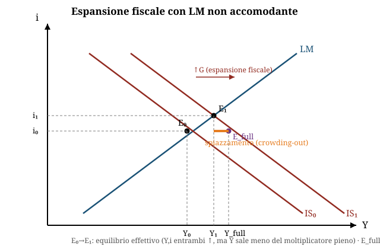

# Politica fiscale, bilancio pubblico e debito pubblico

**Domande d'esame collegate:**
- Calcolo del tasso di interesse che garantisce un rapporto debito/PIL costante, dati crescita PIL, inflazione, bilancio primario in pareggio
- "Cosa afferma il teorema di Haavelmo?"
- Da una tabella di conto economico della PA: calcolo di saldo corrente, indebitamento netto, saldo primario (% PIL), con commento
- IS-LM: spiegare graficamente l'efficacia della politica fiscale (moltiplicatore keynesiano) e lo spiazzamento finanziario (crowding-out) se la politica monetaria non è accomodante

---

**1. Il bilancio pubblico: definizioni e saldi**

- **Amministrazioni pubbliche (AAPP)** = amministrazioni centrali (settore statale + altri enti) + amministrazioni locali + enti di previdenza. È l'aggregato di riferimento della finanza pubblica (diverso da "settore pubblico" che include anche le aziende pubbliche tipo Poste, Ferrovie, Banca d'Italia).
- Composizione del bilancio:
  - **T (entrate)**: tributarie (imposte dirette + indirette) + contributi sociali
  - **G (spesa)**: consumi pubblici + investimenti pubblici + trasferimenti (TR)
  - **INT**: interessi sul debito pubblico

| Saldo | Formula | Significato |
|---|---|---|
| **Saldo corrente** | Entrate correnti − Spese correnti | Se positivo, lo Stato risparmia sulla gestione corrente (può finanziare investimenti) |
| **Saldo primario (Bp)** | **T − G** | Saldo al netto degli interessi: misura lo sforzo di finanza pubblica "sotto controllo" del governo (esclude l'eredità del debito passato) |
| **Saldo di bilancio / Indebitamento netto (Bs)** | **T − (G + INT)** | Saldo complessivo; se negativo = deficit = "indebitamento netto"; finanzia il fabbisogno con nuovo debito |

- **NB per l'esame**: il saldo primario **esclude** gli interessi, l'indebitamento netto li **include**. Un paese può avere saldo primario positivo (avanzo primario) e comunque indebitamento netto negativo (deficit) se la spesa per interessi è molto alta — è il caso storico dell'Italia.
- I saldi si esprimono sempre **in % del PIL** per essere comparabili nel tempo e tra paesi (soglia PSC storica: indebitamento netto ≤ 3% PIL, debito ≤ 60% PIL).

---

**2. Le imposte: tipologie ed effetti**

- **In somma fissa (T)**: non dipende dal reddito.
- **Proporzionale**: T = tY, aliquota costante.
- **Progressiva**: t₀ + t(y)Y, aliquota crescente col reddito, finalità redistributiva.
- L'imposizione **progressiva** è uno **stabilizzatore automatico**: in una recessione (Y↓) il prelievo fiscale medio scende più che proporzionalmente e i trasferimenti (sussidi di disoccupazione) salgono → si attutisce la caduta del reddito disponibile e dei consumi, senza bisogno di una manovra discrezionale.
- **Drenaggio fiscale (fiscal drag)**: con inflazione e aliquote progressive non indicizzate, un aumento del reddito solo *nominale* fa scattare aliquote più alte → il reddito reale netto diminuisce anche se il reddito reale lordo è invariato. Rimedi: credito d'imposta compensativo, indicizzazione degli scaglioni.
- **Erosione, elusione, evasione** indeboliscono gettito ed equità: concentrano il carico fiscale su categorie meno capaci di sottrarsi (tipicamente il lavoro dipendente). Evasione in Italia stimata 110-130 mld/anno (~5% del debito pubblico).

---

**3. Il finanziamento della spesa pubblica: deficit, debito, base monetaria**

- Se **T = G**: bilancio in pareggio, nessun nuovo debito.
- Se **T < G** (deficit): finanziamento tramite
  - emissione di titoli di debito pubblico (ΔB), oppure
  - creazione di base monetaria (ΔH) — **vietata nell'Unione Monetaria Europea**.
- Identità di finanziamento: **G + INT − T = ΔH + ΔB**
- Finanziamento con **base monetaria**: meno costoso (niente interessi), ma rischia inflazione ("tassa da inflazione": l'inflazione inattesa riduce il valore reale del debito a vantaggio del governo).
- Finanziamento con **debito**: costoso (interessi), ma non genera direttamente inflazione.
- **I titoli di debito pubblico sono ricchezza per chi li detiene?**
  - *No*, secondo il **Teorema di equivalenza ricardiana**: agenti "ultra-razionali" prevedono che il debito odierno implica tasse future più alte, quindi aumentano il risparmio oggi (spiazzamento reale) → l'effetto della spesa pubblica sul reddito è identico che sia finanziata con imposte o con debito.
  - *Sì*, in una visione più tradizionale: il reddito disponibile aumenta subito → i consumi aumentano (i titoli sono percepiti come ricchezza netta perché le tasse future ricadranno anche su altri/su generazioni diverse).

---

**4. Il debito pubblico e la sua sostenibilità (formula dinamica debito/PIL)**

- Il **debito pubblico** è lo *stock* accumulato nel tempo dai flussi di disavanzo, finanziato con emissione di titoli.
- Indicatore chiave: rapporto **debito/PIL = B/(p·Y)**. La sostenibilità richiede che questo rapporto sia **non crescente** nel tempo.

**Derivazione step-by-step della condizione di sostenibilità:**

1. Il rapporto debito/PIL aumenta se il tasso di crescita del debito supera la somma di inflazione e crescita reale:
 **Ḃ − ṗ − Ẏ > 0** (dove Ḃ = ΔB/B, ṗ = Δp/p, Ẏ = ΔY/Y)

2. Se non c'è finanziamento monetario, la variazione dello stock di debito in un periodo è pari al deficit primario più la spesa per interessi sul debito esistente:
 **ΔB = (G − T) + iB**

3. Caso particolare — **saldo primario nullo** (G − T = 0): allora ΔB = iB, quindi
 **Ḃ = ΔB/B = i**

4. Sostituendo nella condizione del punto 1 (Ḃ = i):
 **i − ṗ − Ẏ < 0 → i − ṗ < Ẏ**

 cioè: **il debito è sostenibile se il tasso di interesse reale (i − ṗ) è inferiore al tasso di crescita reale del PIL (Ẏ)**.

- Questa è la formula-chiave per i calcoli d'esame su "tasso di interesse compatibile con debito/PIL costante": si impone **i − ṗ = Ẏ** (rapporto esattamente costante, caso limite) e si risolve per l'incognita richiesta.
- Con **saldo primario non nullo**, la condizione si generalizza (bisogna tener conto anche del deficit/avanzo primario in % di PIL); la sostenibilità è più facile con: avanzo primario, finanziamento (parziale) con base monetaria, tasso di interesse basso, crescita del PIL alta, inflazione.
- Perché un debito troppo alto è un male: il risparmio si dirige verso i titoli pubblici anziché altri impieghi produttivi; rischio di insolvenza/crisi finanziaria e aumento dei tassi; rende difficili le manovre anticicliche.

---

**5. Il teorema di Haavelmo (teorema del bilancio in pareggio)**

**Cosa afferma:** un aumento della spesa pubblica finanziato con un pari aumento delle imposte (bilancio che resta in pareggio, ΔG = ΔT) **non è neutrale**: produce comunque un aumento del reddito di equilibrio pari all'aumento della spesa stessa. Il **moltiplicatore del bilancio in pareggio è uguale a 1**.

**Dimostrazione (modello reddito-spesa, imposta in somma fissa, economia chiusa):**

- Y = C + I + G
- C = c(Y − T), con I = Ī dato
- Sostituendo: Y = c(Y−T) + Ī + G → **Y = 1/(1−c) · (Ī + G − cT)**
- Differenziando: **ΔY = 1/(1−c) · (ΔG − cΔT)**
- Se ΔG = ΔT:
 ΔY = 1/(1−c) · (ΔG − cΔG) = 1/(1−c) · (1−c)ΔG = **ΔG**

**Intuizione economica:** l'aumento di G ha un effetto espansivo pieno (moltiplicatore 1/(1−c)) sulla domanda aggregata. L'aumento di T ha un effetto restrittivo minore, pari a c/(1−c), perché riduce il reddito disponibile ma i consumatori assorbono solo una quota c della minore disponibilità (il resto avrebbe comunque un peso minore rispetto all'iniezione diretta di spesa pubblica, che si traduce in domanda al 100%). La somma netta dei due effetti è esattamente pari a ΔG.

**Attenzione — vale solo con imposta in somma fissa.** Con imposta **proporzionale** (T = tY), il teorema **non vale più**:
- Y = 1/(1−c(1−t)) · (I₀ + G)
- ΔY = 1/(1−c(1−t)) · ΔG
- ΔT = t·ΔY = t/(1−c(1−t)) · ΔG
- Si dimostra che **ΔT < ΔG** sempre (perché t < 1−c(1−t) quando t<1): quindi con imposta proporzionale l'aumento di spesa genera un aumento di reddito maggiore dell'aumento di gettito fiscale indotto, e il bilancio pubblico peggiora anche se G e T "partono" dallo stesso importo nominale — il legame ΔG=ΔT del teorema si riferisce a una manovra di variazione delle aliquote/della spesa impostata ex-ante, non all'esito automatico.

---

**6. Politica fiscale e mercato dei prestiti: la visione neoclassica**

- Modello dei prestiti (equilibrio EEG, piena occupazione data): **S(r) = I(−r) + (G − T)**
 - S(r) = offerta di prestiti (risparmio delle famiglie, crescente in r)
 - I(−r) + (G−T) = domanda di prestiti (imprese + Stato)
- **Politica fiscale espansiva (↑G o ↓T) → effetto spiazzamento (crowding-out):**
 1. ↑(G−T) → aumenta la domanda di prestiti da parte dello Stato
 2. → aumenta il tasso di interesse reale r
 3. → aumentano i risparmi, **diminuiscono C e I privati**
 4. Nel nuovo equilibrio Y = Y* (invariato, perché piena occupazione), ma la quota di prodotto assorbita dallo Stato è cresciuta a scapito di quella privata: **la spesa pubblica sostituisce, non aggiunge, spesa privata**.
- Implicazioni di policy (visione 1 / neoclassica): contenere spesa pubblica e tassazione, evitare oscillazioni delle aliquote, limitare il ruolo della manovra di bilancio nella stabilizzazione. Condizione ideale: G − T = 0.

---

**7. Politica fiscale nel modello reddito-spesa keynesiano e IS-LM**

**Modello reddito-spesa (senza settore monetario), imposta in somma fissa:**
- Y = C + I + G; C = c(Y−T); I = I₀ → **Y = 1/(1−c) · (I₀ + G − cT)**
- **Moltiplicatore della spesa pubblica = 1/(1−c)** (con 0<c<1): un aumento di G si traduce in un aumento più che proporzionale di Y, perché la spesa iniziale genera reddito, che genera consumo aggiuntivo, che genera altro reddito, ecc. (↑I→↑Y→↑C→↑Y→↑C…)
- In economia **aperta** e con imposta proporzionale il moltiplicatore si riduce: Y = 1/(1−c(1−t)+m) · (I₀+G+X₀) — le "fughe" verso tasse e importazioni indeboliscono l'effetto moltiplicativo.

**Il modello IS-LM (integra il mercato dei beni con quello monetario):**
- La curva **IS** rappresenta le combinazioni (Y, r) che equilibrano il mercato dei beni: Y = C(Y−T) + I(r) + G. È inclinata negativamente (r↑ → I↓ → Y↓).
- La curva **LM** rappresenta le combinazioni (Y, r) che equilibrano il mercato della moneta (domanda di moneta = offerta data M/p). È inclinata positivamente (Y↑ → più domanda di moneta per transazioni → r deve salire per riequilibrare, a offerta di moneta data).
- **Efficacia della politica fiscale espansiva (↑G):**
 - La IS si sposta a destra (per ogni r, il livello di Y di equilibrio nel mercato dei beni è più alto).
 - Con LM invariata (politica monetaria **non accomodante**, offerta di moneta costante): il nuovo equilibrio si sposta lungo la LM verso l'alto a destra → **sia Y che r aumentano**.
 - L'aumento di Y è **minore** di quanto previsto dal moltiplicatore keynesiano "puro" (che si avrebbe a r costante), perché l'aumento di r **spiazza parzialmente gli investimenti privati** (↓I): questo è lo **spiazzamento finanziario (crowding-out)** — graficamente, la distanza tra lo spostamento "orizzontale" della IS (l'effetto moltiplicatore pieno, a r invariato) e lo spostamento effettivo di Y lungo la nuova LM misura esattamente il crowding-out.
 - Se invece la politica monetaria è **accomodante** (la Banca Centrale espande M in parallelo, spostando anche la LM a destra): r non sale (o sale meno), l'investimento privato non viene spiazzato, e l'aumento di Y è più vicino al pieno moltiplicatore keynesiano.
- Collegamento con la visione neoclassica: quando l'economia è già a piena occupazione (Y = Y_PO fisso, offerta rigida), l'aumento della domanda aggregata da politica fiscale non può tradursi in più Y reale e si scarica interamente sui tassi di interesse (o sui prezzi) → è il caso limite dello spiazzamento totale visto al punto 6.

---

**8. Vincoli europei alla politica di bilancio**

- **Trattato di Maastricht (1992)**: soglie **debito/PIL ≤ 60%**, **deficit/PIL ≤ 3%**. Con crescita nominale del 5%, un deficit/PIL del 3% stabilizza il debito/PIL al 60% (relazione approssimata: d stabile se f/d ≈ γ, cioè 3/60 = 5%).
- Logica delle regole: permettere agli stabilizzatori automatici di operare, assicurare la sostenibilità dei debiti, evitare rischi di contagio (spillover) fra paesi.
- Percorso storico: Patto di Stabilità e Crescita (1997) → riforma 2005 → Six Pack (2011) → Fiscal Compact (2012) → sospensione clausola di salvaguardia (2020, Covid) → **riforma del PSC (23 aprile 2024)**: piano nazionale strutturale di bilancio di medio termine (4-5 anni), percorsi di riduzione del debito differenziati per paese (più flessibili per paesi con debito > 90% PIL se accompagnati da riforme/investimenti), maggiore attenzione alla qualità della spesa, possibilità di trattare la spesa per la difesa come fattore flessibile.

---

## Esercizio tipo svolto

### Tipo 1 — Tasso di interesse per rapporto debito/PIL costante (domanda d'esame più probabile)

**Testo:** Un paese ha un tasso di crescita reale del PIL Ẏ = 2%, un tasso di inflazione ṗ = 1,5%, e un bilancio primario in pareggio (G = T). Qual è il tasso di interesse nominale i che mantiene costante il rapporto debito/PIL?

**Svolgimento:**

1. Con saldo primario nullo, la formula di sostenibilità impone che il rapporto debito/PIL resti costante quando:
 **i − ṗ = Ẏ**

2. Sostituendo i dati:
 i − 1,5% = 2%

3. **i = 2% + 1,5% = 3,5%**

**Commento:** con un tasso di interesse nominale del 3,5% (cioè un tasso reale del 2%, esattamente uguale alla crescita reale del PIL), il debito cresce alla stessa velocità del PIL nominale e il rapporto B/(pY) resta invariato. Se il tasso di interesse effettivo fosse superiore al 3,5% (a parità di crescita e inflazione), il rapporto debito/PIL aumenterebbe nonostante il pareggio primario — è la cosiddetta "palla di neve del debito" (snowball effect), ed è per questo che la condizione i − ṗ < Ẏ è il criterio-chiave di sostenibilità.

### Tipo 2 — Variante con saldo primario non nullo

**Testo:** Stesso paese di prima (Ẏ = 2%, ṗ = 1,5%), ma ora ha un **disavanzo primario** pari all'1% del PIL (G − T = 1% di Y). Il debito iniziale è pari all'80% del PIL. Il rapporto debito/PIL aumenta o diminuisce, se il tasso di interesse nominale è i = 4%?

**Svolgimento (logica, senza formula chiusa completa — impostazione da esame):**

1. Tasso di interesse reale: i − ṗ = 4% − 1,5% = 2,5%.
2. Confronto con la crescita: Ẏ = 2% < 2,5% (tasso reale) → la componente "palla di neve" da sola farebbe **aumentare** il rapporto debito/PIL (perché il costo reale del debito supera la crescita).
3. In più c'è un disavanzo primario dell'1% (G>T), che aggiunge ulteriore nuovo debito ogni anno.
4. **Conclusione: il rapporto debito/PIL aumenta**, per due ragioni cumulative: (a) il tasso di interesse reale supera la crescita, (b) il paese produce nuovo debito anche al netto degli interessi (disavanzo primario). Per stabilizzare il rapporto servirebbe o un avanzo primario sufficiente a compensare il differenziale (i−ṗ−Ẏ)×(debito/PIL), oppure una riduzione di i, oppure più crescita/inflazione.

*(Nota per l'esame: se il testo dà anche il livello iniziale del rapporto debito/PIL, la variazione approssimata del rapporto nel periodo è: Δ(B/Y) ≈ [(i−ṗ−Ẏ)×(B/Y)] + (disavanzo primario/PIL). Utile per rispondere a domande che chiedono "di quanto cambia" e non solo "aumenta o diminuisce".)*
