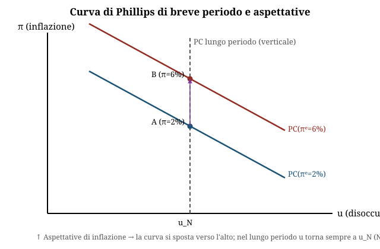
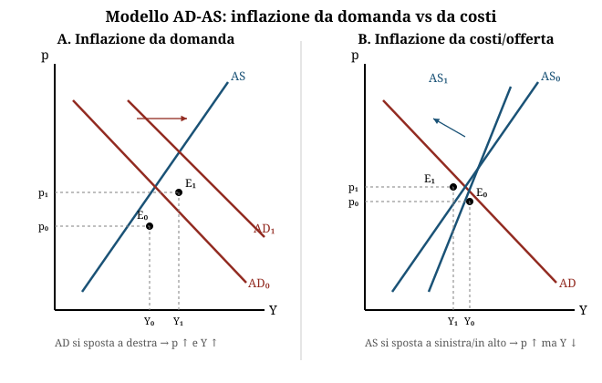

# Inflazione e Curva di Phillips

**Domande d'esame collegate:** Calcolo con curva dei salari tipo ẇ=0,55-5u (relazione salario-disoccupazione), tasso di inflazione, effetto di una politica dei redditi (es. taglio salari -2%) sulla disoccupazione · Calcolo salario reale, PIL reale/nominale, quota salari su reddito · Perché in concorrenza perfetta non c'è disoccupazione volontaria · Cause dell'inflazione · Perché la deflazione è dannosa · Chi è svantaggiato dall'inflazione · Rappresentare graficamente inflazione da domanda e da costi con il modello AD-AS · Relazione tra curva AS e curva di Phillips

---

**1. Definizione e misura dell'inflazione**

- L'**inflazione** è un processo di aumento continuo e generalizzato del livello dei prezzi dei beni e servizi al consumo.
- **Tasso di inflazione**: **π = ṗ = (variazione dei prezzi nell'unità di tempo) / (livello dei prezzi)**.
- Un tasso del 10% annuo composto per 10 anni porta un prezzo di 100€ a 259€ (non 200€: è un tasso di crescita composto, non lineare).
- Si misura come tasso di crescita annuo o come indice (base = 100 in un anno di riferimento), tramite **indici** costruiti come media ponderata dei prezzi di un **paniere**:
  - indice **al consumo** (il più usato, paniere ampio di beni/servizi delle famiglie);
  - indice alla produzione;
  - indice all'ingrosso;
  - **deflatore implicito del PIL** = PIL nominale / PIL reale.

**2. Cause dell'inflazione**

| Tipo | Meccanismo |
|---|---|
| **Da domanda** | Aumento della domanda aggregata; l'offerta non si adegua nel breve periodo → produttori alzano i prezzi |
| **Da offerta / da costi** | Shock che riducono l'offerta o fanno salire i costi di produzione (materie prime, lavoro, macchinari, guerre); il trasferimento sui prezzi dipende dalla struttura di mercato |
| **Importata** | Aumento del prezzo delle materie prime acquistate all'estero |
| **Da profitti** | Aumento dei margini di profitto (mark-up) in mercati non concorrenziali |
| **Da eccesso di moneta** | Teoria monetarista: espansione incontrollata dell'offerta di moneta da parte delle banche centrali rispetto alle merci prodotte |
| **Da aspettative** | I lavoratori/imprese incorporano l'inflazione attesa nelle richieste salariali/nei prezzi, alimentando l'inflazione effettiva (vedi curva di Phillips aumentata, punto 6) |

**3. Il principio del costo pieno e l'inflazione come conflitto distributivo**

- Ipotesi: mercati non concorrenziali → le imprese sono **price-maker**.
- Le imprese fissano il prezzo come costo del lavoro per unità di prodotto (**CLUP** = w/θ) più un **mark-up** (1+g):

  **p = (1 + g) · w/θ**   dove θ = Y/N è la produttività media del lavoro

- In termini dinamici, il **tasso di inflazione** (equazione del costo pieno):

  **π = ṗ = ẇ − θ̇ + (1+g)˙**

  (ẇ = crescita salari nominali, θ̇ = crescita produttività, (1+g)˙ = variazione del mark-up)

- L'inflazione nasce dal **conflitto distributivo** tra imprese (che vogliono il mark-up) e sindacati (che vogliono il salario reale w/p) sulla ripartizione del reddito.

**4. Salario reale, PIL reale/nominale, quota salari**

- **Salario reale** = w/p (potere d'acquisto del salario nominale w).
- **PIL nominale** = pY (valore a prezzi correnti); **PIL reale** = Y (valore a prezzi costanti, "quantità"); **deflatore del PIL** = PIL nominale/PIL reale.
- Due categorie di reddito: lavoratori e percettori di profitto → **pY = W + PR**, con **W = wN** (reddito da lavoro = salario nominale × occupati).
- **Quota di reddito da lavoro** = wN/pY = (w/p)/θ (salario reale su produttività del lavoro).
- La quota di reddito da lavoro **non varia** se: **ẇ − ṗ − θ̇ = 0**.
- Se il mark-up è costante ((1+g)˙=0) e il salario cresce quanto la produttività (ẇ = θ̇), allora π = 0: nessuna inflazione e **quote distributive invariate**. Nei dati OECD reali, la quota salari su reddito è comunque scesa in quasi tutti i paesi G20 dal 1970 al 2011.

**5. Politiche anti-inflazionistiche, in base alla causa**

| Causa dell'inflazione | Politica |
|---|---|
| Conflitto distributivo (salari/prezzi) | **Politica dei redditi** + politiche per la produttività |
| Profitti in mercati non concorrenziali | Politiche per la concorrenza + price cap |
| Domanda o eccesso di moneta | Politica monetaria |

- **Politica dei redditi**: accordi tra imprese e sindacati, con intervento del Governo, per controllare la dinamica di salari e profitti ed evitare l'aumento del livello generale dei prezzi (fondamento: principio del costo pieno).
  - Controllo dei salari (blocco, o crescita = produttività — ma quale produttività, viste le dinamiche settoriali diverse?).
  - Controllo dei prezzi (= controllo dei margini di profitto).
  - Relazioni industriali: **scambio economico** (vantaggi fiscali/economici) o **scambio politico** (impegni del governo su materie non economiche → **patto sociale**).
  - Esempi italiani: 1984 predeterminazione della "scala mobile" (per bloccare la spirale salari-inflazione); 1993 aumenti salariali basati su inflazione programmata + contrattazione di secondo livello.

**6. La curva di Phillips (originaria)**

- Relazione empirica tra tasso di disoccupazione u e tasso di variazione dei **salari monetari** ẇ (Phillips, dati UK 1861-1957):

  **ẇ = γ(u)**

- Curva decrescente e convessa. **uN (o u\*)** = tasso di disoccupazione naturale: al di sotto le imprese offrono salari più alti per attirare lavoratori (ẇ>0), al di sopra i salari ristagnano o scendono.

**7. La curva di Phillips "menù di scelta" (Samuelson-Solow)**

- Sostituendo ẇ = γ(u) nell'equazione del costo pieno (π = ẇ − θ̇ + (1+g)˙) si ottiene:

  **π = γ(u) − θ̇ + (1+g)˙**

- Mostra un **trade-off tra inflazione e disoccupazione**: il policymaker può ridurre u accettando più π, muovendosi **lungo** la curva (non spostandola).
- La scelta ottimale è nel punto di tangenza tra il vincolo (CdP) e la funzione obiettivo del policymaker (curve di indifferenza tra i due "mali" inflazione e disoccupazione) — collegato alla **regola aurea di Tinbergen**: se n. strumenti < n. obiettivi non tutti gli obiettivi sono raggiungibili contemporaneamente; si rinuncia a qualche obiettivo, si aggiungono strumenti, o si passa a "obiettivi flessibili" (funzione di perdita da minimizzare).

**8. Curva di Phillips aumentata dalle aspettative (Friedman-Phelps, 1968)**

- La relazione non è stabile nel **lungo periodo** perché trascura l'**inflazione attesa** πᵉ:

  **πt = γ(u) + πᵉt**

- Con **aspettative adattive**: πᵉt = πᵉ(t-1) + λ(π(t-1) − πᵉ(t-1)), 0<λ<1. Le imprese aggiustano le aspettative istantaneamente, i lavoratori con ritardo.
- Esiste una famiglia di **curve di Phillips di breve periodo (SRPC)**, una per ogni livello di aspettative, e una **curva di lungo periodo (LRPC) verticale in corrispondenza di uN**: nel lungo periodo non c'è trade-off, solo nel breve.
  - u < uN → π > πᵉ (l'economia "surriscalda")
  - u = uN → π = πᵉ (equilibrio, aspettative corrette)
  - u > uN → π < πᵉ

- Con λ=1 (caso limite): πᵉt = π(t-1). Se u resta stabilmente sotto u\*, l'inflazione **accelera** periodo dopo periodo invece di stabilizzarsi (vedi esercizio tipo).

**9. Perché in concorrenza perfetta non c'è disoccupazione volontaria**

- In concorrenza perfetta il salario è determinato dall'incontro tra domanda e offerta di lavoro: al salario di equilibrio, domanda e offerta di lavoro coincidono e chi vuole lavorare a quel salario trova impiego.
- Non essendoci rigidità di prezzi/salari né potere di mercato, non si generano eccessi di offerta di lavoro persistenti: eventuale disoccupazione osservata sarebbe solo frizionale/di breve aggiustamento, non "involontaria" nel senso di lavoratori disposti a lavorare al salario vigente ma esclusi dal mercato. La disoccupazione involontaria richiede invece imperfezioni di mercato (salari rigidi verso il basso, potere contrattuale, informazione imperfetta, principio del costo pieno con price-maker) — è per questo che nei modelli con conflitto distributivo (punto 3) e nella curva di Phillips esiste un uN "naturale" positivo anche in equilibrio.

**10. Modello AD-AS: inflazione da domanda vs da costi (rappresentazione grafica)**

- Assi: prezzo p (verticale), reddito/output Y (orizzontale). AD inclinata negativamente, AS inclinata positivamente (o verticale nel lungo periodo).
- **Inflazione da domanda**: la curva **AD si sposta a destra** (più domanda aggregata) → nuovo equilibrio con **p più alto e Y più alto** lungo la stessa AS.
- **Inflazione da costi/offerta**: la curva **AS si sposta a sinistra/verso l'alto** (costi di produzione più alti o shock di offerta negativo) → nuovo equilibrio con **p più alto ma Y più basso**.
- Collegamento con la Curva di Phillips: uno spostamento di AD a destra corrisponde a un movimento **lungo** la CdP (meno u, più π — trade-off "normale"). Uno shock di AS negativo genera invece **più inflazione E più disoccupazione insieme**: è la **stagflazione** (USA anni '70), un caso in cui il trade-off della CdP tradizionale si rompe perché l'origine dello shock non è la domanda ma l'offerta.

**11. Perché la deflazione è dannosa**

- La deflazione (prezzi in calo continuo) non è il semplice "specchio" positivo dell'inflazione:
  - i consumatori rinviano gli acquisti aspettandosi prezzi ancora più bassi in futuro → crollo della domanda aggregata, che alimenta ulteriore deflazione (spirale deflattiva);
  - il valore reale dei debiti **aumenta** (effetto opposto rispetto all'inflazione) → aggrava la posizione dei debitori, può portare a insolvenze e instabilità finanziaria;
  - i salari nominali sono rigidi verso il basso, quindi un aggiustamento via deflazione genera più facilmente disoccupazione invece che riduzione ordinata dei salari reali;
  - la politica monetaria convenzionale perde efficacia (rischio di tassi di interesse reali troppo alti anche con tassi nominali a zero — "trappola della liquidità").

- In sintesi: la deflazione redistribuisce ricchezza dai debitori ai creditori (opposto dell'inflazione non attesa) e deprime la domanda, con effetti recessivi che si autoalimentano.

**12. Chi è danneggiato dall'inflazione**

| Situazione | Chi guadagna | Chi perde |
|---|---|---|
| **Inflazione non attesa** | Debitori (il valore reale del debito si riduce) | Creditori (il valore reale del credito si riduce); percettori di **redditi fissi** (pensioni, stipendi non indicizzati) — subiscono una perdita di potere d'acquisto |
| **Inflazione attesa** (anche se corretta) | — | Tutti sostengono comunque **menù costs** (costo di revisione dei listini prezzi) e **shoe-leather costs** (costo-opportunità di detenere circolante che si svaluta) |
| **Iperinflazione** | — | Instabilità finanziaria generalizzata, danno diffuso |

- In generale: l'inflazione non prevista **redistribuisce** reddito e ricchezza (modifica i prezzi relativi e il valore reale di crediti/debiti); l'inflazione anticipata ha comunque dei costi reali di aggiustamento anche se non redistribuisce.

---

## Esercizio tipo svolto

**Traccia (analoga a quella d'esame):**
Il mercato del lavoro di un paese è descritto dalla curva dei salari:

**ẇ = 0,55 − 5u**

dove ẇ è il tasso di variazione dei salari monetari e u il tasso di disoccupazione (in decimali, es. u=0,10 = 10%). Si ipotizzi θ̇ = 0 (produttività costante) e mark-up costante, (1+g)˙ = 0.

**a) Determinare il tasso di disoccupazione naturale (uN)**, cioè quello per cui i salari monetari sono stabili (ẇ = 0):

  0,55 − 5uN = 0
  5uN = 0,55
  **uN = 0,11 → 11%**

**b) Se il tasso di disoccupazione effettivo è u = 8% (0,08), calcolare ẇ e il tasso di inflazione π.**

  ẇ = 0,55 − 5(0,08) = 0,55 − 0,40 = **0,15 → 15%**

  Con θ̇ = 0 e (1+g)˙ = 0, dall'equazione del costo pieno π = ẇ − θ̇ + (1+g)˙:

  **π = ẇ = 15%**

  (Con u=8% sotto il livello naturale dell'11%, il mercato del lavoro è "surriscaldato": i salari crescono più velocemente e questo si trasferisce interamente in inflazione, dato che produttività e mark-up sono fermi.)

**c) Politica dei redditi: taglio dei salari nominali del 2% (Δẇ = −2 punti percentuali). Quale disoccupazione è compatibile con lo stesso tasso di crescita salariale, cioè quale u riporta ẇ al livello desiderato (es. si vuole ẇ = 15% − 2% = 13%)?**

  13% = 0,55 − 5u
  5u = 0,55 − 0,13 = 0,42
  **u = 0,084 → 8,4%**

  Interpretazione: a parità di dinamica salariale desiderata più bassa, la curva dei salari implica che serve un tasso di disoccupazione leggermente più alto (dall'8% all'8,4%) per ottenerla — oppure, letto al contrario: un intervento di politica dei redditi che taglia direttamente i salari nominali del 2% (spostando la relazione, non muovendosi lungo di essa) permette di ottenere la stessa dinamica salariale (e quindi la stessa inflazione, visto il costo pieno) con un tasso di disoccupazione più basso di quanto richiederebbe il solo meccanismo di mercato — è esattamente l'obiettivo della politica dei redditi (punto 5): **controllare l'inflazione senza dover scaricare tutto l'aggiustamento sulla disoccupazione**, riducendo il "prezzo" in termini di posti di lavoro persi rispetto a una politica puramente restrittiva (monetaria/fiscale) che agirebbe solo alzando u lungo la curva.

**d) Che succede se il governo cerca di mantenere u=8% (sotto uN=11%) periodo dopo periodo, con aspettative adattive e λ=1?**

  Con la curva di Phillips aumentata πt = γ(ut) + πᵉt e πᵉt = π(t-1):

  | t | πᵉt | ut | ẇt (=πt, dato θ̇=0, mark-up costante) |
  |---|-----|-----|-----|
  | 0 | 0% | 8% | γ(8%) = 15% |
  | 1 | 15% | 8% | γ(8%) + πᵉ1 = 15% + 15% = 30% |
  | 2 | 30% | 8% | 15% + 30% = 45% |

  L'inflazione **non si stabilizza**, ma **accelera** di periodo in periodo (accelerazionismo di Friedman-Phelps): mantenere u permanentemente sotto uN non è sostenibile, perché ogni periodo le aspettative si aggiornano sull'inflazione passata e la spingono ulteriormente verso l'alto. L'unico modo per fermare l'accelerazione è lasciare che u torni a uN = 11%, dove ẇ = γ(uN) = 0 e l'inflazione si stabilizza al livello atteso (costante, non necessariamente zero se le aspettative pregresse erano positive).
