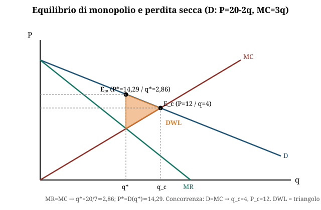
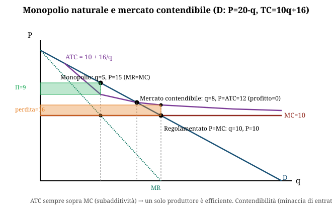

# Concorrenza imperfetta, monopolio e politiche per la concorrenza

**Domande d'esame collegate:**

- Dato mercato con domanda P=20-2q, MC=3q: calcolo della perdita secca (deadweight loss) di monopolio
- Domanda aperta applicata: caso antitrust reale (es. FTC vs Facebook/Instagram/WhatsApp) → discussione su politica della concorrenza
- Dato mercato con domanda P=20-Q, costi TC=10q+16: verificare che sia un monopolio naturale, calcolare l'equilibrio di monopolio (prezzo, quantità, profitti), calcolare l'equilibrio in caso di mercato contendibile, calcolare la perdita del monopolista con regolamentazione P=MC

---

## 1. **I fallimenti del mercato e la concorrenza imperfetta**

- Il mercato fallisce quando non è **concorrenziale** (pochi operatori, rendimenti di scala crescenti, barriere di entrata/uscita, accordi/intese, informazione asimmetrica) oppure quando è **non completo** (esternalità, beni pubblici, costi di transazione).
- In condizioni di concorrenza imperfetta l'equilibrio dell'impresa è **MR = MC** (ricavo marginale = costo marginale), ma a differenza della concorrenza perfetta questo implica **P > MC**: l'impresa ha **potere di mercato**.
- Forme di mercato non concorrenziale, in ordine di intensità del potere di mercato (dal continuum Concorrenza perfetta → Concorrenza monopolistica → Oligopolio → Monopolio puro):
  - **Monopolio**: legale (brevetti), di fatto (strategico), **naturale** (tecnologico)
  - **Oligopolio**: poche imprese, interazione strategica e interdipendenza delle decisioni
  - **Concorrenza monopolistica**: prodotto non omogeneo (differenziazione, pubblicità)
  - **Collusione**: accordi/intese fanno comportare le imprese come un unico monopolista

## 2. **Potere di mercato e indice di Lerner**

- **Potere di mercato (PdM)** = capacità dell'impresa di fissare **P > MC**
- Deriva da: barriere all'entrata, economie di scala (monopolio naturale), accordi ed intese
- Si misura con l'**indice di Lerner**:

**L = (P − MC) / P**

- L varia tra 0 (concorrenza perfetta, P=MC) e valori prossimi a 1 (forte potere di mercato). Più L è alto, più l'impresa si allontana dall'equilibrio concorrenziale.

## 3. **Efficienza allocativa e benessere sociale**

- Il benessere sociale (BS) è la somma di surplus del consumatore (SC) e surplus del produttore (SP): **BS = SC + SP**
- **SC** = differenza tra disponibilità a pagare (curva di domanda) e prezzo effettivamente pagato
- **SP** = differenza tra prezzo di vendita e costo marginale (curva di offerta)
- In **concorrenza perfetta** l'equilibrio (P_C, Q_C, dove Domanda = Offerta = MC) **massimizza il BS** ed è **Pareto-efficiente**: non esistono scambi mutualmente vantaggiosi non sfruttati.

## 4. **Equilibrio di monopolio — derivazione step-by-step**

Metodo generale per una funzione di domanda lineare **P = a − bQ** e un costo marginale **MC(Q)**:

1. **Ricavo totale**: TR = P·Q = (a − bQ)·Q = aQ − bQ²
2. **Ricavo marginale**: MR = dTR/dQ = a − 2bQ
    - Regola pratica: il MR ha **la stessa intercetta** della domanda ma **pendenza doppia**

3. **Condizione di massimo profitto**: MR = MC → si risolve per **Q_M** (quantità di monopolio)
4. **Prezzo di monopolio**: si sostituisce Q_M nella funzione di domanda → **P_M = a − bQ_M**
5. **Profitto**: **π = TR(Q_M) − TC(Q_M) = P_M·Q_M − TC(Q_M)**

- Il monopolista, a differenza del concorrenziale, **non produce dove D = MC** ma dove **MR = MC**, quindi produce **meno** e vende a un **prezzo più alto** rispetto al livello concorrenziale (P_M > P_C, Q_M < Q_C).

## 5. **Perdita secca (deadweight loss) di monopolio**

- Il monopolista pone MR=MC e produce Q_M < Q_C (quantità concorrenziale, dove Domanda=MC)
- **In monopolio il surplus totale è inferiore rispetto al mercato concorrenziale**: esistono scambi mutualmente vantaggiosi non realizzati tra Q_M e Q_C
- Il triangolo compreso tra Q_M, Q_C e la curva di domanda/offerta è la **perdita secca (DWL)**

**Formula e metodo di calcolo della DWL:**

- **Metodo del triangolo**: DWL = ½ · (Q_C − Q_M) · [P_M − MC(Q_M)]
- **Metodo dell'integrale** (equivalente, utile quando MC non è costante): DWL = ∫ da Q_M a Q_C di [Domanda(Q) − MC(Q)] dQ
- I due metodi danno lo stesso risultato; con domanda e MC lineari conviene il metodo del triangolo.

## 6. **Monopolio naturale**

- **Definizione**: si ha monopolio naturale quando i **costi fissi sono molto elevati** (barriera all'entrata) e i **costi variabili sono relativamente bassi**, tipico delle *utilities* (acqua, gas, energia elettrica, rifiuti, trasporto pubblico locale) che devono costruire e mantenere un'infrastruttura di rete.
- **Come si verifica**: si confronta il **costo medio totale (ATC/CMeT)** con la **domanda** (o con il costo marginale). Se l'ATC è **decrescente** su tutto il range di quantità rilevante ed è sempre **superiore al MC** (per la presenza di costi fissi elevati spalmati su più unità), allora un'unica impresa produce a costo inferiore rispetto a più imprese che si dividono il mercato → è **subadditivo** → monopolio naturale.
- Graficamente: ATC decrescente, MC = M costante e sotto l'ATC; MR e Domanda si incrociano con MC in Q\* (quantità di monopolio), mentre Domanda incrocia MC in Q\*\* > Q\* (quantità efficiente). Il rettangolo Π tra P\* e ATC è il profitto di monopolio; il triangolo S tra Q\* e Q\*\* è la perdita secca.

## 7. **Mercati contendibili**

- **Definizione**: mercato con **libertà di entrata e uscita senza costi** (assenza di *sunk costs*, costi affondati)
- **Hit and run entry**: se le imprese presenti hanno **profitti positivi**, nuove imprese entrano offrendo un prezzo leggermente più basso; le imprese insediate sono costrette a ridurre il prezzo, e le nuove entrate possono uscire senza costi se non conviene più restare
- **Anche in presenza di economie di scala** (quindi anche in un monopolio naturale), in un mercato contendibile le imprese realizzano **profitti nulli** (equilibrio hit-and-run-proof)
- L'equilibrio contendibile **non è efficiente nel senso di Pareto** (il prezzo resta comunque pari al costo medio, non al costo marginale)
- Il **prezzo limite** è il prezzo più basso compatibile con profitti nulli (P = ATC) che scoraggia l'entrata di nuovi concorrenti pur non essendo pari al costo marginale
- La **deregolamentazione** trova il suo fondamento teorico proprio nella teoria dei mercati contendibili

## 8. **Regolamentazione P=MC e perdita del monopolista naturale**

- La regola di prezzo ideale dal punto di vista dell'efficienza sarebbe **P = MC** (come in concorrenza perfetta)
- **Ma in presenza di monopolio naturale ciò non è possibile**: dato che l'ATC è sempre superiore al MC (per i costi fissi elevati), imporre P = MC significa fissare un prezzo **inferiore al costo medio**, quindi il monopolista **subisce una perdita** pari, nel caso di costi lineari, ai **costi fissi non recuperati**
- Per questo in pratica si regolano i prezzi con strumenti alternativi:
  - **Price cap** (in particolare il **price cap dinamico**): tasso consentito di aumento del prezzo = **IPC − x**, dove IPC è il tasso di inflazione al consumo e x è deciso dal regolatore in base al miglioramento atteso della produttività
  - Limite massimo al **margine di profitto** (rischio: le imprese gonfiano i costi medi)
  - Limite massimo al **tasso di rendimento sul capitale investito** (rischio: sovracapitalizzazione)
  - Limite massimo diretto al **prezzo** (richiede informazioni molto attendibili sui costi; asimmetria informativa impresa-regolatore → *yardstick competition*)

## 9. **Politiche per la concorrenza e antitrust**

- **Liberalizzazione e apertura dei mercati**: eliminazione di barriere di entrata/uscita non giustificate da altri fallimenti del mercato; l'apertura internazionale riduce il potere di mercato ma solo nei settori *tradables* e solo nel breve periodo (nel lungo periodo possono formarsi oligopoli internazionali)
- **Scissione del monopolista privato** in imprese più piccole (separazione orizzontale/verticale, es. baby bells)
- **Asta** per il diritto a produrre in condizioni di monopolio: se competitiva, trasferisce i profitti di monopolio dall'impresa vincitrice allo Stato
- **Legislazione antimonopolistica (antitrust)**: previene la formazione di monopoli/accordi collusivi e sanziona quelli in essere
  - USA: Sherman Act (1890), Clayton Act (1914)
  - Europa: Trattato di Roma (1957) e Amsterdam (1997), TFUE artt. 101-109, Merger Regulation 139/2004
  - Italia: legge 287/90, ricalca la normativa europea

- **Impresa pubblica** (nazionalizzazione): rinuncia all'obiettivo di massimo profitto per perseguire finalità pubbliche (efficienza in monopolio naturale, sviluppo di un settore); criticata per carenze manageriali (relazione **agente-principale**) e clientelismo
- **Regolamentazione**: controllo diretto tramite regole (entrata, concorrenza effettiva, tariffe/prezzi)

### Tabella riassuntiva — confronto tra strutture di mercato

| Caratteristica | Concorrenza perfetta | Monopolio (generico) | Monopolio naturale | Mercato contendibile |
|---|---|---|---|---|
| **Equilibrio** | P = MC | MR = MC, P > MC | MR = MC, P > ATC | P = ATC (profitti nulli) |
| **Numero imprese effettive** | Molte | Una | Una (efficiente per costi) | Una o poche, ma minacciate da entrata |
| **Barriere all'entrata** | Assenti | Presenti (legali/naturali/strategiche) | Costi fissi elevati | Assenti (no sunk costs) |
| **Profitti di lungo periodo** | Nulli | Positivi | Positivi (Π) | Nulli |
| **Efficienza allocativa (Pareto)** | Sì | No (DWL) | No (DWL) | No (P≠MC, ma P=ATC) |
| **Indice di Lerner (L)** | 0 | Alto (>0) | Alto (>0), ma limitato dalla contendibilità potenziale | Basso/nullo se pienamente contendibile |

### Legislazione antitrust europea (e italiana) — quadro sintetico

| Norma (TFUE / L.287-90) | Oggetto | Esempi |
|---|---|---|
| **Art. 101 TFUE** (art. 2 e 4) | Intese | Orizzontali: fissazione congiunta prezzi, spartizione mercati. Verticali: accordi di esclusiva, prezzi imposti |
| **Art. 102 TFUE** (art. 3) | Abuso di posizione dominante | Prezzi ingiustificatamente gravosi, ostacoli all'accesso, comportamenti che inducono l'uscita |
| **Merger Regulation** (art. 6) | Fusioni e acquisizioni | Controllo delle concentrazioni |

- **Mercato rilevante**: definito per dimensione merceologica (sostituibilità dei beni, misurata dall'**elasticità incrociata**) e dimensione geografica (costi di trasporto, barriere linguistiche/normative)
- **Posizione dominante**: l'impresa può comportarsi in modo indipendente dai concorrenti e dai consumatori
- **Concentrazione**: si misura con **quoziente di concentrazione** e **indice di Herfindahl**

## 10. **Cenni di politica antitrust — casi applicati da conoscere**

- **FTC vs Facebook (2020)**: la FTC ha citato in giudizio Meta/Facebook per monopolizzazione illegale, contestando in particolare le acquisizioni "predatorie" di Instagram e WhatsApp come strategia per eliminare concorrenti emergenti (*buy or bury*) e mantenere la posizione dominante nei social network personali. Rimedio proposto: la separazione (divestiture) di Instagram e WhatsApp da Facebook — causa tuttora in corso/in contenzioso, non un caso concluso. Domanda aperta tipica: discutere se la vendita di Instagram e WhatsApp migliorerebbe il benessere sociale (argomenti pro: più concorrenza, meno barriere per nuovi entranti, prezzo pubblicitario più basso; argomenti contro: perdita di sinergie/economie di scala e di rete, possibili minori investimenti in sicurezza/qualità).
- **AGCM vs Google (istruttoria 2023)**: caso italiano di presunto abuso di posizione dominante, chiuso con impegni (commitments) accettati da Alphabet. Da collegare ai concetti di **posizione dominante** e **interoperabilità**.
- Schema logico da usare per rispondere a una domanda aperta di questo tipo: (1) individuare il mercato rilevante, (2) verificare l'esistenza di posizione dominante, (3) individuare la condotta abusiva/anticompetitiva contestata, (4) valutare il rimedio proposto (comportamentale o strutturale) rispetto all'effetto sul benessere sociale (SC+SP), citando esplicitamente il trade-off tra maggiore concorrenza e perdita di eventuali economie di scala/rete.

---

## **Esercizio tipo svolto 1 — Perdita secca di monopolio**

**Dati**: Domanda inversa P = 20 − 2q; Costo marginale MC = 3q

**Passo 1 — Ricavo marginale**
TR = P·q = (20 − 2q)·q = 20q − 2q²
MR = dTR/dq = 20 − 4q

**Passo 2 — Equilibrio di monopolio (MR = MC)**
20 − 4q = 3q → 20 = 7q → **q_M = 20/7 ≈ 2,857**
P_M = 20 − 2·(20/7) = 20 − 40/7 = **100/7 ≈ 14,29**

**Passo 3 — Equilibrio concorrenziale (P = MC, benchmark efficiente)**
20 − 2q = 3q → 20 = 5q → **q_C = 4**
P_C = 20 − 2·4 = **12**

**Passo 4 — Perdita secca (metodo del triangolo)**
Al livello Q_M, il costo marginale vale: MC(q_M) = 3·(20/7) = 60/7 ≈ 8,571
DWL = ½ · (q_C − q_M) · [P_M − MC(q_M)]
DWL = ½ · (4 − 20/7) · (100/7 − 60/7)
DWL = ½ · (8/7) · (40/7)
DWL = 160/49 ≈ **3,27**

**Verifica con il metodo dell'integrale** (stesso risultato):
DWL = ∫ da q_M a q_C di (20 − 5q) dq = [20q − 2,5q²] da 20/7 a 4 = 40 − 36,73 ≈ **3,27** ✓

**Conclusione**: rispetto al mercato concorrenziale, il monopolista riduce la quantità da 4 a 2,857 unità e alza il prezzo da 12 a 14,29. La perdita secca di benessere sociale è di circa **3,27** (unità monetarie).

---

## **Esercizio tipo svolto 2 — Monopolio naturale e mercato contendibile**

**Dati**: Domanda inversa P = 20 − Q; Costo totale TC = 10q + 16 (quindi MC = 10 costante, costo fisso = 16)

**Passo 1 — Verifica che sia un monopolio naturale**
Costo medio totale: ATC = TC/q = 10 + 16/q

- ATC è **decrescente** al crescere di q (per la presenza del costo fisso 16 spalmato su più unità) e **sempre superiore al MC = 10**
- Un'unica impresa produce a costo medio inferiore rispetto a due imprese che si dividano la stessa quantità totale (i costi fissi si duplicherebbero) → il costo è **subadditivo**
→ Si conferma che si tratta di un **monopolio naturale**

**Passo 2 — Equilibrio di monopolio**
TR = P·Q = (20 − Q)·Q = 20Q − Q²
MR = 20 − 2Q
MR = MC → 20 − 2Q = 10 → **Q_M = 5**
P_M = 20 − 5 = **15**
Profitto: π = TR − TC = (15·5) − (10·5 + 16) = 75 − 66 = **π = 9**

**Passo 3 — Equilibrio in mercato contendibile (profitti nulli, P = ATC)**
Si impone P = ATC, cioè si cerca l'intersezione tra Domanda e ATC:
20 − Q = 10 + 16/Q
Moltiplicando per Q: 20Q − Q² = 10Q + 16 → Q² − 10Q + 16 = 0
Risolvendo: Q = [10 ± √(100 − 64)] / 2 = (10 ± 6) / 2 → **Q = 2 oppure Q = 8**

- A Q = 2: P = 18 (ATC = 10+16/2 = 18) → ma non è un equilibrio stabile: per quantità intermedie (es. Q=5) il prezzo di domanda (15) è superiore all'ATC (13,2), quindi un entrante potrebbe inserirsi con un prezzo più basso e restare comunque profittevole → questo punto viene "eroso" dalla contendibilità
- A **Q = 8**: P = 12 (ATC = 10+16/8 = 12) → oltre Q=8 il prezzo di domanda scende sotto l'ATC (non profittevole), quindi nessun entrante trova conveniente espandersi oltre → questo è l'equilibrio **stabile (hit-and-run-proof)**

**Equilibrio contendibile: Q = 8, P = 12, profitto = 12·8 − (10·8+16) = 96 − 96 = 0**

Rispetto al monopolio "protetto" (Q=5, P=15, π=9), la contendibilità costringe il monopolista naturale ad aumentare la quantità (da 5 a 8) e abbassare il prezzo (da 15 a 12) fino ad azzerare il profitto, pur restando un'unica impresa a produrre (l'equilibrio non è comunque Pareto-efficiente perché P=12 > MC=10).

**Passo 4 — Perdita del monopolista con regolamentazione P = MC**
Si impone P = MC = 10:
20 − Q = 10 → **Q = 10**
Verifica profitto: TR = 10·10 = 100; TC = 10·10 + 16 = 116
**π = 100 − 116 = −16**

**Conclusione**: imponendo il prezzo efficiente P=MC=10, il monopolista naturale **subisce una perdita di 16**, esattamente pari ai costi fissi non recuperati (il prezzo copre solo il costo variabile/marginale ma non i costi fissi). Questo è il motivo per cui in pratica, per i monopoli naturali (utilities), non si impone P=MC ma si ricorre a strumenti come il **price cap** o al prezzo di equilibrio contendibile P=ATC (Passo 3), che garantiscono almeno la sopravvivenza economica dell'impresa.
