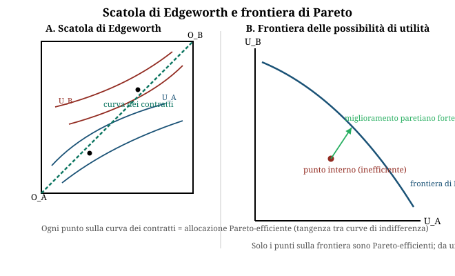

# Economia del benessere e teoria normativa della politica economica

**Domande d'esame collegate:**

- Data una tabella di utilità di 3 individui in 3 stati sociali diversi: individuare gli stati Pareto-efficienti; determinare la scelta collettiva secondo Funzione di Benessere Sociale (FBS) utilitarista, rawlsiana, e di Bergson-Samuelson (es. W=U1×U2); commentare i risultati.
- Domanda teorica standalone: "Spiegate perché in presenza di mercati completi, un sistema di concorrenza perfetta raggiunge una situazione di ottimo paretiano" (Primo Teorema dell'economia del benessere).

---

## 1. **Perché serve l'economia del benessere**

- L'obiettivo della politica economica è la **massimizzazione del benessere della collettività**.
- L'**economia del benessere** si occupa dei fondamenti dell'azione pubblica: individuare le **preferenze e gli obiettivi sociali** a partire dalle preferenze individuali (**individualismo etico e metodologico** — ciascuno è il miglior giudice di se stesso).
- Il problema centrale è **aggregare** le preferenze individuali in una preferenza collettiva. Tre strade principali:
  - **votazione a maggioranza** (rischia il **paradosso di Condorcet**: A batte B, B batte C, C batte A — nessun vincitore stabile; funziona solo se le preferenze sono **unimodali**, e allora vince l'alternativa dell'**elettore mediano**);
  - **Funzione di Benessere Sociale (FBS)**;
  - **criterio paretiano**.

- Il **Teorema di impossibilità di Arrow** dice che non esiste una regola di aggregazione che soddisfi insieme transitività, monotonicità, indipendenza dalle alternative irrilevanti e non dittatorialità. Per aggirarlo, la FBS ammette **confronti interpersonali di utilità** (cosa che il criterio paretiano, basato su utilità ordinale, non fa).

---

## 2. **Ottimo paretiano / Pareto-efficienza: definizione e come si individua**

- **Definizione**: una situazione **A è preferibile a B** se in A **almeno un individuo sta meglio e nessuno sta peggio** che in B.
- **Un'allocazione è Pareto-efficiente** se non esiste nessun'altra allocazione che migliori la condizione di qualcuno **senza peggiorare** quella di nessun altro.
- **Come si individua da una tabella di utilità (N individui, M stati)**: si confrontano gli stati **a coppie**, individuo per individuo.
  - Se lo stato B ha **tutte le utilità ≥** rispetto allo stato A e **almeno una strettamente >**, allora **B domina A** → A **non è Pareto-efficiente** (va scartato).
  - Se il confronto è **misto** (in un'utilità sale, in un'altra scende), i due stati **non sono confrontabili** con Pareto: restano **entrambi candidati efficienti**.
  - Uno stato è **Pareto-efficiente** se **nessun altro stato lo domina**.

- **Limite cruciale**: il criterio paretiano fonda su utilità **ordinali e non confrontabili tra individui** → è **l'unico criterio "neutro"** (non richiede giudizi di valore sull'equità), ma proprio per questo:
  - **non tiene conto dell'equità** ("una situazione può essere di ottimo paretiano ed essere assolutamente disgustosa", Sen — es. A=(100,1000) vs B=(101,2000): B domina A ma è molto più diseguale, e Pareto non lo segnala);
  - **non dà un ordinamento completo**: più stati possono essere simultaneamente efficienti e reciprocamente non confrontabili (nessun criterio per scegliere tra loro);
  - **privilegia lo status quo** (serve un miglioramento paretiano stretto per giustificare un cambiamento);
  - è un criterio di efficienza **statico** (non dinamico/adattivo/innovativo).

- Proprio per superare l'**incompletezza** dell'ordinamento paretiano, si introduce la **FBS**, che aggiunge un giudizio di valore su efficienza vs equità.

---

## 3. **Efficienza paretiana in generale: le tre condizioni**

| Tipo di efficienza | Condizione richiesta | Se non è soddisfatta |
|---|---|---|
| **Nello scambio** | Uguaglianza dei **SMS** (Saggio Marginale di Sostituzione) tra tutti i consumatori, per ogni coppia di beni | si può riallocare i beni tra consumatori e migliorare qualcuno senza peggiorare altri |
| **Nella produzione** | Uguaglianza dei **SMST** (Saggio Marginale di Sostituzione Tecnica) tra tutte le imprese, per ogni coppia di input | si può riallocare i fattori produttivi e produrre di più di un bene senza produrre di meno di un altro |
| **Nella composizione del prodotto** | **SMS = SMT** (Saggio Marginale di Trasformazione, pendenza della frontiera delle possibilità produttive) | si può cambiare il mix di beni prodotti e aumentare la soddisfazione di qualcuno senza peggiorare quella di altri |

- Graficamente: **scatola di Edgeworth** (curva dei contratti = punti di tangenza tra curve di indifferenza = allocazioni efficienti nello scambio) e **frontiera di Pareto** (frontiera delle possibili utilità): solo i punti **sulla frontiera** sono efficienti; un punto interno può muoversi verso la frontiera con un **miglioramento paretiano debole** (migliora solo alcuni) o **forte** (migliora tutti).

---

## 4. **I tre criteri principali di Funzione di Benessere Sociale (FBS)**

| Criterio | Formula (N individui) | Cosa massimizza / implicazione | Giudizio di valore implicito |
|---|---|---|---|
| **Utilitarista** | **W = Σ Uᵢ** (somma delle utilità) | Massimizza il **benessere totale**, indipendentemente da come è distribuito | Nessuna avversione alla disuguaglianza: un'unità di utilità in più vale uguale per chiunque la riceva. Curve di indifferenza sociale = **rette a -45°** |
| **Rawlsiana** | **W = min(Uᵢ)** | Massimizza l'utilità dell'**individuo peggiore** (criterio **maximin**) | Massima avversione alla disuguaglianza: conta solo chi sta peggio. Curve di indifferenza sociale a **"L"** (angolo retto) |
| **Bergson-Samuelson** | Forma generale **W = f(U₁, U₂, …, Uₙ)**, es. **W = U1 × U2** | Forma flessibile che pesa efficienza ed equità in un continuum tra i due estremi precedenti | Avversione alla disuguaglianza intermedia e graduabile. Curve di indifferenza sociale **convesse verso l'origine** (tipo iperboli) |

- Punto chiave da scrivere all'esame: **le diverse FBS esprimono diversi giudizi di valore circa il peso relativo di efficienza ed equità** — non esiste un criterio "oggettivamente giusto", la scelta della FBS è normativa.
- La FBS **richiede confronti interpersonali di utilità** (a differenza del criterio paretiano) e per questo riesce a dare un **ordinamento completo** anche tra stati Pareto-efficienti non confrontabili con Pareto.

---

## 5. **Primo Teorema dell'economia del benessere**

### Enunciato
> **In un sistema economico di concorrenza perfetta, nel quale vi sia un insieme completo di mercati, un equilibrio concorrenziale, se esiste, è un ottimo paretiano.**

Schema logico: **Concorrenza perfetta + Mercati completi → Ottimo paretiano.**

### Condizioni richieste
- **Concorrenza perfetta**: omogeneità dei beni, elevata numerosità degli operatori, libertà di entrata/uscita dal mercato, perfetta informazione, assenza di accordi/intese.
- **Mercati completi**: esiste un mercato per ogni bene e servizio, assenza di esternalità e beni pubblici, assenza di costi di transazione e asimmetrie informative.

### Dimostrazione / intuizione completa
In **equilibrio economico generale (EEG)** di concorrenza perfetta, **tutti** i consumatori e **tutte** le imprese si trovano di fronte agli **stessi prezzi relativi** (dei beni e dei fattori), presi come dati (price-taking):

1. **Scelta ottima del consumatore**: ogni consumatore eguaglia il proprio saggio marginale di sostituzione tra due beni al rapporto dei prezzi:
   **SMS₁,₂ = p₁/p₂**
   Poiché p₁/p₂ è lo **stesso per tutti** i consumatori (prezzi di mercato unici), ne segue che i **SMS sono uguali tra tutti i consumatori** → è soddisfatta la condizione di **efficienza nello scambio**.

2. **Scelta ottima dell'impresa**: ogni impresa eguaglia il proprio saggio marginale di sostituzione tecnica tra due input al rapporto dei prezzi dei fattori:
   **SMST_K,L = w_K/w_L**
   Poiché w_K/w_L è lo stesso per tutte le imprese, i **SMST sono uguali tra tutte le imprese** → è soddisfatta la condizione di **efficienza nella produzione**.

3. **Equilibrio di mercato**: in concorrenza perfetta ogni impresa produce dove **P = MC** (prezzo = costo marginale). Questo fa sì che il **SMT** (pendenza della frontiera delle possibilità produttive, cioè il rapporto dei costi marginali) coincida anch'esso con il rapporto dei prezzi, uguale al SMS dei consumatori:
   **SMS = SMT** → è soddisfatta la condizione di **efficienza nella composizione del prodotto**.

4. Le tre condizioni di efficienza paretiana (scambio, produzione, composizione del prodotto — punto 3 dello schema sopra) sono **tutte simultaneamente soddisfatte** dall'equilibrio concorrenziale, proprio perché il meccanismo dei prezzi (uguali per tutti) le fa coincidere automaticamente. Questa è la sostanza della **"mano invisibile"**: ogni agente, perseguendo il proprio interesse individuale dato il sistema dei prezzi, porta senza saperlo il sistema a un'allocazione Pareto-efficiente.

**Intuizione alternativa in equilibrio parziale (un mercato)**: nell'equilibrio di domanda e offerta (P₁*, Q₁*), la curva di domanda esprime il beneficio marginale dei consumatori e la curva di offerta il costo marginale di produzione. Per qualunque quantità diversa da Q₁*, ci sarebbe uno scarto tra beneficio marginale e costo marginale dell'ultima unità: sarebbe possibile produrre di più o di meno e aumentare il benessere netto. Solo in equilibrio (beneficio marginale = costo marginale = P₁*) non sono più possibili miglioramenti paretiani.

### Limiti del Primo Teorema
- **Non considera l'equità**: dice solo che l'equilibrio è efficiente, non che sia giusto (la distribuzione delle dotazioni iniziali resta arbitraria).
- Si basa su **ipotesi stringenti e irrealistiche** (concorrenza perfetta e completezza dei mercati, viste sopra) → nella realtà si verificano i **fallimenti del mercato**.

| Categoria di fallimento | Cause |
|---|---|
| **Mercati non concorrenziali** | scarsa numerosità degli operatori · rendimenti di scala crescenti · barriere/costi di entrata-uscita · accordi e intese · informazione asimmetrica |
| **Mercati non completi** | esternalità · beni pubblici · costi di transazione e asimmetrie informative |

Quando questi presupposti vengono meno, il mercato **non riesce da solo a raggiungere un'allocazione efficiente** → sono i **limiti della mano invisibile**, che giustificano (ma non da soli: serve anche il confronto coi fallimenti dello Stato) l'intervento pubblico allocativo.

---

## 6. **Cenno al Secondo Teorema dell'economia del benessere**

### Enunciato
> **Se i mercati sono completi** (più ipotesi tecniche su funzioni di utilità e di produzione, tipicamente convessità), **ogni posizione di ottimo paretiano può essere ottenuta come equilibrio concorrenziale, attraverso un'opportuna (re)distribuzione iniziale delle risorse.**

### Implicazione: divisione dei compiti tra Stato e mercato
- **Mercato** → si occupa dell'**allocazione** delle risorse (→ efficienza).
- **Stato** → si occupa della **(pre)distribuzione** delle dotazioni iniziali (→ equità).
- In pratica: lo Stato **non deve** intervenire direttamente sull'allocazione finale (quello resta compito della concorrenza), ma può **redistribuire ex ante** le dotazioni (es. tramite tassazione e trasferimenti) e poi lasciare che il meccanismo di mercato porti, autonomamente, a un nuovo ottimo paretiano — stavolta anche più equo secondo il giudizio di valore scelto.
- Esempio grafico tipico: dati tre ottimi paretiani A, B, C sulla frontiera, per raggiungere B a partire da una situazione iniziale inefficiente O, lo Stato ridistribuisce le dotazioni da O al punto X (sulla stessa retta di scambio che porta a B), poi il mercato conduce da X a B.

---

## 7. **Il ruolo normativo della politica economica: perché serve anche se il mercato è efficiente**

- Anche quando il mercato raggiunge un ottimo paretiano (Primo Teorema), **l'efficienza non implica l'equità**: il criterio paretiano è muto sulla giustizia distributiva (vedi limiti al punto 2).
- I **criteri guida** dell'intervento pubblico sono due, spesso in tensione:
  - **Efficienza**: miglior utilizzo delle risorse scarse (massimo benessere collettivo aggregato).
  - **Equità**: distribuzione "giusta" del benessere.

- Il ruolo dello Stato secondo **Musgrave (1959)**: (1) **allocare** efficientemente le risorse, (2) **redistribuire** la ricchezza, (3) **stabilizzare** il sistema economico.
- La **teoria normativa** della politica economica studia come lo Stato **dovrebbe** intervenire (il decisore pubblico come *pianificatore sociale benevolo*) per perseguire i fini collettivi, scegliendo obiettivi e strumenti — a differenza della **teoria positiva**, che descrive con modelli come il sistema economico funziona di fatto (e della *political economy*, che descrive come i policy-maker si comportano realmente).
- Il Secondo Teorema fornisce la **giustificazione teorica** per intervenire sul lato distributivo **senza sacrificare l'efficienza**: basta agire sulle dotazioni iniziali (via fiscalità/trasferimenti) e lasciare che il mercato allochi efficientemente a valle.
- In sintesi: **il mercato risolve l'efficienza, ma non l'equità — serve la politica economica per scegliere, tramite un giudizio di valore (una FBS), quale tra i molti ottimi paretiani sia socialmente preferibile, e per redistribuire in modo da raggiungerlo.**

---

## **Esercizio tipo svolto**

**Testo.** Si considerino 3 individui (1, 2, 3) e 3 possibili stati sociali (I, II, III), con le utilità riportate nella tabella seguente:

| Stato | U1 | U2 | U3 |
|---|---|---|---|
| **I** | 4 | 4 | 4 |
| **II** | 8 | 6 | 1 |
| **III** | 2 | 5 | 9 |

Si chiede di: (a) individuare gli stati Pareto-efficienti; (b) determinare la scelta collettiva secondo FBS utilitarista, rawlsiana e di Bergson-Samuelson (W = U1×U2×U3); (c) commentare i risultati.

### (a) Individuazione degli stati Pareto-efficienti

Si confrontano gli stati a coppie, individuo per individuo:

- **I vs II**: U1 (4→8) sale, U2 (4→6) sale, U3 (4→1) scende → confronto **misto**: né I domina II, né II domina I.
- **I vs III**: U1 (4→2) scende, U2 (4→5) sale, U3 (4→9) sale → confronto **misto**: non comparabili.
- **II vs III**: U1 (8→2) scende, U2 (6→5) scende, U3 (1→9) sale → confronto **misto**: non comparabili.

Nessuno dei tre stati domina paretianamente un altro (in ogni confronto qualcuno guadagna e qualcuno perde). Quindi:

**→ Tutti e tre gli stati (I, II, III) sono Pareto-efficienti.** È l'esempio tipico del "limite del criterio paretiano: ordinamento incompleto" — Pareto da solo non permette di scegliere tra i tre.

### (b) Applicazione dei tre criteri di FBS

| Stato | Utilitarista W = ΣUᵢ | Rawlsiana W = min(Uᵢ) | Bergson-Samuelson W = U1×U2×U3 |
|---|---|---|---|
| I | 4+4+4 = **12** | min(4,4,4) = **4** | 4×4×4 = **64** |
| II | 8+6+1 = **15** | min(8,6,1) = **1** | 8×6×1 = **48** |
| III | 2+5+9 = **16** | min(2,5,9) = **2** | 2×5×9 = **90** |

- **Criterio utilitarista** → massimo W = 16 → **si sceglie lo stato III** (massimizza il benessere totale, anche se molto concentrato su U3).
- **Criterio rawlsiano (maximin)** → massimo min(Uᵢ) = 4 → **si sceglie lo stato I** (l'individuo peggiore sta meglio possibile: in I il "peggiore" ha utilità 4, mentre in II e III il peggiore ha solo 1 e 2).
- **Criterio di Bergson-Samuelson (W = U1×U2×U3)** → massimo W = 90 → **si sceglie lo stato III** (il prodotto premia sia il totale sia una certa uniformità, ma qui prevale comunque l'alta utilità di U3).

### (c) Commento dei risultati

- I tre stati sono **tutti Pareto-efficienti**, ma il criterio paretiano da solo **non permette di scegliere tra loro**: serve un giudizio di valore aggiuntivo, cioè una FBS.
- **Utilitarista e Bergson-Samuelson convergono sullo stato III**: entrambi premiano il benessere aggregato più alto, e lo stato III ha sia la somma sia il prodotto delle utilità più elevati, nonostante sia lo stato **più diseguale** (individuo 1 ha solo utilità 2 contro il 9 dell'individuo 3).
- Il criterio **rawlsiano diverge nettamente**, scegliendo lo stato **I**, l'unico **perfettamente egualitario** (4,4,4): pur avendo il totale più basso (12 contro 15 e 16), è quello in cui **l'individuo che sta peggio sta comunque meglio** che negli altri due stati.
- Lo stato **II**, pur essendo Pareto-efficiente, **non viene mai scelto da nessuno dei tre criteri**: ha un totale intermedio (15) ma la distribuzione più sbilanciata verso i primi due individui, con l'individuo 3 ridotto a utilità 1 — il "peggio" possibile per il criterio rawlsiano, e non abbastanza alto nel totale/prodotto per essere preferito dagli altri due criteri.
- **Conclusione generale**: la scelta tra stati ugualmente efficienti secondo Pareto dipende **interamente dal giudizio di valore** incorporato nella FBS scelta — cioè da quanto peso si dà all'efficienza (totale del benessere) rispetto all'equità (come è distribuito). Non esiste una risposta "neutra": è esattamente il compito della **teoria normativa della politica economica** dichiarare esplicitamente quale criterio si sta adottando.
