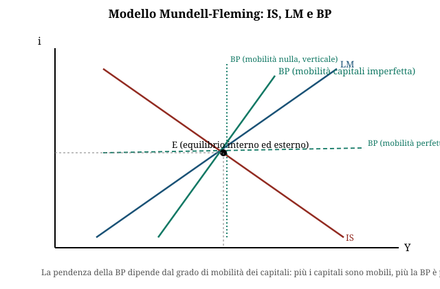

# Economia aperta, bilancia dei pagamenti e modello IS-LM-BP

**Domande d'esame collegate:**
- Modello IS-LM-BP completo (dato esempio: C=0,7Y consumo, I=600-400i investimenti, G=380 spesa pubblica, M=0,1Y importazioni, X=320 esportazioni, Ld=0,25Y+500-1000i domanda di moneta): calcolo del reddito di equilibrio, del saldo della bilancia commerciale, della domanda di moneta transattiva
- Da una tabella con Export/Import/Movimenti di capitale: calcolo della variazione delle riserve ufficiali e del suo effetto sulla base monetaria

---

**1. Perché l'economia aperta cambia il modello**

- In un'economia aperta l'economia nazionale ha relazioni commerciali e finanziarie con il **Resto del Mondo (RdM)**.
- Il modello di politica economica deve includere:
  - un **nuovo obiettivo**: l'equilibrio nei conti con l'estero (BP=0)
  - un **nuovo strumento**: il **tasso di cambio**

**2. La bilancia dei pagamenti (BP): definizione e registrazione**

- La **BP** è un documento contabile che registra le transazioni commerciali e finanziarie effettuate in un dato periodo tra i **residenti** di un paese e i **non residenti**.
- Le transazioni sono regolate in **valuta estera**.
- Principio della **doppia registrazione**: ogni transazione genera una scrittura e, con segno opposto, l'incasso/pagamento che ne deriva.

| Tipo di voce | Significato | Esempi |
|---|---|---|
| **A debito** | pagamento al RdM = esborso di valuta estera | importazioni di merci/servizi, trasferimenti unilaterali all'estero, acquisto di titoli esteri |
| **A credito** | incasso dal RdM = afflusso di valuta estera | esportazioni di merci/servizi, trasferimenti unilaterali dall'estero, vendita di titoli nazionali a non residenti |

**3. Struttura della bilancia dei pagamenti (tre conti)**

| Conto | Contenuto |
|---|---|
| **Conto corrente (CC)** | **bilancia commerciale** (scambi di merci) + partite invisibili (servizi, redditi, trasferimenti unilaterali correnti) |
| **Conto capitale (CK)** | attività intangibili (es. brevetti) + trasferimenti unilaterali in conto capitale |
| **Conto finanziario (CF)** | **movimenti di capitale (MK)** (investimenti diretti e di portafoglio) + variazione delle riserve ufficiali (RU) |

- In assenza di errori ed omissioni, il saldo complessivo della BP è nullo (per costruzione contabile).
- **Semplificando** (CK=0): **BP = CC + MK**, e questo saldo corrisponde algebricamente alla **variazione delle riserve ufficiali** (RU) cambiata di segno.
  - Disavanzo di BP → RU diminuiscono
  - Avanzo di BP → RU aumentano (→ creazione di base monetaria, BM)
- Logica macro: se X>M (esportazioni > importazioni), allora Y>C+I, cioè S>I: l'equilibrio richiede che il risparmio in eccesso trovi sbocco all'estero (deflusso di capitali).

**4. Il tasso di cambio**

- **Tasso di cambio nominale (e)**: prezzo di una valuta in termini di un'altra (quotazione certo per incerto: unità di valuta estera per 1 unità di valuta nazionale, es. $/Euro).
- **Apprezzamento**: aumento di e (es. da 1,2 a 1,25 $/Euro) → serve più valuta estera per comprare 1 unità di valuta nazionale.
- **Deprezzamento**: diminuzione di e (es. da 1,2 a 1,15 $/Euro).
- Cause: eccesso di domanda/offerta di valuta sul mercato dei cambi (le importazioni generano domanda di valuta estera, le esportazioni offerta di valuta estera).
- **Tasso di cambio reale**: $$e_r = \frac{p \cdot e}{p_w}$$ dove p = prezzi interni, p_w = prezzi esteri, e = cambio nominale.
  - Se $pe = p_w$ ($e_r=1$): parità dei poteri d'acquisto ("condizione di arbitraggio internazionale").
  - **Apprezzamento reale** (↑e_r) → perdita di competitività.
  - **Deprezzamento reale** (↓e_r) → guadagno di competitività.
  - Versione dinamica: $\dot e_r = \dot p + \dot e - \dot p_w$ (la competitività varia con l'inflazione interna, quella estera e la variazione del cambio nominale).

**5. Regimi di cambio: fisso vs flessibile**

| | **Cambi fissi** | **Cambi flessibili** |
|---|---|---|
| Meccanismo | Cambio ancorato a una parità fissata dalle autorità monetarie (eventualmente con bande di oscillazione) | Cambio determinato liberamente da domanda/offerta di valuta |
| Ruolo Banca Centrale | Interviene acquistando/cedendo valuta estera per mantenere fisso e | Discrezionalità di intervento ("fluttuazione sporca"), nessun obbligo |
| Se BP>0 | Aumentano le **riserve ufficiali** (BC cede euro, assorbe valuta estera) | Il cambio si **apprezza** (↑e) |
| Se BP<0 | Diminuiscono le **riserve ufficiali** | Il cambio si **deprezza** (↓e) |
| Esempio storico | SME prima dell'UME | — |

**6. Meccanismi automatici di riequilibrio della BP**

- **Via movimenti di capitale (MK)**: sotto (perfetta) mobilità dei capitali, MK=0 è garantito dalla **condizione di parità scoperta**:
$$i = i_w - \dot e^e$$
condizione di **non arbitraggio**: il rendimento atteso di un'attività in valuta nazionale deve eguagliare quello di un'attività estera analoga al netto del deprezzamento atteso della valuta nazionale. Se $i > i_w - \dot e^e$ → afflusso di capitali → i tende a scendere.

- **Via cambi flessibili**: se BP>0 → ↑e → ↑e_r → ↓CC → BP torna a 0; se BP<0 → ↓e → ↓e_r → ↑CC → BP torna a 0.

- **Via variazione dei prezzi in cambi fissi (meccanismo "neoclassico")**: BP>0 → ↑RU → ↑BM → ↑p → ↑e_r → ↓CC → BP torna a 0 (e simmetrico per BP<0). Limiti: l'effetto di BM sui prezzi può essere debole; i prezzi sono spesso rigidi verso il basso, l'aggiustamento è lento e può generare inflazione/deflazione indesiderata.

- **Via variazione dei redditi in cambi fissi (meccanismo "keynesiano")**: uno shock su X si trasmette a Y e quindi a M, smorzando parzialmente lo squilibrio (es. ↑X → CC>0, ma ↑X → ↑Y → ↑M → ↓CC, quindi ↓BP verso 0). Limiti: il riequilibrio non è completo e il canale via riduzione del reddito ha un costo elevato in termini di disoccupazione.

**7. Le politiche di riequilibrio della BP**

- I meccanismi automatici hanno limiti (lentezza, incompletezza, costi su altri obiettivi) → servono **politiche attive**. In generale è preferibile intervenire sulle **cause** dello squilibrio, ma si può intervenire anche su fattori diversi da quelli che l'hanno generato (es. sui MK quando la causa è nei movimenti di beni).

| Tipo di riequilibrio | Leva |
|---|---|
| **Riequilibrio dei MK** | Politica monetaria (variazione di i) o controllo diretto dei movimenti di capitale (es. "tassa di Tobin") |
| **Riequilibrio del CC** | Politiche per la domanda aggregata (fiscali/monetarie, agiscono su Y) oppure politiche per la competitività (agiscono su p, p_w, e) |

- **Politica monetaria sui MK**: se $i < i_w - \dot e^e$ la BC può fare politica monetaria restrittiva per alzare i ed evitare il deflusso di capitali; MA questo ha effetti restrittivi su Y e può aggravare il debito pubblico (tassi più alti). In alternativa: controllo diretto dei MK. Attenzione: le politiche influenzano anche le aspettative $\dot e^e$, che a loro volta muovono i MK.

- **Politiche di domanda sul CC**: $CC=X-M=f(\overset{-}{e_r},\overset{-}{Y},\overset{+}{Y_w})$. Se CC>0: politica espansiva (↑Y → ↑M → ↓CC); se CC<0: politica restrittiva (↓Y → ↓M → ↑CC). **Se CC<0, l'obiettivo esterno (BP=0) è in conflitto con l'obiettivo interno di crescita di Y** (trade-off classico).

- **Politiche sulla competitività**: agiscono su p (politiche dei prezzi/redditi), su p_w (politiche protezionistiche, non ammesse in UE), su e (manovra del cambio: modifica della parità in cambi fissi, o pilotaggio del cambio in cambi flessibili). Se CC<0 → ↓e → ↑CC; se CC>0 → ↑e → ↓CC.

**8. Efficacia della svalutazione: la condizione di Marshall-Lerner**

- CC in valuta estera: $CC = (p_x e)q_x - p_m q_m$.
- Un deprezzamento del cambio (↓e) ha due effetti opposti:
  - fa **aumentare le quantità** esportate e ridurre quelle importate → CC>0 (effetto quantità)
  - **riduce il prezzo in valuta estera** delle esportazioni ($p_x e$) → CC<0 (effetto prezzo)
- L'effetto complessivo è positivo solo se prevale l'effetto quantità, cioè se c'è sufficiente elasticità delle quantità al cambio:
$$|\varepsilon_x| + |\varepsilon_m| > 1 \quad \text{(condizione di Marshall-Lerner)}$$
dove $\varepsilon_x$ = elasticità delle esportazioni al cambio, $\varepsilon_m$ = elasticità delle importazioni al cambio.

**9. Politiche commerciali: liberismo, protezionismo, autarchia**

| Politica commerciale | Definizione |
|---|---|
| **Liberismo** (*free trade*) | massima libertà di commercio, rimozione degli ostacoli a import/export; fondamento: **principio dei costi comparati** di D. Ricardo — ogni paese si specializza nel bene per cui ha un vantaggio comparato |
| **Protezionismo** | difesa della produzione interna dalla concorrenza estera |
| **Autarchia** | chiusura totale dell'economia nazionale verso l'estero |

- **Grado di apertura** $= \dfrac{X+M}{Y}$
- Strumenti del protezionismo:
  - **Tariffario**: **dazi** (imposta sui beni importati, genera gettito fiscale)
  - **Non tariffario**: **contingenti** (limiti fisici/di valore alle importazioni), regolamentazioni, sussidi alle esportazioni, svalutazione competitiva del cambio
- **Effetti di un dazio** (prezzo internazionale invariato, ipotesi paese "piccolo"): il prezzo interno sale da p a $p(1+d)$ →
  - effetto consumo: -↓ consumo interno
  - effetto produzione: +↑ produzione interna
  - effetto importazione: ↓ importazioni
  - effetto entrate fiscali: + gettito (importazioni residue × aliquota del dazio)
  - effetto redistribuzione: consumatori pagano un prezzo più alto (trasferimento verso i produttori interni e lo Stato)
- Giustificazioni del protezionismo:
  - **Ragioni di scambio**: un dazio può spingere i produttori esteri a ridurre il prezzo al netto del dazio (*pricing to market*), migliorando la ragione di scambio $TT = \dfrac{p_x e}{p_m}$
  - **Industria nascente**: economie di scala dinamiche (*learning by doing*) — una protezione temporanea permette al paese nuovo entrante di ridurre i costi unitari fino a essere competitivo
- **Attenzione**: rischio di **contromisure** — un paese protezionista può subire ritorsioni simmetriche dagli altri paesi.

**10. Il modello Mundell-Fleming (IS-LM-BP)**

- Estende il modello IS-LM ad un'economia aperta.
- **Obiettivo aggiuntivo**: BP=0. **Strumento aggiuntivo**: tasso di cambio.
- Aggiunge al mercato dei beni le esportazioni nette (X-M) e la condizione di equilibrio esterno BP=0.
- **Tre mercati, tre curve**:
  - Mercato dei beni → curva **IS**
  - Mercato della moneta → curva **LM**
  - Mercato estero (valutario/dei capitali) → curva **BP**
- L'equilibrio generale del sistema è dato dall'**intersezione simultanea** di IS, LM e BP nel piano (Y, i).

**Costruzione delle equazioni:**

- **IS** (mercato dei beni), forma generale: $Y = C+I+G+X-M$, con $C=cY$, $I=I(i)$, $M=mY$, $X=\bar X$
$$\Rightarrow Y = \frac{1}{1-c+m}\left[I(i)+\bar G+\bar X\right]$$
  (multiplo keynesiano ridotto dalla propensione a importare m)

- **LM** (mercato della moneta): condizione $L_d(Y,i) = M_s$ (domanda di moneta = offerta di moneta); la LM è crescente nel piano (i,Y): a Y più alto serve i più alto per mantenere in equilibrio il mercato monetario dato Ms.

- **BP** (mercato estero): $BP(Y,i,\bar e) = CC(Y,\bar e) + MK(i) = 0$, esplicitamente $BP = X(e) - m(e)Y + MK(i) = 0$
  - **Curva BP inclinata positivamente**: a Y più alto (→ più importazioni, CC peggiora) serve i più alto (→ più afflusso di capitali) per mantenere BP=0.
  - **Pendenza della BP e mobilità dei capitali**:
    - se i movimenti di capitale sono **vietati** (mobilità nulla) → BP **verticale** (BP dipende solo da Y, tramite CC)
    - se la mobilità dei capitali è **crescente**, la BP diventa più **piatta**
    - in caso di **perfetta mobilità dei capitali** → BP **orizzontale**, in corrispondenza del tasso di interesse internazionale $i_w$ (qualunque i diverso da $i_w$ genera flussi di capitale infiniti)
  - Sopra la curva BP: zona di **avanzo**; sotto: zona di **disavanzo**.
  - Una **svalutazione del cambio** (↓e) sposta la BP verso il basso (più esportazioni a parità di Y) e la rende meno inclinata (minore propensione a importare in termini reali): $Y = \dfrac{1}{m(e)}X(e)+MK(i)$

**11. Effetti delle politiche in cambi fissi vs flessibili (schema generale Mundell-Fleming)**

| Politica | Cambi fissi | Cambi flessibili |
|---|---|---|
| **Fiscale espansiva** | Efficace: BC deve espandere BM per difendere il cambio, rafforzando l'effetto su Y | Meno efficace/inefficace con alta mobilità dei capitali: l'afflusso di capitali (↑i) apprezza il cambio, che spiazza le esportazioni nette |
| **Monetaria espansiva** | Inefficace nel lungo periodo: ↓i causa deflusso di capitali/perdita di riserve, costringendo la BC a riassorbire liquidità per difendere la parità | Efficace: ↓i deprezza il cambio, che stimola le esportazioni nette e amplifica l'effetto espansivo su Y |

(Nota: le slide analizzate presentano gli elementi costitutivi del modello — IS, LM, BP, pendenze e meccanismi — ma non sviluppano graficamente ogni singolo caso politica/regime; la tabella sintetizza la logica standard del modello Mundell-Fleming coerente con quanto esposto su MK, competitività e riequilibrio.)

---

## Esercizio tipo svolto

**Dati**: C = 0,7Y — I = 600 − 400i — G = 380 — M = 0,1Y — X = 320 — $L_d = 0,25Y + 500 - 1000i$

### 1. Equazione IS (equilibrio del mercato dei beni)

$$Y = C+I+G+X-M$$
$$Y = 0,7Y + (600-400i) + 380 + 320 - 0,1Y$$
$$Y - 0,7Y + 0,1Y = 1300 - 400i$$
$$0,4\,Y = 1300 - 400i$$
$$\boxed{Y = 3250 - 1000i} \quad \text{(equazione della curva IS)}$$

### 2. Saldo della bilancia commerciale (CC = X − M) in funzione di i

$$CC = X - M = 320 - 0,1Y$$

sostituendo la IS:

$$CC = 320 - 0,1(3250-1000i) = 320 - 325 + 100i$$
$$\boxed{CC = 100i - 5}$$

→ il saldo commerciale migliora (CC aumenta) al crescere del tasso di interesse i, perché i più alto riduce gli investimenti, quindi riduce Y (via IS), quindi riduce le importazioni M=0,1Y.

### 3. Domanda di moneta transattiva in funzione di i

La componente transattiva di $L_d$ è **0,25Y** (la parte che dipende dal reddito; la parte $500-1000i$ è la componente speculativa/legata al tasso di interesse). Sostituendo la IS:

$$L_{d,\text{transattiva}} = 0,25Y = 0,25(3250-1000i)$$
$$\boxed{L_{d,\text{transattiva}} = 812,5 - 250i}$$

### 4. Chiusura numerica del sistema (nota metodologica)

Per ottenere un **valore numerico unico** di Y* (e quindi di i*, CC* e della domanda di moneta transattiva) serve la curva **LM**, cioè la condizione $L_d = M_s$ con un valore dato dell'**offerta di moneta $M_s$** (o, in alternativa, un valore di i dato direttamente dal testo). Con i soli dati forniti (IS + $L_d$, ma senza $M_s$) il sistema IS-LM è **sottodeterminato**: si può esprimere Y, CC e la domanda di moneta transattiva solo **in funzione di i**, come sopra.

**Esempio illustrativo** (solo per mostrare il procedimento completo — il valore di i qui è ipotizzato, va sostituito con il dato reale fornito nel testo d'esame, es. tramite $M_s$ o un tasso i esplicito): se i = 5% (0,05):

- $Y = 3250 - 1000(0,05) = 3200$
- $I = 600 - 400(0,05) = 580$
- verifica: $Y = 0,7(3200)+580+380+320-0,1(3200) = 2240+580+380+320-320 = 3200$ ✓
- $CC = 100(0,05) - 5 = 0$ (commercio in pareggio)
- $L_{d,\text{transattiva}} = 0,25(3200) = 800$

Il metodo (equazione IS → sostituzione in CC e nella componente transattiva di $L_d$) è lo stesso qualunque sia il valore di i fornito dal testo dell'esame.
