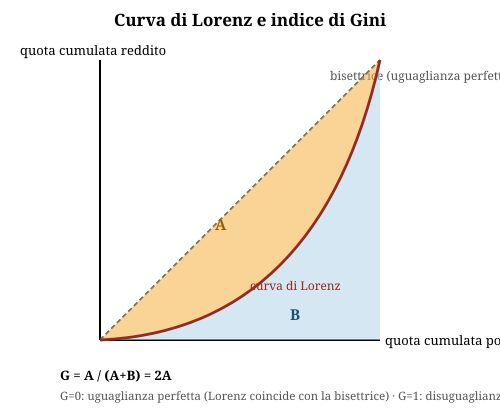

# Disuguaglianze economiche, di genere e Stato Sociale

**Domande d'esame collegate:** nessuna trovata nei compiti passati analizzati — cluster a bassa priorità, copertura di sicurezza sintetica

---

## 1. **Equità, efficienza e ruolo dello Stato**

- **Equità**: distinguere uguaglianza delle **opportunità** (compensare il caso/luck, non l'impegno/effort) da uguaglianza dei **risultati** (redditi, ricchezza, consumi).
- **2° teorema dell'economia del benessere**: con mercati completi e concorrenza perfetta, ogni allocazione Pareto-efficiente si può ottenere ridistribuendo le risorse iniziali → ruolo distributivo allo **Stato**, ruolo allocativo al **mercato**.
- Equità ed efficienza: **indipendenti** in teoria, ma esiste **trade-off** (metafora del "secchio bucato" di Okun) e possibile **complementarità** (soprattutto nei PVS: equità come prerequisito della crescita).
- **Curva di Kuznets**: relazione a **U rovesciata** tra reddito pro capite e disuguaglianza (aumenta nelle prime fasi di industrializzazione, poi diminuisce); non sempre confermata empiricamente.

## 2. **Misurare la disuguaglianza**

- **Distribuzione funzionale** del reddito: quota lavoro (salari) vs quota capitale (profitti, interessi, rendite).
- **Distribuzione personale**: reddito per classi di individui/famiglie.
- **Reddito disponibile = reddito di mercato + trasferimenti − tasse.**
- **Curva di Lorenz**: quota cumulata di reddito (asse y) vs quota cumulata di popolazione (asse x); coincide con la bisettrice in caso di perfetta uguaglianza.
- **Indice di Gini**: **G = A / (A+B) = 2A**, con A = area tra bisettrice e curva di Lorenz, A+B = area del triangolo sotto la bisettrice. Varia da 0 (uguaglianza) a 1 (disuguaglianza massima).
- Il Gini dei redditi **di mercato** è generalmente più alto di quello dei redditi **disponibili**: l'intervento pubblico (tasse + trasferimenti) riduce la disuguaglianza.

- **Povertà assoluta**: soglia da un paniere di beni/servizi essenziali (definita da Istat in Italia).
- **Povertà relativa**: soglia UE = **60% della mediana** del reddito disponibile equivalente (in Italia, famiglia di 2 persone ≈ 1.218 €/mese nel 2024; incidenza ≈ 10,9% delle famiglie).
- **Top incomes**: quota di reddito del top 10%/1% — trend a U (paesi anglosassoni) o a L (Europa continentale), in calo dal dopoguerra e in risalita dagli anni '80-'90.

## 3. **Cause delle disuguaglianze economiche**

- Aumento degli **"skill premia"** (tecnologia + globalizzazione) → sparisce la "classe media".
- **Divario digitale**, **capitalismo delle piattaforme**.
- Perdita di potere contrattuale dei sindacati, capitalismo finanziario e oligarchico (peso crescente delle rendite al top della distribuzione).

## 4. **Le politiche redistributive**

- **Redistribuzione** (agisce sul reddito disponibile, ex post: tasse/trasferimenti) vs **pre-distribuzione** (agisce sul reddito di mercato, ex ante: es. salario minimo).
- Sequenza dei redditi: PIL → Reddito lordo (+trasferimenti monetari) → **Reddito disponibile** (− contributi − imposte dirette) → Reddito netto (− imposte indirette) → Reddito finale (+ trasferimenti non monetari + reddito abitativo).
- **Imposta diretta**: colpisce reddito/patrimonio (in Italia: IRPEF, IRES, IRAP, IMU).

| Tipo di imposta sul reddito | Formula | Caratteristica |
|---|---|---|
| In somma fissa | T | non dipende dal reddito |
| Proporzionale | tY | aliquota costante |
| Progressiva | t(y)Y | aliquota crescente con il reddito |

- **Curva di Laffer**: oltre una certa aliquota, ulteriori aumenti possono ridurre il gettito totale (effetto disincentivante).
- **IRPEF Italia 2025** (3 scaglioni): 23% fino a 28.000€; 35% da 28.001 a 50.000€ (6.440€ + 35% sull'eccedenza); 43% oltre 50.000€ (14.140€ + 43% sull'eccedenza).
  - Esempio calcolo: aliquota **marginale** = aliquota sull'ultimo euro guadagnato; aliquota **media** = imposta totale / reddito totale (sempre ≤ aliquota marginale in un sistema progressivo).

## 5. **Lo Stato Sociale**

- **Obiettivi**: (1) reddito minimo garantito indipendentemente dal lavoro; (2) riduzione dell'insicurezza sui rischi della vita (malattia, vecchiaia, infortuni, disoccupazione); (3) fornitura universale di servizi essenziali.
- Campi di intervento: **sanità, assistenza, previdenza, istruzione**.
- Critiche: possibile disincentivo all'offerta di lavoro; problemi di sostenibilità del bilancio pubblico (invecchiamento della popolazione).

| Modello di welfare | Area | Finanziamento | Logica |
|---|---|---|---|
| **Bismarck** | Europa continentale | Contributi lavoratori/imprese | Occupazionale, assicurativo |
| **Beveridge — anglosassone** | UK, USA | Fiscalità generale | Minimale, prova dei mezzi, target: poveri |
| **Beveridge — scandinavo** | Scandinavia | Fiscalità generale | Universalistico, alti standard per tutti |

- **Sanità**: intervento pubblico per efficienza (esternalità, asimmetrie informative) ed equità (bene meritorio, diritto alla salute — art. 32 Cost.). In Italia: **SSN** (1978, legge 833), copertura universale.
- **Istruzione**: intervento pubblico per efficienza (esternalità positiva, vincoli di liquidità) ed equità (diritto all'istruzione indipendente dal reddito familiare — art. 34 Cost.); strumenti: obbligo scolastico, borse di studio, libri di testo, istruzione degli adulti.
- **Contrasto alla povertà** — principali strumenti:
  - **Reddito minimo**: dietro verifica dei requisiti (es. REI, RDC).
  - **Imposta negativa**: sussidio per portare il reddito a una soglia predefinita.
  - **Reddito di partecipazione**: condizionato ad attività a favore della società.
  - **Reddito di cittadinanza**.
  - Criticità comuni: costo del finanziamento, verifica requisiti, stigma sociale.

- **Politiche abitative**: edilizia pubblica/social housing, incentivi fiscali prima casa, sussidi affitto, regole su sfratti/morosità.
- **Politiche per la famiglia**: sostegno al costo dei figli (asili nido, trasferimenti), congedi familiari, cura degli anziani, sostegno a maternità/paternità.

## 6. **Disuguaglianze di genere nel mercato del lavoro**

- Dimensioni principali: divario di partecipazione/occupazione, **segregazione orizzontale** (settori diversi) e **verticale** ("soffitto di cristallo"), qualità del lavoro, **divario retributivo**.
- Base normativa: **art. 37 Cost.** (parità di retribuzione a parità di lavoro) e **art. 157 TFUE** (parità retributiva UE, anche per lavoro di pari valore).
- **Gender Pay Gap (GWG)**: differenza tra retribuzione oraria lorda media maschile e femminile, in % della retribuzione maschile.
  - **GWG = (Wm − Wf) / Wm**

- Nella UE il gap medio "grezzo" (unadjusted) è intorno al 12%, con forte eterogeneità tra paesi.
- Questioni di misurazione: media vs mediana; retribuzione oraria (isola l'effetto ore lavorate) vs mensile (riflette anche differenze di orario/part-time).
- **Divario "ponderato per fattori"** (ILO): si confrontano sottogruppi omogenei per istruzione, età/esperienza, tempo pieno/part-time, pubblico/privato, poi si aggrega.
- **Scomposizione di Blinder-Oaxaca (1973)**, basata sull'equazione dei salari di Mincer: separa il gap in
  - **componente spiegata** (differenze osservabili: istruzione, esperienza, settore, ecc.)
  - **componente non spiegata** (differenza nei "rendimenti" delle stesse caratteristiche → possibile indicatore di **discriminazione**)

- Fattori Eurostat che alimentano il gap: interruzioni di carriera (91% prese da donne), squilibrio nei ruoli dirigenziali (uomini 65% dei manager), part-time (75% donne), segregazione occupazionale (donne 73% in istruzione/sanità/assistenza, settori a paga più bassa).

## 7. **Politiche per le pari opportunità (Italia e UE)**

- **Pari opportunità**: principio giuridico di eliminazione di ogni ostacolo discriminatorio (sesso, razza, religione, disabilità, età, orientamento sessuale) nell'accesso a risorse e opportunità.
- Base costituzionale italiana: **art. 3** (uguaglianza formale e sostanziale), **art. 37** (parità retributiva lavoratrice/lavoratore), **art. 51** (parità di accesso a uffici pubblici e cariche elettive, revisione 2003), **art. 31** (tutela maternità e famiglia).
- **Direttiva UE sulla trasparenza salariale** (adottata 24/4/2023), quattro assi:
    1. **Accesso alle informazioni** (stipendio dichiarato negli annunci, divieto di chiedere storia retributiva ai candidati).
    2. **Obbligo di segnalazione** (aziende >250 dipendenti riferiscono annualmente; se gap >5% ingiustificato, misure correttive obbligatorie).
    3. **Accesso alla giustizia** (risarcimento, inversione dell'onere della prova a carico del datore).
    4. **Discriminazione intersezionale** inclusa per la prima volta nell'ambito di applicazione.

- Piano italiano (pariopportunita.gov.it): target ridurre gender pay gap privato dal ~17% al ~10%, per i laureati dal ~22% a <15%; misure principali: definizione normativa del GPG, sistemi di misurazione dell'equal pay aziendale, policy di genere per le imprese, incremento indennità congedi parentali, microcredito per donne a basso reddito/vittime di violenza/madri sole, riduzione del pension gap da maternità.
